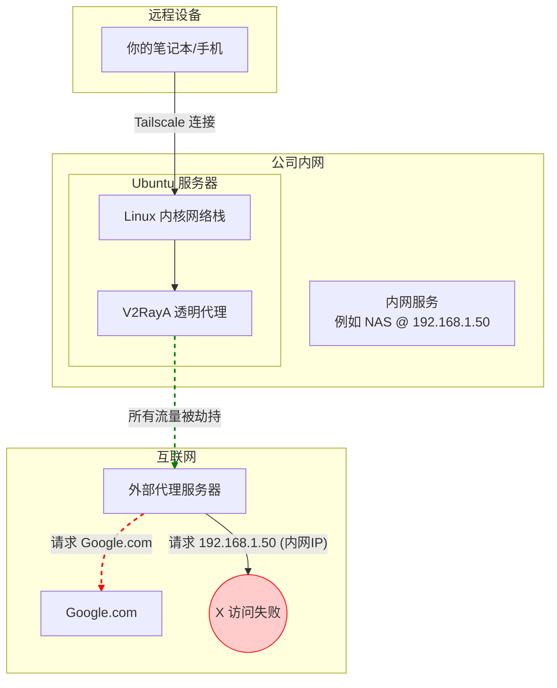
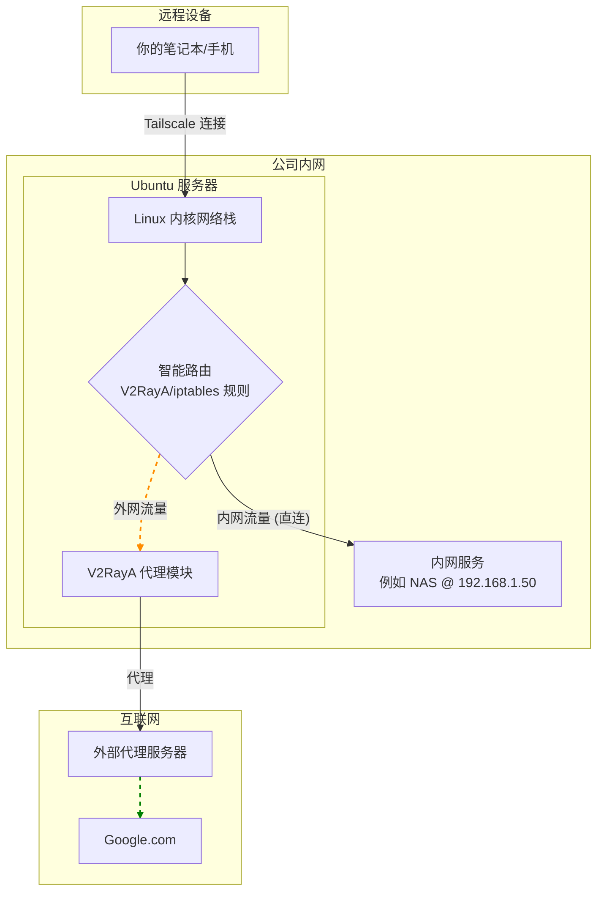

### **Tailscale + V2RayA 透明代理完美融合：实现内网穿透与智能分流教程**

本教程旨在解决一个常见且核心的组网问题：当使用 Tailscale 将设备接入公司内网，并利用一台服务器作为出口节点（Exit Node）和透明代理（V2RayA）时，如何确保既能科学上网，又能无缝访问仅限内网IP的资源（如NAS、数据库、开发服务器等）。

#### **1. 目标与挑战**

  * **目标架构**：任何加入 Tailscale 网络的设备（笔记本、手机），无论身在何处，都能像在公司一样，无缝、安全地访问公司内网服务，同时所有国际网络流量自动通过代理加速。
  * **核心挑战**：V2RayA 的透明代理通过 `iptables` 规则“劫持”了所有网络流量。这导致了访问内网IP（如 `192.168.1.50`）的请求也被错误地发送到了外部代理服务器，最终访问失败。

#### **2. 网络拓扑分析**

##### **问题状态（调整前）**

在你当前的配置下，所有流量，无论内外，都被强制推向了 V2RayA。



**问题分析**：上图清晰地展示了，访问内网服务 `192.168.1.50` 的流量（红色虚线）被 V2RayA 错误地导向了外部代理服务器，导致路径中断，访问失败。

##### **理想状态（调整后）**

我们的目标是实现智能分流：访问外网的流量走代理，访问内网的流量走直连。



**解决方案**：通过在 Ubuntu 服务器上设置“智能路由分流”逻辑，系统能够判断流量目的地。如果是外网，则交给 V2RayA 代理模块；如果是内网，则直接在局域网内转发，绕过代理。

-----

#### **3. 详细实施步骤**

##### **第1步：核心配置 - V2RayA 路由规则分流**

这是最直接、最重要的步骤。

1.  **登录 V2RayA 管理面板**：
    在 Ubuntu 服务器上，用浏览器访问 `http://127.0.0.1:2017` 或你的服务器 IP 地址加 `:2017` 端口。

2.  **进入路由设置**：
    点击左侧菜单的 **设置 (Settings)** -\> **路由设置 (Routing Settings)**。

3.  **创建内网直连规则**：
    我们需要新建一条规则，告诉 V2RayA，所有发往内网地址的流量都应该“直连”。

      * **规则名称**：`Bypass-Internal-LAN`
      * **IP**：填写你公司内网的 CIDR 地址段，以及 Tailscale 自身的地址段。**这一点至关重要**。
        ```
        # 常见私有地址段，根据你的情况选择或全部添加
        192.168.0.0/16, 10.0.0.0/8, 172.16.0.0/12
        
        # 必须添加 Tailscale 的保留地址段，防止节点间通信被代理
        100.64.0.0/10
        ```
        你可以将它们合并到一行，用逗号隔开：
        `192.168.0.0/16, 10.0.0.0/8, 172.16.0.0/12, 100.64.0.0/10`
      * **出站 (Outbound)**：务必选择 **`direct`**。
      * 点击 **创建**。

4.  **调整规则优先级**：
    将刚刚创建的 `Bypass-Internal-LAN` 规则拖动到列表的**最顶部**。路由规则是按顺序匹配的，必须优先判断是否为内网流量。

5.  **保存并应用**：
    点击右上角的 **保存并应用 (Save & Apply)**。

##### **第2步：基础加固 - 验证 Tailscale 配置**

1.  **宣告路由与出口节点**：
    确保你的 Ubuntu 服务器启动 Tailscale 服务的命令是完整的。

    ```bash
    # 请将 192.168.1.0/24 替换为你的实际公司内网网段
    sudo tailscale up --advertise-routes=192.168.1.0/24 --advertise-exit-node
    ```

2.  **在管理后台启用路由**：

      * 登录 [Tailscale Admin Console](https://login.tailscale.com/admin/machines)。
      * 找到你的 Ubuntu 服务器，点击 `...` -\> **Edit route settings...**。
      * 确认 "Subnet routes" 和 "Exit node" 均已启用。

##### **第3步（可选，但推荐）：使用 `iptables` 规则兜底**

为了让分流逻辑更加稳固，不受 V2RayA 内部变动的影响，可以在 `iptables`层面增加绕行规则。

1.  **找到 V2RayA 的 `iptables` 链名称**：

    ```bash
    sudo iptables -t nat -L PREROUTING
    ```

    输出中会有一条 `REDIRECT` 或 `jump` 规则，指向一个自定义链，通常是 `V2RAYA_PREROUTING` 或 `V2RAYA`。

2.  **插入绕行规则**（假设链名为 `V2RAYA_PREROUTING`）：

    ```bash
    # 在 V2RAYA 链的最前面插入规则，让目标为内网的流量直接返回，不再被处理
    # 请将 192.168.1.0/24 替换为你的实际网段
    sudo iptables -t nat -I V2RAYA_PREROUTING 1 -d 192.168.1.0/24 -j RETURN

    # 也建议添加对 Tailscale 网络的豁免
    sudo iptables -t nat -I V2RAYA_PREROUTING 1 -d 100.64.0.0/10 -j RETURN
    ```

3.  **持久化规则**：

    ```bash
    sudo apt-get update && sudo apt-get install iptables-persistent
    # 安装时选择 Yes 保存当前规则
    sudo netfilter-persistent save # 修改后手动保存
    ```

-----

#### **4. 最终验证**

在你的远程设备上（已连接 Tailscale 并启用出口节点）：

1.  **测试内网访问**：

    ```bash
    ping 192.168.1.50 # 替换为你的内网服务IP
    curl http://192.168.1.50:port # 测试服务端口
    ```

    如果能收到响应，说明内网分流成功。

2.  **测试外网访问和出口IP**：

    ```bash
    curl ifconfig.me
    ```

    返回的 IP 地址应该是你 Ubuntu 服务器的公网 IP，说明代理仍然生效。

至此，你已经成功构建了一个功能完善、分流智能的远程接入网络。