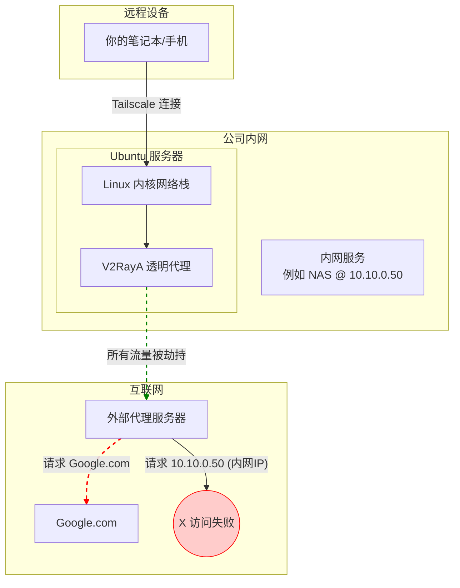
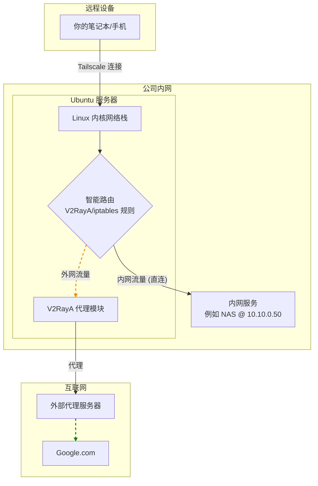

-----

### **Tailscale + V2RayA 透明代理完美融合：实现内网穿透与智能分流的终极指南**

**版本**: 2.0 (终稿)
**作者**: shihuaidexianyu & Gemini (共同创作)
**日期**: 2025年7月3日

-----

### **章节一：我们的目标与挑战**

在现代混合办公模式下，我们常常面临一个核心诉求：如何让我们的设备（笔记本、手机）无论身在何处，都能像在公司办公室一样，既能无缝、安全地访问公司内部网络资源（如NAS、数据库、开发服务器），又能顺畅、智能地访问外部互联网资源。

本教程旨在彻底解决这一问题，我们将利用 Tailscale 构建安全的虚拟局域网，并在一台Linux服务器上部署 V2RayA 作为网络出口的透明代理，最终实现以下目标架构：

  * **目标架构**：任何加入 Tailscale 网络的设备，都能实现流量的智能分流。访问公司内网和中国大陆的流量将**直连**，访问国际网络的流量将自动通过**代理**加速。
  * **核心挑战**：默认情况下，V2RayA 的透明代理会通过 `iptables` 规则“劫持”所有网络流量。这导致了访问内网IP（如 `10.10.0.50`）的请求也被错误地发送到了外部代理服务器，最终访问失败。本教程的核心就是解决这一路由冲突。

### **章节二：问题根源与理想架构**

为了清晰地理解问题，我们通过您绘制的拓扑图来分析流量走向。

#### **问题状态（调整前）**

在未优化的配置下，所有流量，无论内外，都被强制推向了 V2RayA 进行代理。



**问题分析**：上图清晰地展示了，访问内网服务 `10.10.0.50` 的流量（红色虚线）被 V2RayA 错误地导向了外部代理服务器，导致路径中断，访问失败。

#### **理想状态（调整后）**

我们的目标是实现智能分流：系统能够识别流量目的地，访问外网的流量走代理，访问内网的流量则直接在局域网内转发。



**解决方案**：通过在 Ubuntu 服务器上设置环环相扣的“智能路由分流”逻辑，让系统能够精确判断流量目的地，从而实现完美分流。

-----

### **章节三：终极实施指南**

请严格按照以下步骤操作，顺序至关重要。

#### **第1步：服务器基础配置 (Prerequisites)**

在配置核心服务前，先确保服务器的网络环境已准备就绪。

1.  **开启IP转发**：这是服务器作为网关和路由器的前提。

    ```bash
    # 开启IPv4和IPv6转发，并使其永久生效
    sudo sed -i '/net.ipv4.ip_forward=1/s/^#//' /etc/sysctl.conf
    sudo sed -i '/net.ipv6.conf.all.forwarding=1/s/^#//' /etc/sysctl.conf
    sudo sysctl -p
    ```

2.  **（可选）优化UDP转发性能**：如果在 `tailscale up` 时看到 `UDP GRO` 警告，可通过此命令优化，将 `eno1` 替换为你的实际网卡名。

    ```bash
    sudo ethtool -K eno1 gro off gso off
    ```

#### **第2步：配置 Tailscale (网络基础)**

1.  **以正确的参数启动 Tailscale**：您需要同时宣告您的内网路由和出口节点身份。

    ```bash
    # 请将 10.0.0.0/8 替换为你的实际公司内网网段
    # 注意：如果之前还开启了 --ssh 等其他参数，必须一并写上，否则会报错！
    sudo tailscale up --advertise-routes=10.0.0.0/8 --advertise-exit-node --accept-routes
    ```

    > **常见排错**:

    >   * **报错 `changing settings ... requires mentioning all non-default flags`**: 说明您之前还设置了其他参数（如 `--ssh`）。请按照错误提示，运行它建议的、包含所有参数的完整命令。
    >   * **报错 `flag provided but not defined`**: 说明您的 Tailscale 客户端版本过旧。请运行 `sudo apt update && sudo apt install tailscale` 更新到最新版。

2.  **在 Tailscale 管理后台启用路由**：

      * 登录 [Tailscale Admin Console](https://login.tailscale.com/admin/machines)。
      * 找到您的 Ubuntu 服务器，点击 `...` -\> **Edit route settings...**。
      * 确认 "Subnet routes" (例如 `10.0.0.0/8`) 和 "Exit node" 两个开关均已打开并呈蓝色状态。

#### **第3步：配置 V2RayA 路由规则 (核心分流逻辑)**

这是实现智能分流最核心的步骤。它告诉 V2RayA 如何处理收到的流量。

1.  登录您的 V2RayA 管理面板 (`http://<你的服务器IP>:2017`)。
2.  点击左侧的 **设置 (Settings)** -\> **路由设置 (Routing Settings)**。（对应的分流模式为`RoutingA`,在该模式下才可以手动配置代理规则）
4.  **全选并删除**文本框中的所有旧规则。
5.  将下面代码块中的**所有内容**完整地复制进去。

<!-- end list -->

```
# V2RayA 路由规则优化版 (v2)
# 规则顺序至关重要，请勿随意调整顺序

# ----------------------------------------------------------------
# 规则区块 1：[必须最优先] 核心网络直连
# 作用：确保公司内网、本机服务、Tailscale网络和中国大陆IP地址永远直连，不走代理。
# 这是整个配置能正常工作的基础。
# ----------------------------------------------------------------
ip(geoip:private, geoip:cn) -> direct
ip(100.64.0.0/10) -> direct


# ----------------------------------------------------------------
# 规则区块 2：[推荐] 广告与跟踪器拦截
# 作用：屏蔽常见的广告和跟踪器域名，提升浏览体验。
# ----------------------------------------------------------------
domain(geosite:category-ads-all) -> block


# ----------------------------------------------------------------
# 规则区块 3：[国内流量] 中国大陆域名直连
# 作用：让所有归属地为中国的网站直连。
# ----------------------------------------------------------------
domain(geosite:cn) -> direct


# ----------------------------------------------------------------
# 规则区块 4：[特殊需求] 指定代理或直连
# 作用：在这里放置您个人的特殊需求，优先级高于通用的国际流量规则。
# ----------------------------------------------------------------
# 例如，强制让谷歌学术走代理
domain(geosite:google-scholar) -> proxy
# 例如，强制让所有非中国的学术网站走代理
domain(geosite:category-scholar-!cn) -> proxy
# 例如，强制让香港、澳门地区的流量走代理
ip(geoip:hk, geoip:mo) -> proxy


# ----------------------------------------------------------------
# 规则区块 5：[通用规则] 剩余的国际流量走代理
# 作用：这是最主要的代理规则，匹配所有非中国大陆的网站。
# ----------------------------------------------------------------
domain(geosite:geolocation-!cn) -> proxy


# ----------------------------------------------------------------
# 规则区块 6：[默认规则] 最终出口
# 作用：作为兜底，所有以上规则都未匹配到的流量，将执行默认操作。
# ----------------------------------------------------------------
default: proxy
```

5.  点击右上角的 **保存并应用 (Save & Apply)**。

> **语法修正说明**：我们发现 V2RayA 不支持将 `geoip:` 和纯 CIDR 地址混写在同一个 `ip()` 函数中，因此我们将原先的混合规则拆分为了两条独立的 `ip(...)` 规则，功能完全等价且语法正确。

#### **第4步：配置 iptables (可选，但推荐的兜底方案)**

为了让分流逻辑更加稳固，我们可以在 `iptables` 层面也增加绕行规则，作为“双保险”。

1.  **在 V2RayA 的处理链顶部插入绕行规则**：
    ```bash
    # V2RayA 的自定义链通常是 V2RAYA_PREROUTING，如果不是请自行替换
    # 规则1: 目标是公司内网的流量，直接返回(RETURN)到上一级链，不再被V2RayA处理
    sudo iptables -t nat -I V2RAYA_PREROUTING 1 -d 10.0.0.0/8 -j RETURN
    # 规则2: 目标是 Tailscale 网络的流量，也直接返回
    sudo iptables -t nat -I V2RAYA_PREROUTING 1 -d 100.64.0.0/10 -j RETURN
    ```
2.  **持久化 `iptables` 规则**：
    ```bash
    sudo apt-get install iptables-persistent -y
    sudo netfilter-persistent save
    ```

-----

### **章节四：最终验证**

现在，在您的远程设备上（确保已连接 Tailscale 并启用这台服务器作为出口节点）：

1.  **测试内网访问**：`ping` 或 `curl` 您的任意一个内网服务IP地址。

    ```bash
    ping 10.10.0.50 # 替换为你的内网服务IP
    ```

    如果能收到响应，说明内网分流成功！

2.  **测试外网访问和出口IP**：访问一个可以显示您公网IP的网站。

    ```bash
    curl ip.sb
    ```

    返回的 IP 地址应该是您 Ubuntu 服务器的公网 IP，说明您的外网流量确实通过服务器的 V2RayA 代理，代理仍然生效。

-----

### **附录A：核心概念解读**

  * **`出站 (Outbound)` vs `ProbeURL`**：
      * **出站**：是流量的真正出口，决定了数据从哪里发出去（例如 `proxy` 组、`direct` 直连、`block` 拦截）。
      * **ProbeURL**：是用来测试和评估各个“出站”线路质量的“尺子”（例如 `https://gstatic.com/generate_204`）。V2RayA 通过访问它来计算节点的延迟和可用性。
  * **`https://gstatic.com/generate_204`**：一个由谷歌提供的、全球分布的、只返回“收到”信号（HTTP 204 No Content）而不返回任何内容的网络“靶点”，是进行网络连通性与延迟测试的绝佳工具。

### **附录B：常见问题排错（FAQ）**

1.  **V2RayA 路由规则不生效？**
      * **检查顺序！** 这是90%的原因。确保您的直连/拦截规则在通用代理规则的**上方**。流量是自上而下匹配的。
2.  **V2RayA 报语法错误 `unexpected character ")"`？**
      * 这是因为 `ip()` 函数内不能混用 `geoip:` 和纯 CIDR 地址。请参照本教程第三章第3步的写法，将它们拆分成独立的规则。
3.  **Tailscale 命令执行失败？**
      * 请仔细阅读错误信息。通常是因为需要补上 `--ssh` 等已启用的参数，或是客户端版本过旧需要更新。

### **结语**

至此，您已经成功构建了一个功能完善、分流智能、稳定可靠的远程接入网络。通过本次实践，我们不仅解决了具体问题，更深入理解了背后复杂的网络路由逻辑。享受随时随地如在内网办公的便捷吧！
