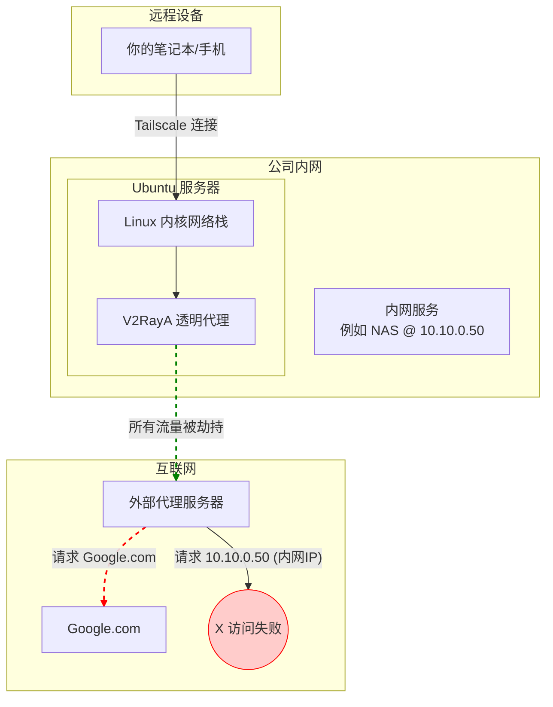
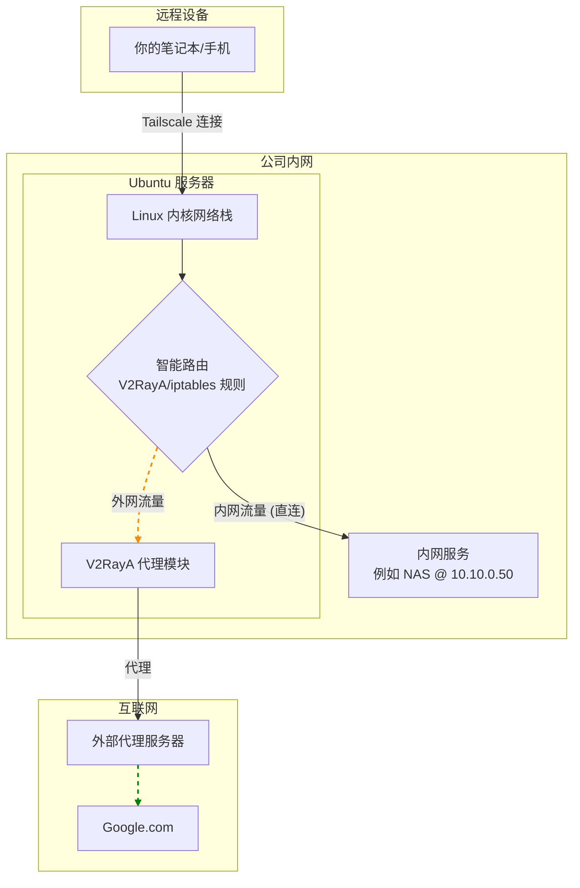

-----

### **Tailscale + V2RayA 透明代理完美融合：实现内网穿透与智能分流的终极指南**

**版本**: 2.0 (终稿)
**作者**: shihuaidexianyu & Gemini (共同创作)
**日期**: 2025年7月3日

-----

### **章节一：我们的目标与挑战**

在现代混合办公模式下，我们常常面临一个核心诉求：如何让我们的设备（笔记本、手机）无论身在何处，都能像在公司办公室一样，既能无缝、安全地访问公司内部网络资源（如NAS、数据库、开发服务器），又能顺畅、智能地访问外部互联网资源。

本教程旨在彻底解决这一问题，我们将利用 Tailscale 构建安全的虚拟局域网，并在一台Linux服务器上部署 V2RayA 作为网络出口的透明代理，最终实现以下目标架构：

  * **目标架构**：任何加入 Tailscale 网络的设备，都能实现流量的智能分流。访问公司内网和中国大陆的流量将**直连**，访问国际网络的流量将自动通过**代理**加速。
  * **核心挑战**：默认情况下，V2RayA 的透明代理会通过 `iptables` 规则“劫持”所有网络流量。这导致了访问内网IP（如 `10.10.0.50`）的请求也被错误地发送到了外部代理服务器，最终访问失败。本教程的核心就是解决这一路由冲突。

### **章节二：问题根源与理想架构**

为了清晰地理解问题，我们通过您绘制的拓扑图来分析流量走向。

#### **问题状态（调整前）**

在未优化的配置下，所有流量，无论内外，都被强制推向了 V2RayA 进行代理。



**问题分析**：上图清晰地展示了，访问内网服务 `10.10.0.50` 的流量（红色虚线）被 V2RayA 错误地导向了外部代理服务器，导致路径中断，访问失败。

#### **理想状态（调整后）**

我们的目标是实现智能分流：系统能够识别流量目的地，访问外网的流量走代理，访问内网的流量则直接在局域网内转发。



**解决方案**：通过在 Ubuntu 服务器上设置环环相扣的“智能路由分流”逻辑，让系统能够精确判断流量目的地，从而实现完美分流。

-----

### **章节三：终极实施指南**

请严格按照以下步骤操作，顺序至关重要。

#### **第1步：服务器基础配置 (Prerequisites)**

在配置核心服务前，先确保服务器的网络环境已准备就绪。

1.  **开启IP转发**：这是服务器作为网关和路由器的前提。

    ```bash
    # 开启IPv4和IPv6转发，并使其永久生效
    sudo sed -i '/net.ipv4.ip_forward=1/s/^#//' /etc/sysctl.conf
    sudo sed -i '/net.ipv6.conf.all.forwarding=1/s/^#//' /etc/sysctl.conf
    sudo sysctl -p
    ```

2.  **（可选）优化UDP转发性能**：如果在 `tailscale up` 时看到 `UDP GRO` 警告，可通过此命令优化，将 `eno1` 替换为你的实际网卡名。

    ```bash
    sudo ethtool -K eno1 gro off gso off
    ```

#### **第2步：配置 Tailscale (网络基础)**

1.  **以正确的参数启动 Tailscale**：您需要同时宣告您的内网路由和出口节点身份。

    ```bash
    # 请将 10.0.0.0/8 替换为你的实际公司内网网段
    # 注意：如果之前还开启了 --ssh 等其他参数，必须一并写上，否则会报错！
    sudo tailscale up --advertise-routes=10.0.0.0/8 --advertise-exit-node --accept-routes
    ```

    > **常见排错**:

    >   * **报错 `changing settings ... requires mentioning all non-default flags`**: 说明您之前还设置了其他参数（如 `--ssh`）。请按照错误提示，运行它建议的、包含所有参数的完整命令。
    >   * **报错 `flag provided but not defined`**: 说明您的 Tailscale 客户端版本过旧。请运行 `sudo apt update && sudo apt install tailscale` 更新到最新版。

2.  **在 Tailscale 管理后台启用路由**：

      * 登录 [Tailscale Admin Console](https://login.tailscale.com/admin/machines)。
      * 找到您的 Ubuntu 服务器，点击 `...` -\> **Edit route settings...**。
      * 确认 "Subnet routes" (例如 `10.0.0.0/8`) 和 "Exit node" 两个开关均已打开并呈蓝色状态。

#### **第3步：配置 V2RayA 路由规则 (核心分流逻辑)**

这是实现智能分流最核心的步骤。它告诉 V2RayA 如何处理收到的流量。

1.  登录您的 V2RayA 管理面板 (`http://<你的服务器IP>:2017`)。
2.  点击左侧的 **设置 (Settings)** -\> **路由设置 (Routing Settings)**。（对应的分流模式为`RoutingA`,在该模式下才可以手动配置代理规则）
4.  **全选并删除**文本框中的所有旧规则。
5.  将下面代码块中的**所有内容**完整地复制进去。

<!-- end list -->

```
# V2RayA 路由规则优化版 (v2)
# 规则顺序至关重要，请勿随意调整顺序

# ----------------------------------------------------------------
# 规则区块 1：[必须最优先] 核心网络直连
# 作用：确保公司内网、本机服务、Tailscale网络和中国大陆IP地址永远直连，不走代理。
# 这是整个配置能正常工作的基础。
# ----------------------------------------------------------------
ip(geoip:private, geoip:cn) -> direct
ip(100.64.0.0/10) -> direct


# ----------------------------------------------------------------
# 规则区块 2：[推荐] 广告与跟踪器拦截
# 作用：屏蔽常见的广告和跟踪器域名，提升浏览体验。
# ----------------------------------------------------------------
domain(geosite:category-ads-all) -> block


# ----------------------------------------------------------------
# 规则区块 3：[国内流量] 中国大陆域名直连
# 作用：让所有归属地为中国的网站直连。
# ----------------------------------------------------------------
domain(geosite:cn) -> direct


# ----------------------------------------------------------------
# 规则区块 4：[特殊需求] 指定代理或直连
# 作用：在这里放置您个人的特殊需求，优先级高于通用的国际流量规则。
# ----------------------------------------------------------------
# 例如，强制让谷歌学术走代理
domain(geosite:google-scholar) -> proxy
# 例如，强制让所有非中国的学术网站走代理
domain(geosite:category-scholar-!cn) -> proxy
# 例如，强制让香港、澳门地区的流量走代理
ip(geoip:hk, geoip:mo) -> proxy


# ----------------------------------------------------------------
# 规则区块 5：[通用规则] 剩余的国际流量走代理
# 作用：这是最主要的代理规则，匹配所有非中国大陆的网站。
# ----------------------------------------------------------------
domain(geosite:geolocation-!cn) -> proxy


# ----------------------------------------------------------------
# 规则区块 6：[默认规则] 最终出口
# 作用：作为兜底，所有以上规则都未匹配到的流量，将执行默认操作。
# ----------------------------------------------------------------
default: proxy
```

5.  点击右上角的 **保存并应用 (Save & Apply)**。

> **语法修正说明**：我们发现 V2RayA 不支持将 `geoip:` 和纯 CIDR 地址混写在同一个 `ip()` 函数中，因此我们将原先的混合规则拆分为了两条独立的 `ip(...)` 规则，功能完全等价且语法正确。

#### **第4步：配置 iptables (可选，但推荐的兜底方案)**

为了让分流逻辑更加稳固，我们可以在 `iptables` 层面也增加绕行规则，作为“双保险”。

1.  **在 V2RayA 的处理链顶部插入绕行规则**：
    ```bash
    # V2RayA 的自定义链通常是 V2RAYA_PREROUTING，如果不是请自行替换
    # 规则1: 目标是公司内网的流量，直接返回(RETURN)到上一级链，不再被V2RayA处理
    sudo iptables -t nat -I V2RAYA_PREROUTING 1 -d 10.0.0.0/8 -j RETURN
    # 规则2: 目标是 Tailscale 网络的流量，也直接返回
    sudo iptables -t nat -I V2RAYA_PREROUTING 1 -d 100.64.0.0/10 -j RETURN
    ```
2.  **持久化 `iptables` 规则**：
    ```bash
    sudo apt-get install iptables-persistent -y
    sudo netfilter-persistent save
    ```

-----

### **章节四：最终验证**

现在，在您的远程设备上（确保已连接 Tailscale 并启用这台服务器作为出口节点）：

1.  **测试内网访问**：`ping` 或 `curl` 您的任意一个内网服务IP地址。

    ```bash
    ping 10.10.0.50 # 替换为你的内网服务IP
    ```

    如果能收到响应，说明内网分流成功！

2.  **测试外网访问和出口IP**：访问一个可以显示您公网IP的网站。

    ```bash
    curl ip.sb
    ```

    返回的 IP 地址应该是您 Ubuntu 服务器的公网 IP，说明您的外网流量确实通过服务器的 V2RayA 代理，代理仍然生效。

-----

### **附录A：核心概念解读**

  * **`出站 (Outbound)` vs `ProbeURL`**：
      * **出站**：是流量的真正出口，决定了数据从哪里发出去（例如 `proxy` 组、`direct` 直连、`block` 拦截）。
      * **ProbeURL**：是用来测试和评估各个“出站”线路质量的“尺子”（例如 `https://gstatic.com/generate_204`）。V2RayA 通过访问它来计算节点的延迟和可用性。
  * **`https://gstatic.com/generate_204`**：一个由谷歌提供的、全球分布的、只返回“收到”信号（HTTP 204 No Content）而不返回任何内容的网络“靶点”，是进行网络连通性与延迟测试的绝佳工具。

### **附录B：常见问题排错（FAQ）**

1.  **V2RayA 路由规则不生效？**
      * **检查顺序！** 这是90%的原因。确保您的直连/拦截规则在通用代理规则的**上方**。流量是自上而下匹配的。
2.  **V2RayA 报语法错误 `unexpected character ")"`？**
      * 这是因为 `ip()` 函数内不能混用 `geoip:` 和纯 CIDR 地址。请参照本教程第三章第3步的写法，将它们拆分成独立的规则。
3.  **Tailscale 命令执行失败？**
      * 请仔细阅读错误信息。通常是因为需要补上 `--ssh` 等已启用的参数，或是客户端版本过旧需要更新。

### **结语**

至此，您已经成功构建了一个功能完善、分流智能、稳定可靠的远程接入网络。通过本次实践，我们不仅解决了具体问题，更深入理解了背后复杂的网络路由逻辑。享受随时随地如在内网办公的便捷吧！

## 附录1

“透明代理/系统代理”，这指的是让设备上的网络流量经过一个代理程序，而不需要应用程序本身进行任何特殊的代理配置。
下面是实现“透明代理”或“系统代理”的几种不同技术方式。它们在实现原理、工作层级和应用场景上都有明显的区别。

---

### 1. redirect

`redirect` 模式是基于 Linux 内核的 `iptables` NAT (网络地址转换) 表的一种实现方式。

* **工作原理**：`redirect` 通过修改网络数据包的目标地址和端口，将原本要发送到远程服务器的流量，强行“重定向”到本机（localhost）上正在监听的某个端口。这个过程发生在网络层（IP层）和传输层（TCP/UDP层）。
* **工作层级**：主要在传输层（Layer 4）操作。
* **特点**：
    * **实现简单**：配置相对容易，是比较传统的透明代理方式。
    * **丢失原始目标地址**：由于数据包的目标 IP 和端口被修改了，代理软件需要通过特定的系统调用（如 `getsockopt` 的 `SO_ORIGINAL_DST` 选项）才能“找回”流量原本要访问的目标地址和端口。
    * **适用性**：主要用于代理本机发出或经过本机转发的流量。
* **通俗比喻**：就像一个邮局的检查站，本来要寄往 A 地址的包裹，被检查员直接把收件地址改成了检查站自己的地址。检查员处理完后，需要翻看原始记录才知道这个包裹原本要去哪。

---

### 2. tproxy

`tproxy` (Transparent Proxy) 也是基于 `iptables` 的一种更高级、更“透明”的代理方式。

* **工作原理**：`tproxy` 可以在不改变数据包目标 IP 和端口的情况下，将流量劫持到本地的代理程序。它通过给数据包打上“标记”（mark），并配合策略路由（Policy-Based Routing），将这些被标记的包路由到本地的代理套接字（socket）。
* **工作层级**：主要在网络层（Layer 3）操作。
* **特点**：
    * **真正的透明**：代理程序可以直接看到数据包原始的目标 IP 和端口，无需额外操作去获取。这使得代理程序可以伪装成原始的目标服务器来处理连接。
    * **功能强大**：对 IPv4 和 IPv6 都有良好的支持，可以处理 TCP 和 UDP 流量。
    * **配置复杂**：相比 `redirect`，`tproxy` 的配置更为复杂，需要内核支持，并且需要配置 `iptables` 和策略路由（`ip rule`）。
* **通俗比喻**：还是邮局检查站，但这次检查员不修改包裹上的地址。他只是给包裹盖上一个“需内部处理”的图章，然后通过内部的特殊通道，将包裹送到一个处理工位。处理者一眼就能看到包裹上写的原始地址。

---

### 3. system tun (TUN 模式)

`TUN` (Tunnel) 是一种虚拟网络接口技术。它在操作系统内核中创建一个虚拟的、工作在网络层（IP层）的网卡。

* **工作原理**：操作系统通过修改全局的路由表，将所有（或特定）的网络流量都指向这个虚拟的 `TUN` 网卡。一个用户空间的应用程序（比如 VPN 客户端）会连接到这个 `TUN` 设备，从而能读取到系统发送的所有原始 IP 数据包。应用程序处理完这些数据包（例如加密后发往代理服务器）后，再将返回的数据包写回 `TUN` 设备，由它注入回操作系统的网络协议栈。
* **工作层级**：网络层（Layer 3）。
* **特点**：
    * **控制权高**：应用程序可以获得完整的 IP 数据包，可以进行任何形式的修改和处理，自由度极高。
    * **全局代理**：通过修改系统路由表实现，因此可以捕获设备上几乎所有应用程序的流量，效果是系统全局的。
    * **实现复杂**：应用程序需要自己处理 IP 数据包，甚至需要实现一个用户空间的 TCP/IP 协议栈来解析和重组 TCP/UDP 流量，技术门槛较高。
* **通俗比喻**：这相当于在你的设备里安装了一个唯一的、强制的“出口安检机”（TUN 设备）。所有要发出的网络请求（IP 包）都必须先通过这个安检机，安检机里的程序可以对这些请求为所欲为。

---

### 4. gvisor tun

这是 `TUN` 模式的一个变种，结合了 Google 的 `gVisor` 技术。

* **工作原理**：流量的捕获方式和 `system tun` 完全一样，都是通过 `TUN` 虚拟网卡。区别在于处理这些 IP 数据包的程序运行在 `gVisor` 沙箱中。`gVisor` 是一个用户空间的内核，它为应用程序提供了一个安全的隔离环境。它自己实现了一套网络协议栈（netstack）。
* **工作层级**：网络层（Layer 3），但在一个被隔离的沙箱环境中处理。
* **特点**：
    * **核心优势是安全**：网络流量的处理（尤其是复杂的 TCP/IP 协议栈的解析）是在 `gVisor` 沙箱中完成的。即使网络流量中含有恶意攻击代码，或者代理程序自身存在漏洞，也只会影响到沙箱，而无法危害到主机操作系统内核，安全性极高。
    * **性能开销**：由于引入了沙箱和用户态协议栈，相比直接在主机上处理，会有一定的性能损耗。
* **通俗比喻**：这就像“出口安检机”（TUN 设备）本身被放在一个全封闭的防爆室（gVisor 沙箱）里。即使要检查的包裹是炸弹，也只会在防爆室里爆炸，不会伤到外面的主系统。

---

### 5. system proxy (系统代理)

这是一种工作在应用层的代理方式。

* **工作原理**：它依赖于操作系统提供的全局代理设置（例如 Windows 的 Internet 选项、macOS 的网络设置、或者 Linux 的 `http_proxy` 环境变量）。代理软件将自己的监听地址（如 `127.0.0.1:8888`）配置到这个系统设置中。
* **工作层级**：应用层（Layer 7）。
* **特点**：
    * **依赖应用自觉**：只有那些“遵守规范”、会主动读取并使用系统代理设置的应用程序（最常见的是浏览器、各类下载工具等）的流量才会被代理。很多底层应用、游戏或命令行工具可能会直接忽略这些设置。
    * **协议限制**：通常只对 HTTP/HTTPS/SOCKS 等特定协议有效，无法捕获所有类型的网络流量。
    * **配置简单**：对用户和开发者来说，这是最简单的实现方式。
* **通俗比喻**：这就像公司发布一个通知：“所有员工请自觉将邮件和快递发到前台，由前台统一处理”。遵守规定的员工（应用）会照做，但不遵守规定的员工（应用）仍然会自己直接去邮局，公司对此无法强制。

### 总结对比

| 特性 | **redirect** | **tproxy** | **system tun** | **gvisor tun** | **system proxy** |
| :--- | :--- | :--- | :--- | :--- | :--- |
| **工作层级** | 传输层 (L4) | 网络层 (L3) | 网络层 (L3) | 网络层 (L3) (沙箱内) | 应用层 (L7) |
| **实现原理** | `iptables` NAT | `iptables` + 策略路由 | 虚拟网卡 + 系统路由 | TUN + gVisor 沙箱 | 操作系统代理设置 |
| **透明度** | 较高 (丢失原始目标) | 极高 (保留原始目标) | 极高 | 极高 | 低 (应用需配合) |
| **流量范围** | TCP/UDP | TCP/UDP | 所有 IP 流量 | 所有 IP 流量 | HTTP/SOCKS 等 (部分应用) |
| **配置复杂度** | 简单 | 复杂 | 较高 | 复杂 | 非常简单 |
| **核心优势** | 简单、传统 | “真正”透明、灵活 | 全局控制、自由度高 | 极高的安全性 | 用户友好、易于实现 |
| **核心劣势** | 丢失原始目标信息 | 配置复杂 | 需实现用户态协议栈 | 性能有损耗 | 无法覆盖所有应用和协议 |

选择哪种方式取决于你的具体需求：
* 追求**简单**且能满足基本需求，选 `redirect`。
* 需要**最纯粹的透明代理**，且不介意复杂配置，选 `tproxy`。
* 需要**接管设备所有流量**进行底层处理（如VPN），选 `system tun`。
* 在 `system tun` 的基础上，**最看重安全性**，不惜牺牲部分性能，选 `gvisor tun`。
* 只想代理**常规的网页浏览**等上层应用流量，且希望最方便用户，选 `system proxy`。
好的，这张图片展示的是一些用于“防止DNS污染”的技术选项。DNS（域名系统）是互联网的“电话本”，负责将我们易于记忆的域名（如 `www.google.com`）转换成机器可以识别的 IP 地址。DNS 污染和劫持就是在这个转换过程中做手脚，让你访问到错误的或恶意的网站。

## 附录2

下面是一些DNS防护措施（或者说防止DNS污染的一些手段）的介绍。
---

### 1. 关闭 (Off)

* **含义**：这是最基本的状态，表示不启用任何特殊的 DNS 保护措施。
* **工作方式**：你的设备将使用由网络环境自动分配的 DNS 服务器。这通常是你的宽带运营商（ISP，如中国电信、中国移动）提供的 DNS 服务器。
* **优点**：
    * 无需任何配置，即插即用。
    * 通常访问国内网站的解析速度最快，因为服务器在地理位置上很近。
* **缺点**：
    * **极易受到DNS污染和劫持**：这是最容易被攻击的状态。运营商、中间网络节点都可能篡改你的 DNS 查询结果，导致你访问错误的网站（例如，在网页中插入广告）或无法访问某些国外网站。
* **适用场景**：对网络安全和访问完整性要求不高，或者在完全可信的网络环境下。

---

### 2. 仅防止DNS劫持(快速) (Only Prevent DNS Hijacking (Fast))

* **含义**：这是一种轻量级的保护方式，主要目标是防止域名查询结果被恶意篡改，特别是防止那些将你导向广告或钓鱼网站的劫持行为。
* **工作方式**：这种模式通常采用一些快速的验证技术。例如，它可能会向多个不同的 DNS 服务器发送同一个查询请求，并比对返回的结果是否一致。或者，它会优先使用 UDP 协议进行查询，当发现返回的结果可疑（比如返回的是一个已知的、常用于劫持的IP地址）时，会再通过 TCP 协议进行一次验证查询，因为 TCP 连接相对更难被篡改。
* **优点**：
    * **速度快**：因为它主要还是使用传统的 DNS 查询方式（基于 UDP，端口53），只在必要时增加额外的验证步骤，所以对网络速度的影响很小。
    * **能抵御常见劫持**：可以有效防止大部分由底层网络运营商发起的广告注入等DNS劫持。
* **缺点**：
    * **无法防止DNS污染**：对于更高级的、通过网络防火墙实现的DNS污染（也称“投毒”），这种方式通常无能为力。因为防火墙可以直接丢弃你的DNS请求或返回一个伪造的应答，快速验证机制可能无法有效识别。
    * **明文传输**：查询过程仍然是明文的，网络中间节点可以看到你在访问哪个网站。

---

### 3. 转发DNS请求 (Forward DNS Requests)

* **含义**：将本地的所有 DNS 查询请求，不直接发送给运营商的 DNS 服务器，而是“转发”到一个你信任的、干净的公共 DNS 服务器（如 Google 的 `8.8.8.8`，Cloudflare 的 `1.1.1.1`，或国内的 `223.5.5.5` 等）。
* **工作方式**：你的设备或路由器扮演一个 DNS 中继的角色。它接收来自本机应用的 DNS 请求，然后以自己的名义将这些请求加密或不加密地发送到预先配置好的上游 DNS 服务器。
* **优点**：
    * **有效规避运营商DNS**：从根源上绕过了本地运营商可能存在问题的 DNS 服务器，从而有效防止其造成的污染和劫持。
    * **配置灵活**：可以选择不同的上游服务器以获得更好的效果。
* **缺点**：
    * **查询过程可能仍是明文**：如果只是简单的转发（使用UDP/53端口），查询请求在传输过程中依然是明文的，中间网络节点（如防火墙）仍然可以窥探和污染这些流量。
    * **可能被抢答**：由于是明文查询，防火墙有可能比你请求的远程 DNS 服务器更快地返回一个错误的“抢答”结果，导致污染依然发生。

---

### 4. DoH (DNS-over-HTTPS)

* **含义**：这是一种现代的、高度安全的 DNS 查询技术。它将 DNS 查询伪装成普通的 HTTPS（加密网页）流量。
* **工作方式**：DNS 查询不再通过传统的 53 端口以明文方式发送，而是被打包成一个 HTTPS 请求，通过 443 端口（即浏览网页的加密端口）发送给支持 DoH 的 DNS 服务器。
* **优点**：
    * **极强的抗污染和防窃听能力**：因为查询内容和 HTTPS 网页流量完全一样，都被 TLS 加密了，中间的任何网络设备（包括防火墙和运营商）既无法知道你在查询哪个域名，也无法篡改查询内容和结果。
    * **穿透性好**：能有效绕过大多数基于端口和协议特征的封锁和干扰。
* **缺点**：
    * **性能略有影响**：相比传统的 UDP 查询，建立 HTTPS 连接需要额外的加密和解密过程，可能会带来微小的延迟。不过随着技术优化，这种延迟已经越来越不明显。
    * **需要服务器支持**：客户端和 DNS 服务器必须同时支持 DoH。

---

### 5. 自定义高级设置 (Custom Advanced Settings)

* **含义**：提供一个入口，让高级用户可以手动配置上述未列出的或者更复杂的 DNS 方案。
* **可能包含的内容**：
    * **DoT (DNS-over-TLS)**：和 DoH 类似，也是加密的 DNS 查询，但它使用一个专门的端口（853），而不是共用 HTTPS 的 443 端口。它的加密开销比 DoH 稍小，但因为端口特征明显，更容易被识别和封锁。
    * **DNSCrypt**：另一种加密 DNS 的协议。
    * **指定多个上游服务器**：可以手动填写多个 DNS 服务器地址，并设置负载均衡或故障转移策略。
    * **分流规则**：例如，设置国内域名使用一个快速的国内 DNS，国外域名使用 DoH。

### 总结对比

| 选项 | 加密性 | 抗污染/劫持能力 | 速度 | 隐私保护 |
| :--- | :--- | :--- | :--- | :--- |
| **关闭** | 无 (明文) | 极弱 | 最快 (理论) | 无 |
| **仅防止劫持(快速)** | 无 (明文) | 弱 (防劫持 > 防污染) | 很快 | 无 |
| **转发DNS请求** | 通常无 (明文) | 中等 (取决于上游) | 快 | 较弱 |
| **DoH (DNS-over-HTTPS)** | **强 (HTTPS加密)** | **极强** | 较快 (有轻微加密开销) | **强** |
| **自定义高级设置** | 可配置 | 可配置 | 可配置 | 可配置 |

**简单来说：**

* **关闭**：裸奔，什么保护都没有。
* **仅防止劫持(快速)**：穿了件薄T恤，能防蚊子（广告劫持），但防不了枪（防火墙污染）。
* **转发DNS请求**：换了个可靠的带路党，但路上还是可能遇到劫匪（中间人攻击）。
* **DoH**：坐上了加密的防弹装甲车（HTTPS），全程加密，安全直达目的地。
* **自定义高级设置**：给你一堆零件，让你自己组装一台想要的交通工具。

对于大多数追求网络访问自由和安全的用户来说，**DoH (DNS-over-HTTPS) 是目前综合效果最好的选择**。
