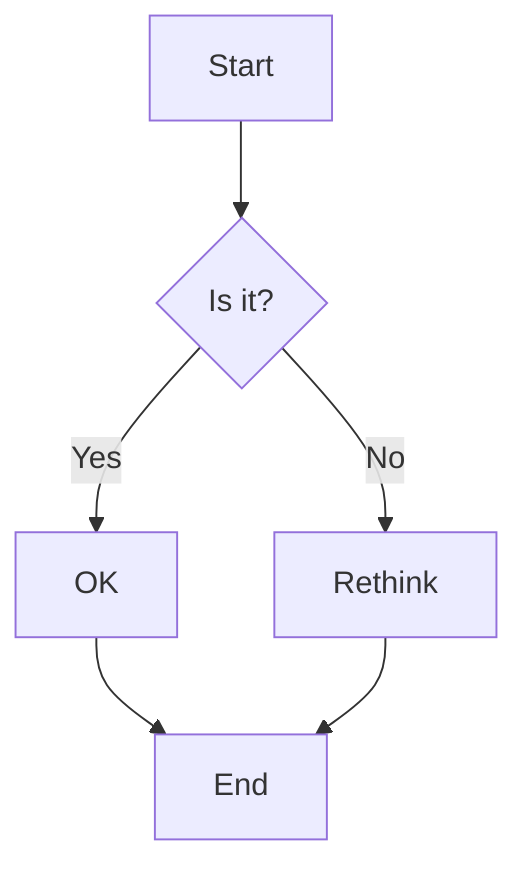

# Markdown 功能演示

这个页面展示了VitePress支持的所有Markdown扩展功能。

## 目录

[[toc]]

## 自定义容器

::: info 信息提示
这是一个信息提示框，用于展示一般性信息。
:::

::: tip 💡 小贴士
这是一个小贴士，提供有用的建议或技巧。
:::

::: warning ⚠️ 注意
这是一个警告提示，需要用户特别注意。
:::

::: danger 🚨 危险
这是一个危险提示，表示可能导致严重后果的操作。
:::

::: details 点击查看详细信息
这是一个折叠的详细信息块。

- 支持Markdown语法
- 可以包含代码块
- 也可以包含其他元素

```javascript
console.log('Hello VitePress!')
```

:::

## GitHub风格的提醒

> [!NOTE]
> 这是一个备注，用于强调重要信息。

> [!TIP]
> 这是一个技巧提示，帮助用户更好地使用功能。

> [!IMPORTANT]
> 这是重要信息，用户必须了解的关键内容。

> [!WARNING]
> 这是警告信息，提醒用户潜在的风险。

> [!CAUTION]
> 这是谨慎提醒，警告可能的负面后果。

## 代码块功能

### 语法高亮

```javascript
// JavaScript 代码示例
function greet(name) {
  console.log(`Hello, ${name}!`)
  return `Welcome to ${name}'s blog`
}

greet('VitePress')
```

### 行号显示

```python:line-numbers
# Python 代码示例
def fibonacci(n):
    if n <= 1:
        return n
    return fibonacci(n-1) + fibonacci(n-2)

# 计算前10个斐波那契数
for i in range(10):
    print(f"F({i}) = {fibonacci(i)}")
```

### 行高亮

```vue{3,7-9}
<template>
  <div class="demo">
    <h1>{{ title }}</h1>  <!-- 这行被高亮 -->
    <p>{{ description }}</p>
  </div>
</template>

<script setup>  <!-- 这些行被高亮 -->
import { ref } from 'vue'
const title = ref('VitePress Demo')  <!-- 这些行被高亮 -->
</script>
```

### 焦点模式

```typescript
interface User {
  id: number
  name: string
  email: string  // [!code focus]
}

function createUser(userData: User) {
  return {
    ...userData,
    createdAt: new Date()  // [!code focus]
  }
}
```

### 代码差异

```javascript
function calculate(a, b) {
  return a - b  // [!code --]
  return a + b  // [!code ++]
}
```

### 错误和警告

```javascript
function divide(a, b) {
  if (b === 0) {
    throw new Error('Division by zero')  // [!code error]
  }
  console.log('This might be slow')  // [!code warning]
  return a / b
}
```

## 代码组

::: code-group

```javascript [index.js]
// 主文件
import { createApp } from 'vue'
import App from './App.vue'

createApp(App).mount('#app')
```

```vue [App.vue]
<template>
  <div id="app">
    <h1>Hello VitePress!</h1>
  </div>
</template>

<script setup>
// Vue 组件
</script>
```

```css [style.css]
/* 样式文件 */
#app {
  font-family: 'Avenir', Helvetica, Arial, sans-serif;
  text-align: center;
  color: #2c3e50;
  margin-top: 60px;
}
```

:::

## 表格

| 功能 | 状态 | 描述 |
|------|------|------|
| 语法高亮 | ✅ | 支持多种编程语言 |
| 行号显示 | ✅ | 可选择性启用 |
| 代码复制 | ✅ | 悬停显示复制按钮 |
| 行高亮 | ✅ | 支持单行和范围高亮 |

## 表情符号

支持使用`:emoji:`语法：

:tada: :100: :heart: :rocket: :star2:

## 数学公式

内联数学：$E = mc^2$

块级数学：

$$
\frac{1}{\Bigl(\sqrt{\phi \sqrt{5}}-\phi\Bigr) e^{\frac25 \pi}} = 1+\frac{e^{-2\pi}} {1+\frac{e^{-4\pi}} {1+\frac{e^{-6\pi}} {1+\frac{e^{-8\pi}} {1+\ldots} } } }
$$

## 自定义组件

### 博客统计

<BlogStats />

### 时间线卡片

<BlogTimelineCard
  date="2024-12-25"
  title="Markdown功能演示"
  description="创建了这个全面的Markdown功能演示页面"
  :tags="['VitePress', 'Markdown', '演示']"
/>

## 徽章

<Badge type="info" text="信息" />
<Badge type="tip" text="提示" />
<Badge type="warning" text="警告" />
<Badge type="danger" text="危险" />

## 链接

- [内部链接](/content/about)
- [外部链接](https://vitepress.dev)
- [锚点链接](#目录)

---

这个页面展示了VitePress的强大Markdown功能，你可以在自己的文章中使用这些特性来创建丰富的内容。

## Mermaid 图表



