# 普通心理学

## 其他

### 1

#### 现代心理学的发展

> 心理学史
>
> - 柏拉图与亚里士多德的哲学思想之争
>   - 亚里士多德,约翰∙洛克:经验主义者
>     - 人们的心智生来是白板,通过在世界上的经验来获取信息
>   - 柏拉图,伊曼努尔∙ 康德:先天论者
>     - 人们生来便具有心理结构,对人们经验世界的方式产生了限制
>
> - 实验心理学实验室的建立
>   - 威廉∙冯特:建立了第一个正式的实验心理学实验室
>   - 爱德华∙铁钦纳:美国第一批心理学家之一
>   - 威廉∙詹姆士:<心理学原理>
>   - 斯坦利∙霍尔:美国心理学协会
>
> - 结构主义
>   - 对心理和行为的结构的研究
>   - 铁钦纳:内省法
>   - 存在的问题:简化论,元素论
>   - 马克思∙惠特海默:格式塔心理学
>
> - 机能主义
>
>   - 行为的机能或目的是什么
>
>   - 约翰∙杜威:美国教育领域的改革
>
> 作为先驱者的女性
>
> - 玛丽∙惠顿∙卡尔金斯
>   - 美国心理学协会的第一位女主席
>   - 创造了研究记忆的重要技术
> - 玛格丽特∙沃什布恩
>   - 第一位获得心理学博士学位的女性
>   - <动物心理>
> - 海伦∙汤普森∙伍利
>   - 智力和情绪测验的性别差异研究
> - 丽塔∙斯塔特∙霍林沃斯
>   - 智力的性别差异研究
>   - 智力极端儿童的研究

#### 心理学家做些什么

> 心理学家们做些什么,学位分布,工作场所
>
> - 认知心理学家
>   - 基本的认知过程,如记忆和语言  
> - 社会心理学家
>   - 塑造人们态度和行为的社会力量
> - 工业与组织心理学家
>   - 提升工作场所中人们的调适能力
> - 教育心理学家
>   - 教育环境下学生的调适能力
> - 临床心理学家
>   - 应用心理学知识来改善人们的生活

### 2

#### 成为有批判精神的研究消费者

- 避免把相关推论为因果.
- 要求关键术语和概念有操作性定义,这样人们才能对其含义有一致的理解.
- 在寻找证实性数据之前,首先要考虑如何反驳一个理论,假设或信念,因为只要你想证明它们合理,证据总能很容易找到.
- 不要轻信显而易见的解释,要不断寻找其他可能的解释,尤其在已有的解释会给提出者带来利益之时.
- 要认识到个人偏差会怎样歪曲对现实的感知.
- 要对复杂问题的简单答案以及复杂效应和问题的单一原因和解决方案保持怀疑.
- 对所有宣称有效的治疗,干预或产品保持质疑,找出其效果的对照基础:与什么相比?
- 心智开放,保持怀疑态度 :必须意识到,大多数结论是初步的而非确定的;寻找新证据以减少你的不确定感,同时对变化和修正保持开放态度.
- 挑战那些在做结论时使用个人观点取代证据且不接受建设性批评的权威.

## 1 生活中的心理学

### 心理学为独具特色

**心理学**:关于**个体**的**行为**及**心理**过程(心智过程)的**科学**研究

**科学方法**:由一套用来分析和解决问题的有序步骤组成,用客观收集到的信息作为得出结论的事实基础

**行为**:人和其他动物的可观察行为

**心理过程(心智)**:发生在个体内部的过程--思考,计划,归因,创造以及做梦

- 心理学的目标:

  - 描述发生的事情

    - 行为数据:关于有机体的行为以及行为发生条件的观察报告
    - 整合不同分析水平提供的信息
      - 复杂社会环境和文化环境中作为整体的人的行为

        - > 暴力,偏见的根源
      - 狭窄和精细的行为单元

        - > 对交通灯的反应速度
      - 更小的行为单元--生物基础

        - > 大脑中存储不同记忆类型的部位
    - 保证客观性
      - 排除主观观点--偏差,偏见和期望--的影响

  - 解释发生的事情
  
    - 大多数行为受到内部因素和外部因素的共同影响

      - #### 一个对于行为的解释

        > 解释一些人为什么开始吸烟?
  
        - 内部解释:个体的冒险倾向
        - 外部解释:大量的同辈压力
        - 综合解释:上述二者都是必不可少的
  
    - 通过一个潜在的原因解释多种行为(通常的目标)
  
    - 见多识广的想象力
  
      - 把已知和未知的事物创造性地整合起来
  
  - 预测将要发生的事情
  
    - 科学预测的措辞必须足够精确,以便能对其进行检验,若证据不支持就予以拒绝
    - 对于某些行为方式背后原因的准确解释,常常能让研究者对未来的行为做出准确的预测
  
  - 控制发生的事情
  
    - 控制意味着使行为发生或不发生--启动行为,维持行为,停止行为,以及影响行为的形式,强度或发生率
    - 如果我们根据一个对行为的因果解释能够创造出行为得以被控制的条件,那么这个因果解释就是令人信服的
    - 帮助人们提升生活质量的途径

- 心理学的观点

| 观点       | 研究的焦点             | 基本研究主题                               |
| ---------- | ---------------------- | ------------------------------------------ |
| 心理动力学 | 无意识驱力,冲突       | 作为无意识动机外显表达的行为               |
| 行为主义   | 特定的外显反应         | 行为及其刺激的原因和结果                   |
| 人本主义   | 人类的经验和潜能       | 生活模式,价值观,目标                     |
| 认知       | 心理过程,语言         | 通过行为指标推断心理过程                   |
| 生物学     | 脑与神经系统的加工过程 | 行为和心理加工过程的生物化学基础           |
| 进化       | 进化而来的心理适应性   | 从进化而来的适应性功能的角度来阐述心理机制 |
| 社会文化   | 态度和行为的跨文化模式 | 人类经验的普遍性方面和文化特异性方面       |

- 心理动力学观点
  - 人类的行为源于遗传的本能,生物驱力,以及为解决个人需要与社会要求之间的冲突而做的努力
  - 剥夺状态,生理唤起和冲突都为行为提供了力量
  - 西格蒙德∙弗洛伊德:行为有可能是由意识觉知之外的动机驱动的;强调儿童早期是人格形成的阶段
  
- 行为主义观点
  - 试图理解特定的环境刺激如何控制特定类型的行为
  - 强调严格的实验和严谨定义的变量
  - 约翰.华生,B.F.斯金纳
  
- 人本主义观点具体
  - 人是具有能动性的生物,本性善良而且具有选择能力,人类的主要任务是争取积极的发展
  - 卡尔.罗杰斯:积极关注
  - 亚伯拉罕.马斯洛:自我实现
  
- 认知观点
  - 关注人的思维以及所有的认识过程--注意,思考,记忆和理解,一些最重要的行为是从全新的思维方式中产生的
  - 在认知视角下,个体不是对客观的物质世界做出反应,而是对个体思维和想象的内在世界的主观现实作出反应.
  - 诺姆∙乔姆斯基:儿童语法的获得
  - 让∙皮亚杰:儿童的认知发展理论
  
- 生物学观点
  - 在基因,大脑,神经系统以及内分泌系统的机能中寻找行为的原因
  - 行为取决于生理结构和遗传过程,经验可以通过改变基础的生物结构和过程来改变行为.
  - 行为神经科学:试图理解诸如感觉,学习,情绪等行为背后的大脑过程
  - 认知神经科学:关注高级认知功能的脑机制,比如记忆和语言
  
- 进化观点
  - 心理能力和身体能力一样,经过了几百万年的进化以达成特定的适应性目标
  - 适应性问题:躲避食肉动物和寄生虫,采集和交换食物,寻找并留住配偶以及抚育健康的子女
  - 男性和女性所承担的不同性别角色
  
- 社会文化观点
  - 研究行为的原因和结果的跨文化差异
  
    - > 弗洛伊德的心理动力学理论中的很多方面都不能应用到与弗洛伊德时代的维也纳几位不同的其他文化中

## 2 心理学的研究方法

### 研究过程

1. 初始的观察或问题
2. 形成假设
3. 设计研究
4. 分析数据并得出结论
5. 报告研究发现
   1. 所有的数据和方法都必须接受公开检验
   2. 同行评审
   3. 向更广泛的公众传播科研结果
6. 考虑开放的问腿
7. 对开放的问题开展研究

**理论**(theory):一套用于解释一种现象或一系列现象的有组织的概念集合.

**决定论假设**(determinism):一切事件,包括生理的,心理的和行为的,都是特定原因的结果,或者是由其所决定的.

**假设**(hypothesis):对原因和结果关系的试探性的,可以检验的阐述.

**科学方法**:一套以能够限制误差源并得出可靠结论的方式收集和解释证据的一般程序.

**观察者偏差**:由观察者个人的动机和预期导致的错误.

> 观察者偏差起着过滤器的作用,一些事情被视为是相关的和重要的而获得注意,另一些则被视为无关和不重要的而被忽略

**标准化**:在数据收集的所有阶段均使用统一的,一致的程序.

**操作性定义**:以测量该概念或决定它是否存在的特定操作或程序来界定一个概念从而在实验内使其含义标准化.

> 一个实验中的所有变量都必须给予操作性定义

- 变量:任何在数量或性质上可以有不同取值的因素.
  - 自变量:被操纵的变量
  - 因变量:实验者所测量的变量

- 实验法
  - 研究者操纵一个自变量来观察其对因变量的影响
  - 优势:允许实验者得出关于变量间因果关系的判断
  - 劣势:人为控制的实验环境本身可能歪曲原本可自然发生的行为;参与者在知道被监控的情况下可能试图取悦研究者,尝试揣测研究的目的;有一些重要的问题受到伦理的约束而不可能实施

**混淆变量**:并非实验者有意引入到实验情境中的一些因素确实影响了参与者的行为,并混淆了数据的解释.

**期望效应**:研究者或观察者以微妙的方式向参与者传达他所预期发现的行为,并因此引发期望的反应.

**安慰剂效应**:因个体相信治疗有效而导致的健康或幸福感的改善.

> 当没有施加任何一种实验操纵,但实验者却改变了他们的行为.

**控制程序**:一些试图使所有变量和条件(除了那些与被验证的假设相关的)保持恒定的方法

**双盲控制**:实验助手和参与者都不知道哪些参与者接受了何种处理

**安慰剂控制**:引入一个不进行任何处理的实验条件

- 研究设计
  - **被试间设计**:参与者被随机分配到实验条件和控制条件
  - **代表性样本**:在性别,种族等方面的分布都与总体的特征非常吻合的样本
  - **随机取样**:总体的每个成员参与实验的可能性都是相等的
  - **被试内设计**:利用每一个参与者作为自己的控制组

**相关法**:用于确定两个变量,特质或者属性之间的关联程度(相关不意味着因果关系)

### 心理测量

**信度**:心理测验或实验研究得到的行为数据的一致性和可靠性(可重复性)

**效度**:研究或测验得到的信息准确地测量了研究者想要测量的心理变量或品质(预测性)

- 自我报告法:通过言语(手写或口述)回答研究者提出的问题.
  - 获得无法直接观察到的经验的数据(包括内部的心理状态和外部行为)
  - 问卷法和访谈法
  - 局限性
    - 不适用于语言能力受限的参与者
    - 参与者可能错误理解问题或不能清楚地记得过去的经历
    - 受到社会期望的影响
    - 参与者可能说谎或捏造事实
    - 访谈的情境会产生个人偏见和成见

**行为测量**:研究外显行为和可观察,可记录的反应的方法

- 观察
  - 直接观察:清晰可见的,外显的,容易记录的行为(面部表情)
  - 技术辅助的间接观察(计算机:反应时,脑成像技术:大脑的活动)
  - 自然观察:研究者观察一些自然发生的行为而不试图改变或干涉它

许多研究结合使用自我报告法和行为观察法

**个案研究**:集中在个体或小群体上进行各种测量(有时对特殊个体进行透彻分析有助于理解人类经验的普遍特性)

### 人类和动物研究中的伦理问题

- 知情同意(签署同意书)
  - 告知将要经历的程序以及参与研究的潜在风险和利益
  - 确保参与者的隐私得到保护
  - 提前告知参与者可以在任何时间停止实验,没有任何处罚
- 风险/收益的评估
  - 把风险降至最低程度
  - 把风险告知参与者
  - 采取适当的防范措施应对可能的强烈反应
- 故意欺骗(不让参与者事先知道研究的目的)
  - 研究必须具有充分的科学价值和教育价值
  - 如果研究有很高的可能性导致参与者身体疼痛或严重的情绪痛苦,那么研究者一定不能欺骗参与者
  - 必须证明除了欺骗之外,没有任何同等有效的替代研究程序
  - 研究者必须在研究结束后,对参与者解释实验中欺骗
  - 参与者在欺骗得到解释后,必须有机会收回自己的数据

事后解释:尽可能多地提供有关该研究的信息,确保参与者离开时没有疑惑,心烦或尴尬.

- 动物实验
  - 获益
    - 可以进行一些非常重要的突破性研究,如药物成瘾等
    - 有利于动物本身,如更好的治疗方法等
  - 3R原则:
    - 减少所需的动物数量(reduce)
    - 替换动物的使用(replace)
    - 改善实验步骤以使疼痛和不适降至最小(refine)

### 理解统计学:分析数据并得出结论

描述统计:以一种客观的,统一的方式使用数学程序来描述数值型数据的不同方面

推论统计:利用概率论来确定一组数据完全因随机变异而出现的可能性

- **集中量数**:可作为一组参与者最典型分数指标的单个代表性分数
  - 中数
  - 众数
  - 平均数
- **差异量数**:描述围绕在集中量数周围的分数分布情况的统计量
  - 全距
  - 标准差
  - 方差
- 相关
  - 相关系数:关于两个变量之间相关程度和性质的度量
  - 绝对值反应相关性大小,正负反应相关性方向
- 正态曲线
  - 当从大量个体身上收集关于某个变量的数据时,数据的分布常常符合正态曲线
  - 完全由随机因素造成的差异也符合正态曲线
- 统计显著性
  - 当差异由随机所致的概率不足5%时,(以p<0.05来表示),心理学家将接受这个差异为"真".
  - 检验方法的选择取决于研究设计,数据类型以及样本的大小
  - t检验:考察两组数据的均值差异是否达到统计上的显著性
- 成为一个明智的统计学消费者
  - 参与者群体的选择会对结果造成很大的影响
  - 当数据不能满足统计学的基本假设时(如有极端值), 统计分析会得出一些误导结果
    - 检查样本的大小
    - 同时检查中数,众数以及平均数
  - 研究应当报告样本大小,变异量数以及显著性水平

## 3 行为的生物学和进化基础

### 遗传和行为

> 心理学研究的主要目标之一是发现各种人类行为产生的原因.
>
> 天性和教养,或者说遗传与环境,是心理学对因果解释的一个重要维度.
>
> 物种的多样性反映了自然选择的作用.

- 基因型:个体的全部基因组合(基因结构)

- 表型:个体的外表和行为模式
- 自然选择的发生
  1. 环境压力(环境的变化)
  1. 竞争(为了获得资源)
  1. 最适表型得到选择(从各种表型之中)
  1. 繁殖成功(最适表型相应的基因型传递给下一代)
  1. 基因型(和表型)的频率增加(在下一代中)

- 两足化和大脑化是人类的两大适应性进化
  - 两足化:直立行走的能力;直立行走使得人类的祖先可以探索新资源和开发新环境.
  - 大脑化:脑容量的增大,发展出复杂的思考,推理,记忆和计划能力(TIMS)

- 语言的出现是人类进化的下一个里程碑,也是文化进化的基础

- 遗传:从祖先那里对生理和心理特质的继承(研究遗传机制的学科:遗传学)
  - 遗传的基本单元是基因,基因与环境之间存在交互作用,共同影响表型特征.

> 遗传力:亲代性状传递给后代的能力大小

- 基因组:一个有机体的基因组是指染色体上基因以及相关DNA的全部序列.

> 人类行为遗传学:结合遗传学和心理学来探究遗传和行为之间的因果联系,==关注个体差异的来源==(关注于估计特定人类性状或行为的遗传力 (heritability))

- 研究方法:收养研究,双生子研究
  - 收养研究尽可能多地收集儿童亲生父母的信息,随着儿童的成长,研究者评估这些儿童与其亲生父母以及养父母之间的相似性(前者反应遗传的作用,后者反映了环境的作用)
  - 比较同卵双生子和异卵双生子在**特定特质**或**行为**上的相似性(食物偏好的遗传力)

### 神经系统的活动

- 神经元是神经系统的基本单元,接受,加工和传递信息到其他细胞,腺体和肌肉
  - 神经元的结构
    - 树突:接受从感受器或其他神经元发出的刺激
    - 胞体:维持细胞的生命,整合从树突接收的刺激
    - 轴突:向外延展的纤维,将整合后的**信息**传递出去
    - 终扣:轴突末端膨大的球状结构

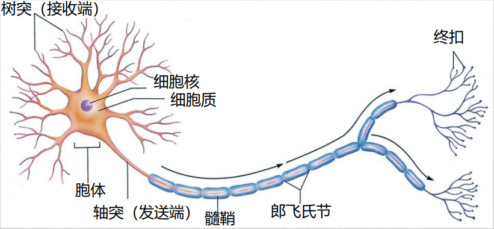

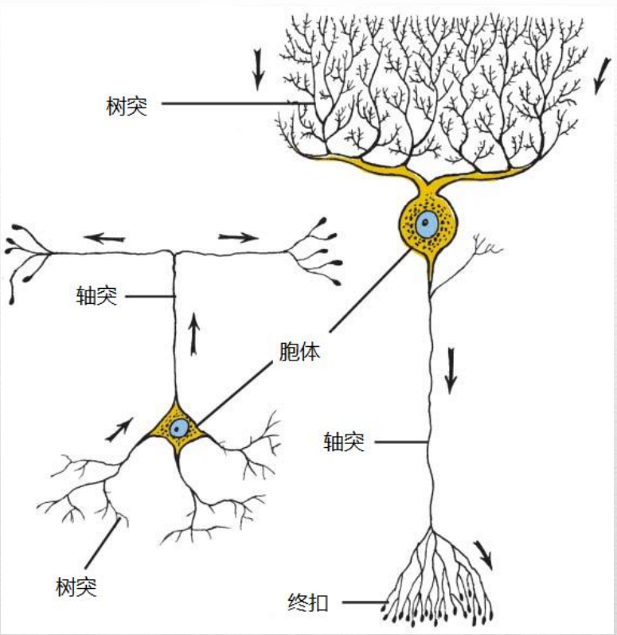

- 感觉神经元:携带来自感受器细胞的信息向内传至中枢神经系统

- 感受器:高度特化的细胞,对光线,声音或身体姿势等非常敏感

- 运动神经元:携带来自中枢神经系统的信息向外传至肌肉和腺体

- 中间神经元:(大脑中的绝大多数)将来自感觉神经元的信息,再传递到其他中间神经元或运动神经元
- 镜像神经元:观察其他个体执行动作时模拟相同动作以理解其行为意图

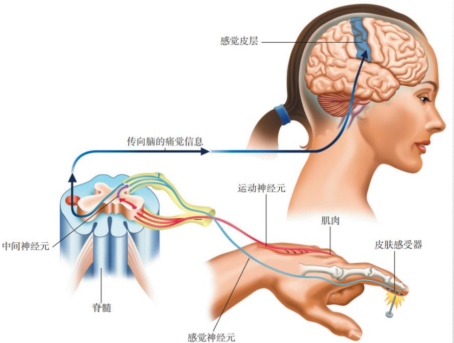

- 胶质细胞

  - 固定神经元的位置

  - 帮助新生的神经元找到其在脑中的适当位置(发育过程中)
  - 清理脑内环境,清除受损或死亡的神经元留下的废物;吸收过量的神经递质和神经元间隙的其他物质
  - 绝缘作用,形成髓鞘增加神经信号的传导速度
  - 被称为星形胶质细胞的特化胶质细胞构成血脑屏障阻碍有毒有害物质(非脂溶性物质)

- **静息电位**:细胞内液相对细胞外液具有70mv的负电压的极化电位

- **动作电位**:

   1. 在静息状态下,轴突周围液体的离子浓度不同于轴突内部的液体.正因如此,细胞内液发生相对细胞外液的极化,产生神经元的静息电位.

   2. 当神经冲动到达轴突的一个节段时,带正电的钠离子流入轴突.钠离子的内流导致神经元变成去极化.随着每个**节段**依次变成去极化,神经冲动沿着轴突向下传递.(离子通道)

       1. 1. > 兴奋性输入引起离子通道允许钠离子流入细胞=>导致细胞发放
             >
             > 抑制性输入引起离子通道努力保持细胞内呈现负电位=>阻止细胞发放

   3. 一旦神经冲动传过,钠离子流出轴突,则静息电位得以恢复.(泵出)

   4. 一旦恢复静息电位,轴突的这个节段就准备好了传递下一个冲动.

- **全或无定律**:阈值以上,动作电位的大小不受刺激强度增加的影响;一旦兴奋性输入的总和达到阈值,统一大小的动作电位便会产生;如果未达到阈值水平,动作电位就不会产生.

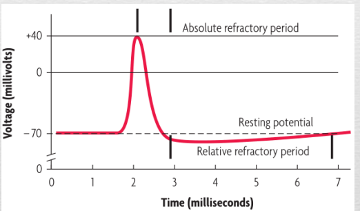

- 不应期
  - 绝对不应期:无法引发动作电位
  - 相对不应期:只对比平常发放所需强度更加强烈的刺激作出反应

- 在轴突覆盖髓鞘的神经元上,动作电位从一个节点向下一个节点跳跃式传导.(节省时间;节省在轴突各个位置的离子通道开闭所需的能量)

> 多发性硬化症:由于髓鞘退化而引起的严重障碍.症状:复视,震颤,最终导致瘫痪.来自身体免疫系统的特化细胞侵害了有髓鞘的神经元,使轴突裸露出来破坏了正常的突触传递.

- 突触
  - 突触前膜:发出信息神经元的终扣
  - 突触后膜:接收信息神经元的树突和胞体的表面

- 神经递质与镶嵌在突触后膜上的受体分子结合的条件:不能有其他神经递质或化学分子附着在受体分子上;神经递质的形状必须与受体分子相匹配
  - 去处:被突触前终扣重新吸收;在酶的作用下分解

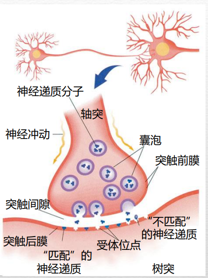

- 乙酰胆碱:兴奋性神经递质,引起肌肉收缩,存在于中枢和外周神经系统
  - 阿尔兹海默症(记忆**丧失**,分泌乙酰胆碱的神经元退化)

- γ-氨基丁酸 (GABA):脑中最普遍的抑制性神经递质,可能多达1/3的脑部突触使用GABA作为信使,对其敏感的神经元特别集中于丘脑,下丘脑和*枕叶皮层*等脑结构中
  - 焦虑或抑郁:苯二氮䓬类药物可提高GABA的活性(帮助与突触后分子结合)

- 谷氨酸:脑中最普遍的兴奋性神经递质,因为有助于在脑中传递信息,所以它在情绪反应,学习和记忆过程中起着关键作用
  - 谷氨酸受体不能正常工作时,学习的进程会变慢;
  - 谷氨酸水平的紊乱与多种心理障碍有关,包括精神分裂症;
  - 在药物,酒精和尼古丁成瘾中起作用
  
- 多巴胺,去甲肾上腺素(儿茶酚胺类),5-羟色胺
  - 多巴胺和去甲肾上腺素在心理障碍中起到重要作用,如焦虑障碍,心境障碍和精神分裂症.
  - 增加脑内去甲肾上腺素水平的药物可以提升心境和减轻抑郁,精神分裂症的病人脑中多巴胺高于正常水平(降低多巴胺水平以治疗)
  - **所有**产生5-羟色胺的神经元都位于脑干,这一结构与唤醒以及许多自主过程有关(致幻剂LSD似乎通过抑制5-羟色胺神经元而产生效应,正常情况下它们会抑制其他神经元)

- 内啡肽:神经调质:能够改变或调节突触后神经元活动的物质
  - 内源性吗啡的简称,在情绪行为(焦虑,恐惧,紧张和愉悦)和疼痛的控制具有重要作用
  - 纳洛酮可以阻断吗啡和内啡肽与受体的结合(检验内啡肽在针灸和安慰剂的镇痛效应中至少有部分作用的可能性)

### 生物学和行为

对脑的干预

- 损伤:
  - 盖奇:脑损伤,心理变化
  - 布洛卡区:语言障碍(tan)
  - 动物损伤实验(控制脑损伤的部位和程度)
- 重复经颅刺激(rTMS):使用磁刺脉冲来对人类参与者造成暂时的可逆损伤,而不需要对实际组织造成损害就可以干预特定脑区的活动的程序
- 直接刺激脑区(猫):沃尔特.赫斯:电极的位置不同,迅速开闭可引起睡眠,性唤起,焦虑或恐惧.

大脑活动的记录和成像

- 脑电图(EEG):在头皮上放置电极,记录大范围整合性的电活动模式
- 计算机断层扫描术(CT|CAT)
- 正电子发射断层扫描术(PET)
- 磁共振成像(MRI)
- 功能性磁共振成像(fMRI)

### 神经系统

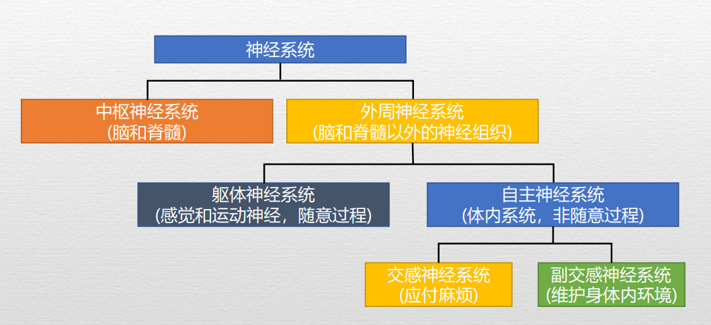

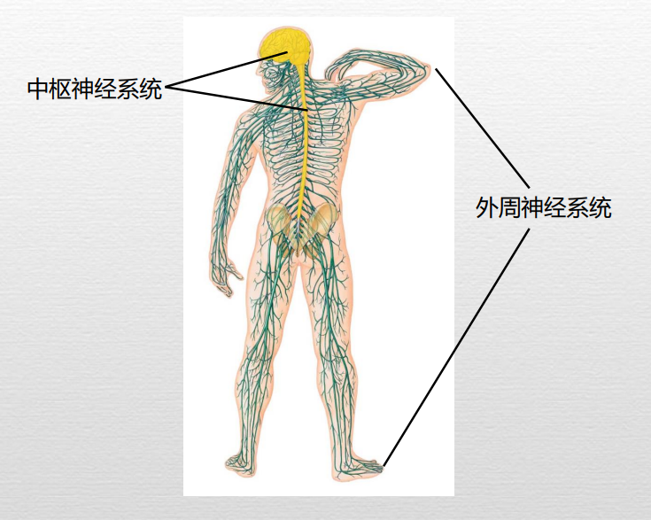

- 中枢神经系统(CNS)由脑和脊髓中的所有神经元组成.
- 外周神经系统(PNS)由所有构成神经纤维的神经元构成,这些神经纤维把CNS和身体联系起来.
- 中枢神经系统的工作是整合和协调所有的身体功能,加工全部传入的神经信息,向身体的不同部位发出指令.
- PNS把来自感受器的信息提供给CNS,并传递脑对身体器官和肌肉的指令.

- 脊髓
  - 中枢神经系统发出和接收神经信息是通过脊髓而实现的.
  - 脊髓是将脑与外周神经系统联系起来的神经元干线,它位于脊柱的椎管内.
  - 脊神经从脊柱的每对椎骨之间的脊髓发出,最终遍及全身的各种感受器,肌肉和腺体联系起来.
  - 脊髓协调身体两侧的活动,并负责不需脑参与的简单且动作迅速的反射.
  - 脊髓的神经受损会导致腿部或躯干的瘫痪,瘫痪的范围取决于脊髓受损部位的高度,损伤的部位越高,造成的瘫痪范围越大.

- 躯体神经系统(SNS):调节骨骼肌的动作
- 自主神经系统(ANS):维持机体的基本生命过程,应对两种状态
  - 机体受到威胁:交感神经:逃跑或战斗反应
  - 维持常规身体状态:副交感神经:常规维护

交感神经系统的神经纤维从脊髓发出或传入脊髓的途中,会连接到神经节,即特化的神经链簇.

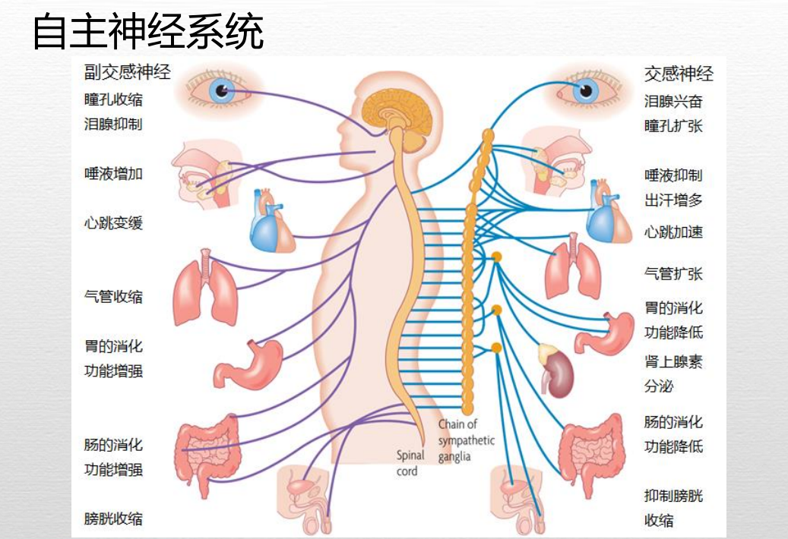

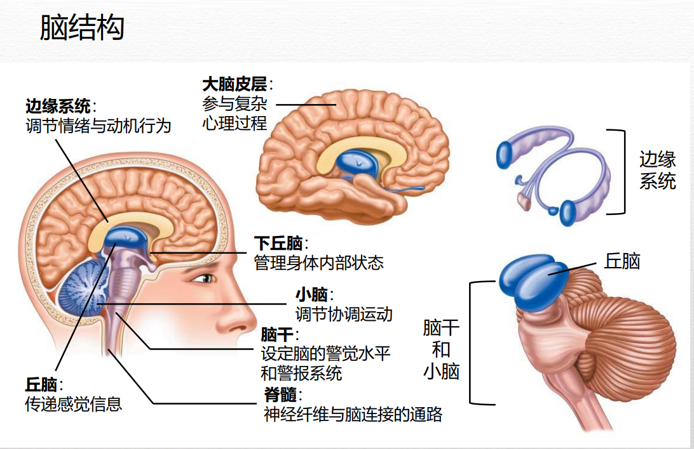

- 脑干,丘脑和小脑
  - 脑干:综合调节机体内部状态的脑结构;主要与自主过程如心率,呼吸,吞咽和消化等功能有关
  - 延髓:位于脊髓的最上端,是呼吸,血压和心跳调节中枢(延髓的损伤是致命的),从身体发出的上行神经纤维和从脑发出的下行神经纤维都在延髓发生交叉(解释了为何身体左侧与大脑右侧相连,etc.)
  - 脑桥:紧贴延髓之上,提供传入纤维到其他脑干结构和小脑中.
  - 网状结构:一类致密的神经细胞网络,(脑的哨兵)唤醒大脑皮层去注意新刺激,甚至在睡眠中也保持脑的警觉反应(该区域的大面积损伤会导致昏迷),其有伸向丘脑的长纤维束,传入的感觉信息通过丘脑到达大脑皮层的适当区域,并在那里进行进一步的加工.
  - 小脑:与脑干相连,位于头骨基底部,协调身体的运动,控制姿势并维持平衡.(更多的功能:学习和执行身体运动序列,还可能与一些高级的认知功能有关,如语言加工和痛觉体验)
- 边缘系统:与动机行为,情绪状态和记忆过程相关.它也参与体温,血压和血糖水平的调节,并执行其他体内环境的调节活动.
  - 海马:边缘系统中最大的脑结构,在记忆获得中发挥重要作用({H.M.}  切除部分海马:难以形成新的记忆)
  - 杏仁核:在情绪控制中起作用(损伤对于精神活跃的个体产生镇静效应)(损害对于特定面部表情的识别:带有悲伤和恐惧等负性情绪)在带有情绪内容的记忆的形成和提取中发挥重要作用
  - 下丘脑:脑内最小的结构之一,由几个神经核团组成,即调节与动机行为(包括进食,饮水,体温调节和性唤起)有关的生理过程的小神经元束;下丘脑维持着身体内稳态.

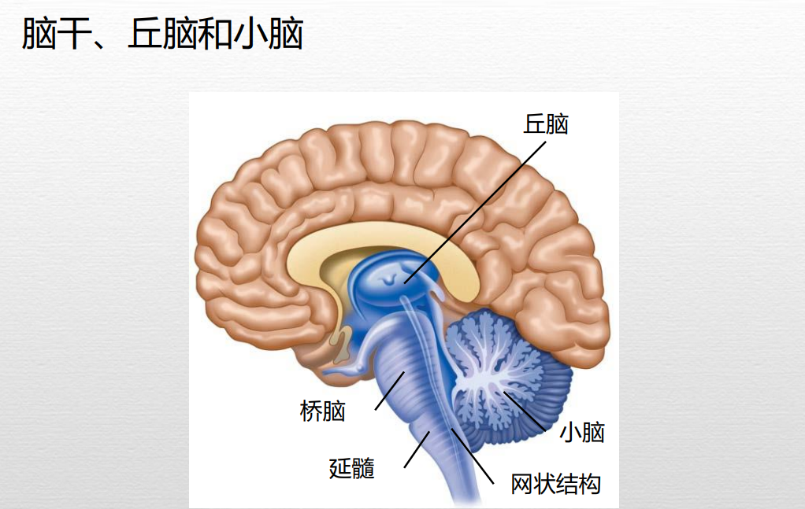

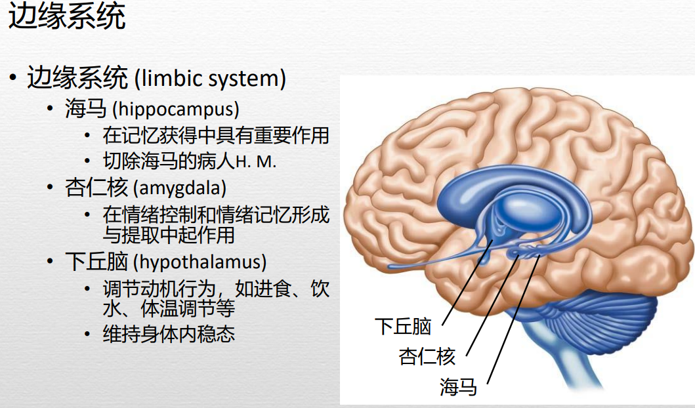

- 大脑皮层:全部的心理过程发生的场所,整合感觉信息,协调你的运动,促成抽象思维和推理.
- 大脑:大脑分成左右对称的两半,称为大脑半球;两个半球被大量神经纤维连接起来,这些纤维总称为胼胝体,这个通路负责在两个半球之间来回传递信息.
  - 额叶:参与运动控制和认知活动,如计划,决策,设定目标,位于外侧裂之上和中央沟之前(盖奇,布洛卡区,损伤会对人的行为和人格产生毁灭性影响)
  - 顶叶:负责触觉,痛觉和温度觉,位于中央沟之后
  - 枕叶:视觉信息到达的部位,位于头的后部
  - 颞叶:负责听觉过程,位于外侧裂下部,即每个大脑半球的侧面(包括维尔尼克区:生成的言语流畅无意义,言语的理解能力受到了损害)
  - 每个脑结构合作完成它们的功能,但是有的功能有必须的区域,当这些区域受损时,它们的功能就遭到破坏或完全丧失.
  - 额叶运动皮层:身体的随意肌有600余块,其活动受到正好位于中央沟之前的额叶运动皮层的控制
    - 脑一侧发出的命令传向身体对侧的肌肉,身体下部的肌肉受到运动皮层顶部神经元的控制,身体上部的肌肉受运动皮层下部神经元的控制
    - 与身体下部相比,身体上部从皮层得到精细得多的运动指令
    - 运动皮层的两个最大区域负责支配手指(尤其是大拇指)以及言语相关的肌肉活动(反映了操作物体,使用工具,进食和谈话等这些人类活动的重要性)
  - 躯体感觉皮层:加工温度,触觉,躯体位置和疼痛的信息
    - 感觉皮层的上部与身体下部相关,皮层下部与身体上部相关
    - 感觉皮层的大部分区域用于加工来自唇,舌,拇指和食指的感觉信息
    - 听觉信息由听皮层加工,位于两侧颞叶
    - 视觉传入由位于大脑后部枕叶的视皮层进行加工(视皮层的最大区域接受眼后部视网膜中心区的传入信息,这里传递的视觉信息最为详细)
  - 联络皮层:将不同感觉通道的信息结合起来,用于计划对外界刺激做出适当反应

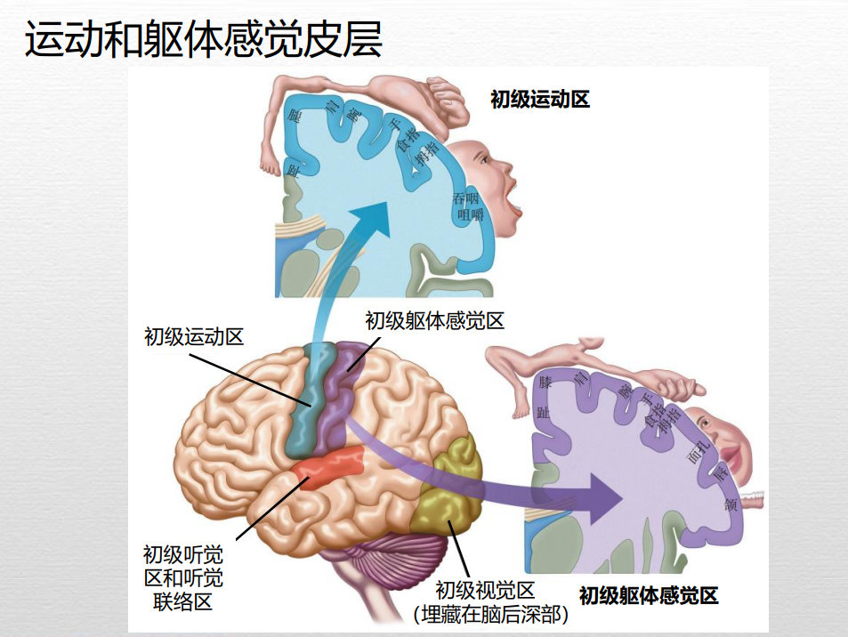

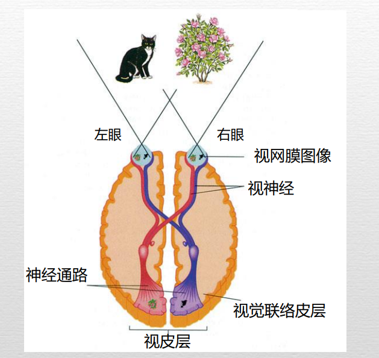

- 半球功能偏侧化:某些功能会偏侧化到一侧大脑半球(大多数个体的言语功能位于左半球)

- 裂脑病人研究(实验内容和结论)
  - q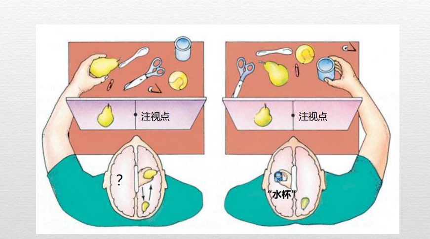

> 当一个裂脑病人用左手去寻找与快速闪现在左视野的图片相匹配的物体时,他可以成功做到,因为他的视觉信息和触觉信息都进入到右半球
>
> 病人不能说出这个物体的名字,因为言语主要是左半球的功能
>
> 要求同一个病人用右手完成相同的任务,他不能利用触觉成功地找出物体,因为视觉信息和触觉信息是在不同的半球加工的
>
> 病人可以说出物体的名字

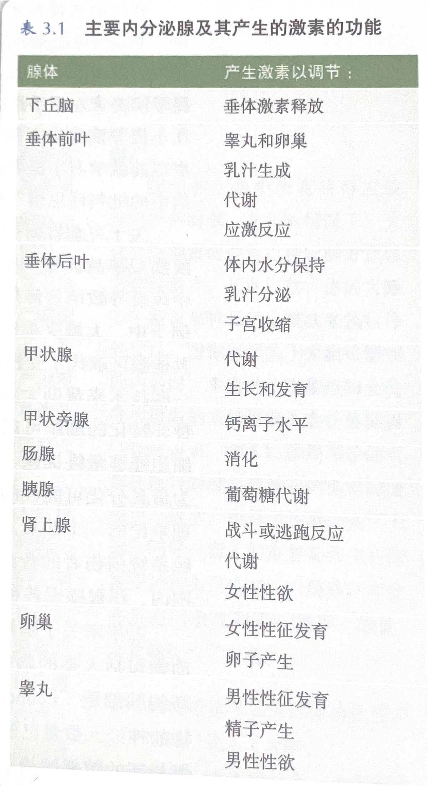

- 内分泌系统:辅助神经系统的工作(分泌激素到血液中)
  - 激素协助调节生长,第一性征和第二性征的发育,以及协助调节代谢,消化和唤醒水平.

- 下丘脑:内分泌系统与中枢神经系统间的中转站

- 脑垂体:(通常被称为"主腺体")产生约10种影响其他分泌腺分泌的激素,以及一种影响生长的激素
  - 促性腺激素  -> 睾酮:精子的产生,提高攻击欲和性欲
  - 卵泡刺激素(FSH)和黄体生成素(LH)-> 雌激素:促使女性的卵巢释放卵子,使其具有生育力

- 神经发生:自然产生的干细胞发育成新的脑细胞

- 可塑性:新的细胞生长和生活经验能够在出生之后重塑大脑

## 4 感觉与知觉

### 关于世界的感觉知识

- 知觉
  - 定义:理解环境中客体和事件的所有过程--感觉它们,理解它们,识别和标记它们,以及准备对它们作出反应
  - 功能:生存和感官享受
- 知觉的三个阶段
  - 感觉:感受器受到刺激后产生神经冲动以反映身体内外经验的过程
  - 知觉组织:大脑整合来自感官的证据以及对世界的已有知识,形成对外部刺激的内在表征;通常在没有意识觉知的情况下迅速而有效地完成
  - 辨别和识别:赋予知觉物以定义;辨认问题(这个客体是什么?)识别问题(这个客体是干什么用的?)
- 远距刺激:环境中的物理客体
- 近距刺激:客体在视网膜上的光学成像
- 知觉任务:从近距刺激辨认远距刺激

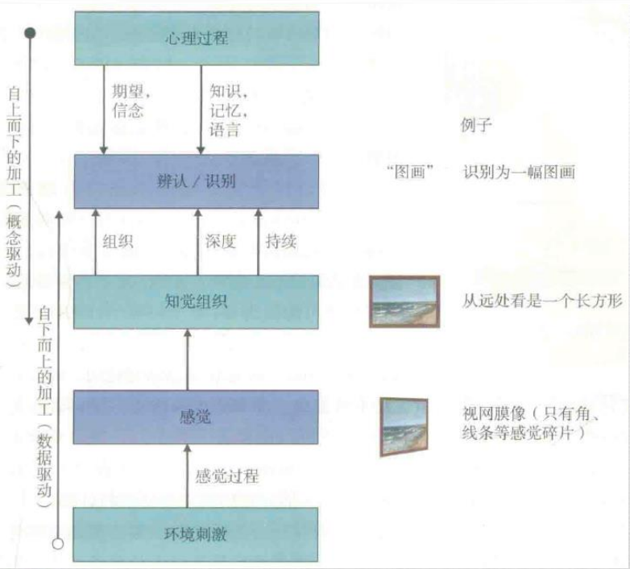

- 心理物理学:研究物理刺激与其引发的行为或心理体验之间的关系

- 绝对阈限:产生感觉体验所需的最小物理刺激量
  
- > [!note]
  >
  > 绝对阈限是**物理量**
  
  - 测量方法:刺激以不同的强度呈现,每一试次观察者都要回答是否觉察到刺激
  - 操作性定义:在一半的测试中能够觉察到感觉信号存在的刺激水平


- 心理测量函数
  - 在每一种刺激强度(横坐标)下刺激被觉察到的百分数(纵坐标)的曲线
  - 通常是S型曲线
    - 观察者在每次刺激觉察过程中会发生微小变化(由于注意,疲劳等)
    - 观察者有时没有觉察到刺激也会进行反应
    - 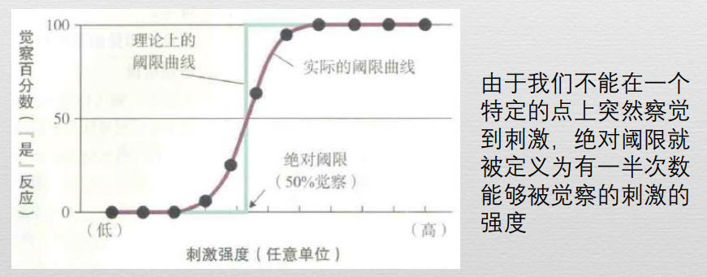

- 感觉适应:感觉系统对持续的刺激输入反应逐渐减弱的现象;更快速地对新信息源的挑战产生注意和作出反应

- 反应偏差:由一些与刺激的感觉特性无关的因素,观察者偏好以特定方式进行反应的系统倾向

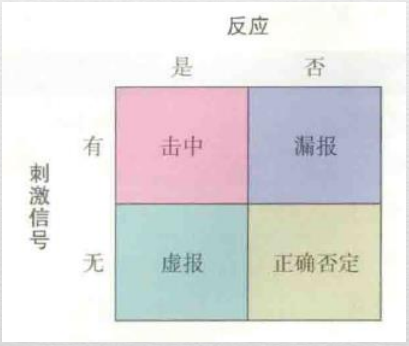

- 信号检测论
  - 解决反应偏差问题的一种系统方法
  - 区分感觉觉察的两个独立的过程
    - 感觉过程:观察者对刺激强度的感受性
    - 决策过程:观察者的反应偏差
- 差别阈限(最小可觉差,JND)
  - 能够识别出的两个不同刺激之间的最小物理差异
  - 测量方法:使用一对刺激,改变这两个刺激间的差异,要求观察者判断两个刺激是否相同
  - 操作性定义:有一半次数觉察出差异的的刺激差值
  - 韦伯定律:刺激之间的最小可觉差与标准刺激强度的比值是恒定的(用于最小可觉差,与绝对阈限区分开)
  - > [!note]
    >
    > 标准刺激是人为指定的,并不是一成不变的
    >
    > 最小可觉差也是**物理量**
  - 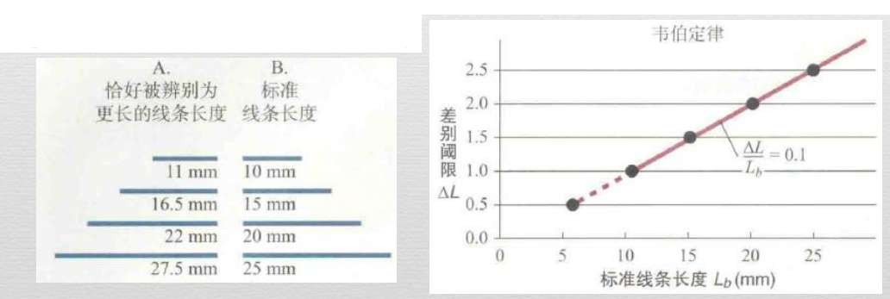
  - 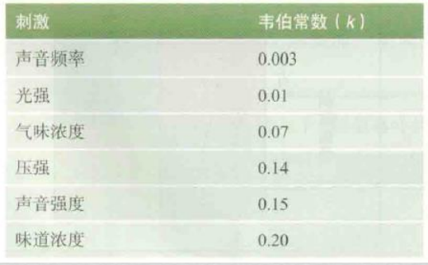

换能:从一种物理能量形式(如光)到另一种形式(如神经冲动)的转换

- 感觉系统的信息传递过程
  - {感受器}把物理形式的感觉信号转换为能够被神经系统加工的细胞信号,这些细胞信号向更高水平的神经细胞提供信息.
  - {神经细胞}整合不同的感受器单元的信息,提取关于刺激的基本性质的信息(刺激的大小,强度,形状和距离).
  - 在感觉系统的更深处,信息被整合为更复杂的编码,传递到{大脑的特定的感觉皮层和联合皮层}

### 视觉系统

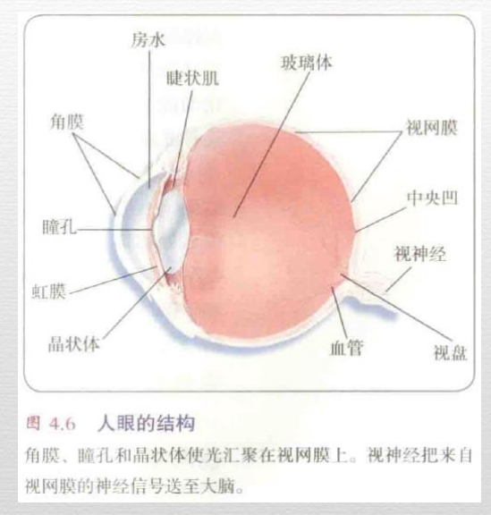

- 瞳孔:光线通过瞳孔进入眼睛(瞳孔大小:控制进入眼球的光线量)
- 晶状体:通过瞳孔的光线进晶状体聚焦到视网膜,使图像左右反转且上下颠倒
- 调节:睫状肌可以改变晶状体的厚度,使近处或者远处的客体聚焦在视网膜上(近视:焦点落在视网膜之前,远视:焦点落在视网膜之后)
- 视网膜
  - 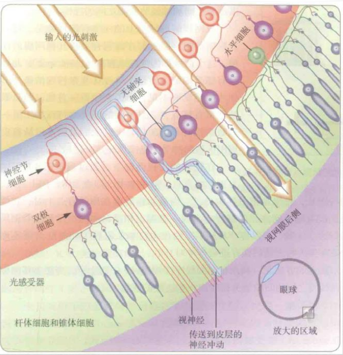
  - 光感受器:锥体细胞和杆体细胞
    - 锥体细胞:在明亮而充满色彩的白天功能最佳
    - 杆体细胞:在近乎黑暗时拥有最佳功能
    - 暗适应:光线条件从光亮转为黑暗后眼睛感受性逐渐提高的过程,其产生是由于在黑暗中停留一段时间后,杆体细胞比锥体细胞变得更敏感,杆体细胞能对环境中微弱的光作出反应
    - 中央凹:只有密布的锥体细胞,对颜色和空间细节在这里被最准确地探测到
    - 双极细胞:整合来自多个感受器的神经冲动,并将结果传递到神经节细胞
    - 神经节细胞:整合来自一个或多个双极细胞的冲动,形成单一的发放频率(纵向连接);神经节细胞的轴突组成视神经,将眼睛外面的视觉信息传递到大脑
    - 水平细胞&无长突细胞:(横向连接)水平细胞把感受器相互连接起来,无长突细胞则负责双极细胞之间和神经节细胞之间的连接
    - 盲点:(没有感受器)一只眼睛的感受器可以登记另一只眼睛看不到的信息;大脑会用盲点周围区域恰当的感受信息来填充这一区域

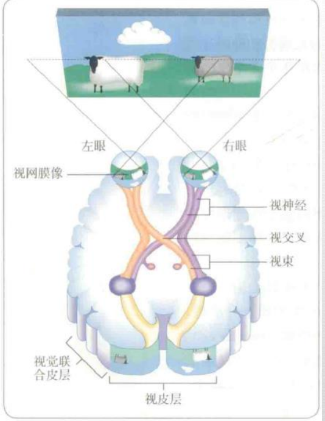

视觉系统的神经通路:视神经,视交叉,视束,外侧膝状体核(丘脑内的一个结构),初级视觉皮层

视觉分析的两个通路:模式识别(是什么)和位置识别(在哪里)(脑损伤可能影响模式通路或位置通路,或者影响两个通路之间的交流,从而产生一些不同的障碍,统称为失认症)

- 感受野:**一个细胞**的感受野是其输入刺激所对应的视野区域(感受器)
  - 神经节细胞:对特定大小的光斑有最强反应
    - (皮层)简单细胞:对特定朝向的光棒有最强反应
    - (皮层)复杂细胞:对运动着的特定朝向的光棒有最强反应
    - (皮层)超复杂细胞:对运动着的有特定长度或特定运动角度的光棒或者运动中的角或顶点有最强反应
  - 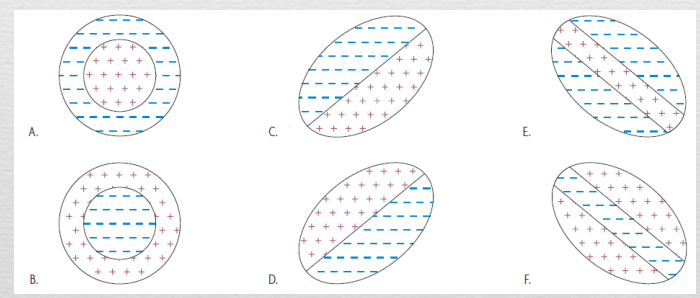

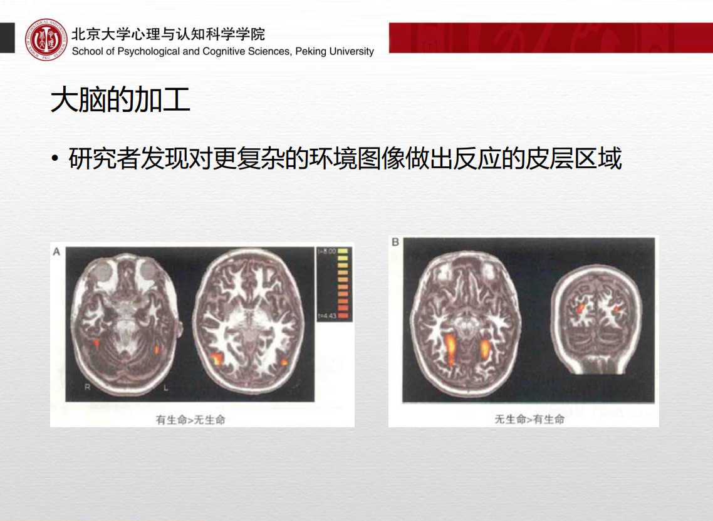

- 颜色视觉
  - 可见光;400 nm - 700 nm
  - 特定物理波长的光线产生特定的颜色体验(三个维度:色调,饱和度,明度)
    - 色调:描述光的颜色的维度
    - 饱和度:描述颜色感觉纯度的维度
    - 明度:描述颜色强度的维度
    - 加法颜色混合(光),减法颜色混合(颜料)
    - 互补色:色环上直接相对的两种波长的光
    - 颜色的视觉后像
    - 色盲:部分或完全不能分辨颜色(红绿色盲(大部分),黄蓝色盲(很少),完全没有颜色体验(最少))
- 三原色理论
  - 三种类型的颜色感受器:红绿蓝
  - 所有的其他的颜色都是由这三种基本感觉相加或相减混合得到的
  - 对应的生理结构:视网膜上存在三种锥体细胞
- 拮抗加工理论
  - 三个基本系统,每个系统包含两种拮抗成分:红绿,蓝黄,黑白
  - 颜色的视觉后像
  - 色盲的颜色类型成对出现
  - 对应的生理结构:一些神经节细胞接受来自红光的兴奋性输入和来自绿光的抑制性输入,而另一些细胞的兴奋和抑制模式是相反的,从而构成红绿拮抗加工系统

### 听觉系统

- 声音的心理维度
  - 音高:声音的高低,由频率决定
  - 响度:声音的强度,由振幅决定
  - 音色:反应了复合声波的成分

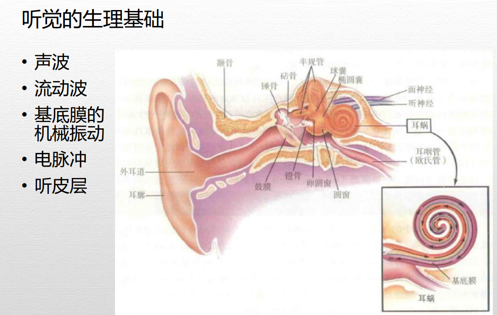

四个基本的能量转换:

1. 空气中的声波必须在耳蜗中转换为流体波
2. 流体波必须导致基底膜产生机械振动
3. 振动必须转化为电脉冲
4. 电脉冲必须传入听皮层

- 听觉障碍
  - 传导性耳聋(空气振动传导到耳蜗的过程中出现问题)
  - 神经性耳聋(在耳中产生神经冲动或将神经冲动传导到听皮层的神经机制存在缺陷或听皮层损伤)
- 音高知觉理论
  - 地点说:基底膜发生最大刺激的特定位置(适用于1000Hz以上的音高知觉)
  - 频率说:基底膜振动的频率(适用于5000Hz以下的音高知觉,齐射原理)
- 声音定位
  - 两耳时间差
  - 两耳强度差

### 其他感觉

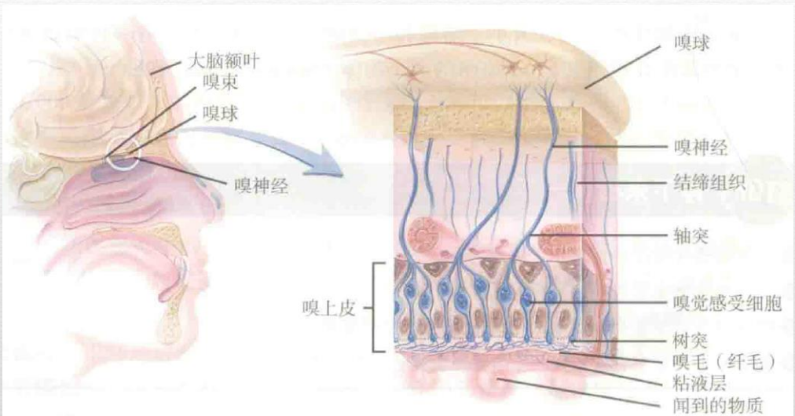

- 嗅觉
  - 发现和定位食物
  - 探测潜在的危险源
  - 有效的交流形式(信息素)

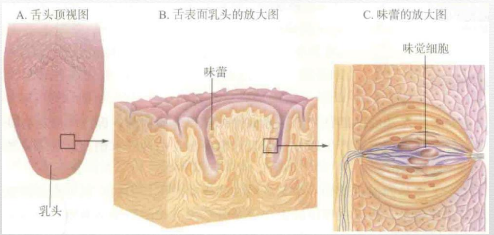

- 味觉
  - 五种基本味道:酸甜苦咸鲜
  - 单个味觉感受细胞对五种基本感觉味道中的某一种反应最为强烈
  - 分辨食物的味道主要依靠嗅觉而非味觉
- 触觉和肤觉
  - 压力
    - 众多类型的感受器细胞
      - 迈斯纳小体:摩擦皮肤
      - 梅克尔触盘:小物体对皮肤施加的持续的压力
    - 压力敏感性在身体不同部位的差异非常大
      - 指尖>后背皮肤
  - 温度
    - 冷传感纤维和暖传感纤维
  - 触摸
    - 性感区

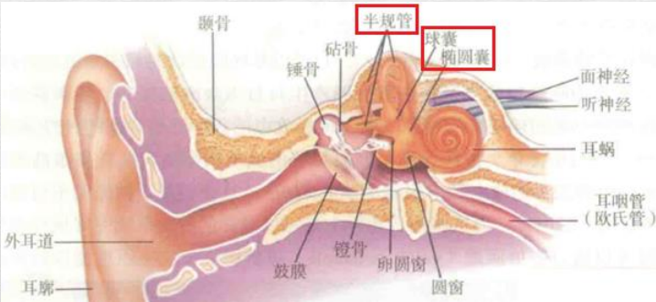

- 前庭觉
  - 身体--特别是头部--是如何根绝重力确定朝向的
  - 感受器:位于内耳中充满液体的导管和囊中的小纤毛
  - 晕动现象:来自视觉系统和前庭系统的信息相互冲突时产生
  - 球囊和椭圆囊:直线上加速和减速;半规管:任何方向的运动信息
- 动觉
  - 提供运动过程中关于身体状态的感觉反馈
  - 感受器:位于关节中的感受器和位于肌肉和肌腱中的感受器
  - 动觉和触觉信息的整合
- 痛觉
  - 身体对有害刺激(强度足够导致组织损伤或具有这种威胁性的刺激)的反应,是重要的防御信号
  - 感受器:只对特定疼痛刺激(温度,化学物质,机械刺激)起反应的感受器,对痛觉刺激的组合起反应的感受器
  - 神经通路:脊髓 -> 丘脑 -> 大脑皮层
  - 内啡肽: 影响痛觉体验
  - 门控理论:脊髓中的细胞像神经闸门一样,切断和阻止一些痛觉信号进入大脑,而允许其他信号进入.大脑和皮肤中的感受器向脊髓发送开门和关门的信息
  - 神经矩阵理论:人们常常经历一些没有物理起因的疼痛,在这种情况下,疼痛完全源于大脑

### 知觉的组织过程

- 注意过程
  - 将意识觉知指向所有能获得的信息中的一个子集
  - 目标指向选择:你对将要注意的客体做出的选择,与你自己的目标有关
  - 刺激驱动捕获:刺激的特征--环境中的客体--自动抓住你的注意,不依赖于知觉者当时的目标
  - 至少在某些情况下,刺激驱动会胜过目标指向选择
- 知觉组织原则
  - 图形与背景:知觉组织的第一步是将场景中的一部分解读为突出于背景的物体
  - 格式塔心理学
    - 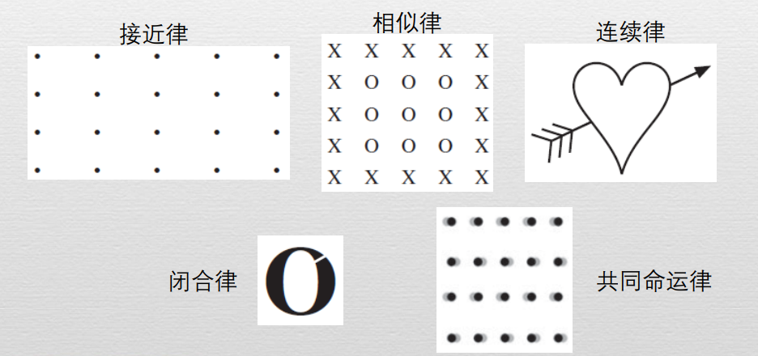
    - (人们会将,后面不赘述)最接近的元素组织在一起
    - 最相似的元素组织在一起
    - 即使线条被截断,人们也会将其知觉为连续的
    - 填补小的空隙而将客体知觉为一个整体
    - 似乎在向同一方向运动的客体组织起来


- 空间和时间上的整合
  - 边界扩展
  - 变化盲视
- 运动知觉
  - 对外部世界的不同扫视进行比较
  - Φ现象
    - 当视野不同位置的两个静止光点以大约每秒4到5次的频率交替出现时,我们会知觉到单个光点在两个位置之间来回移动
  - 有助于将视觉系统中的元素拼凑在一起

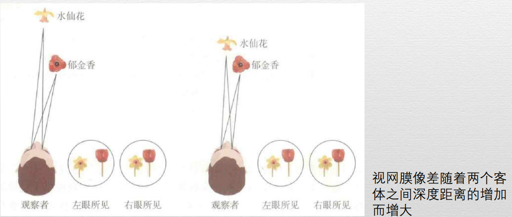


- 深度知觉
  - 双眼深度线索
    - 视网膜像差(一个客体对应于双眼的图像在水平方向上的位移):视网膜像差随着知觉者与客体之间的深度距离的增加而增大
    - 视轴辐合(当两只眼睛注视同一个客体时,它们就会在某种程度上向内测转动):眼睛辐合程度随着客体深度距离的增加而减少(up to 3m)
  - 运动线索
    - 运动视差(当个体运动时,环境中客体的相对距离决定了它们在视网膜影像上相对运动的大小和方向)
    - 运动视差随着客体深度距离的增加而减少
  - 单眼视觉
    - 插入或遮挡:近处的物体遮挡远处的物体
    - 相对大小:近处的物体在视网膜上投射的像更大
    - 线条透视:当平行线向远处延伸时,它们在视网膜成像中在地平线上汇聚为一个点
    - 质地梯度:随着表面向深处延伸,质地的密度变大


- 知觉恒常性
  - 尽管感受器接受的刺激在改变,但个体所知觉到的世界是不变的,恒常的,稳定的.
  - 大小恒常性:在视网膜成像大小变化的情况下感知客体真实大小的能力(依赖对深度的知觉和关于相似形状物体典型大小的先验知识)
  - 形状恒常性:即便当客体处于倾斜的位置,使得视网膜成像的形状本质上不同于客体本身的形状时,个体仍然能够正确地感知客体的真实形状(依赖于对深度的知觉)
  - 亮度恒常性:人们在不同的照明条件下,将物体的白度,灰度和黑度知觉为特定的倾向(依赖于对物体反射光线占入射光线百分比的知觉)
- 错觉
  - 当使用一种被证明是错误的方式体验某种刺激模式时,个体会体验到错觉
  - 由于人们的感觉系统具有相同的生理基础和人们对世界的经验相似,大多数人在相同知觉情形中会有同样的错觉

### 辨认和识别过程

- 自下而上的加工(数据驱动)
  - 以经验事实为基础,处理零散的信息,并将外界刺激的具体物理特征转换为抽象表征
- 自上而下的加工(概念驱动,假设驱动)
  - 涉及过去的经验,知识,动机和文化背景等(记忆中存储的概念会影响对感觉数据的解释)

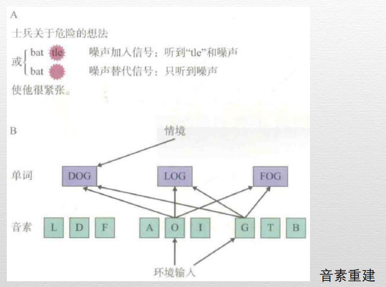

音素重建:噪音掩盖了物理信号,但人们却很少意识到他们听到的声音信号有间断

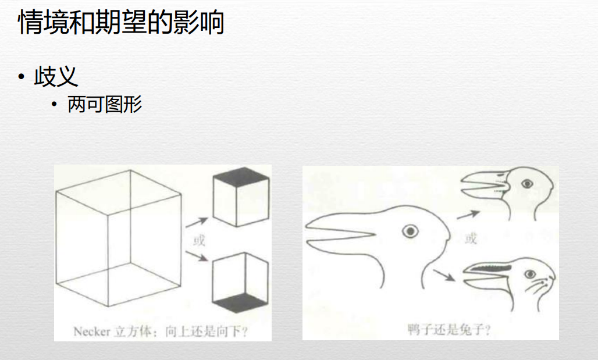

歧义:单一的图像有多种解释(来回翻转)

歧义的解决:利用情景信息和先前的期望

- 定势
  - 一种暂时的准备状态,使个体以某种特定的方式对一个刺激产生知觉或反应
  - 运动定势:个体做出预设的快速反应的准备状态(枪声 -> 跑)
  - 心理定势:个体根据习得的规则,说明,期望或习惯倾向来应对某种情境的准备状态(可能妨碍解决问题)
  - 知觉定势:在既定情境中知觉到特定刺激的准备状态(母亲:孩子的哭声)

## 5 心理,意识和其他状态

### 意识的内容

- 意识
  - 可以用来表示一般的心理状态或其具体的内容
  - 或者指对某些信息和反应的觉知
- 意识的内容
  - 清醒时的意识包括特定时刻的知觉,思维,情感,意向和欲望,即你正集中注意力的心理活动
  - 你既意识到你正在做的事情,也意识到你正在做这个事实
  - 自我感就是来自于"局内人"的立场出发观察你自己的经验
  - 总之,它们构成了意识的内容--在特定时刻你有意识地觉知到的所有经验

### 觉知的类型

- 非意识过程
  - 一些躯体活动很少进入意识,例如血压的调节
  - 一些通常是非意识的活动也可以有意识地进行,例如调节呼吸
- 前意识记忆
  - 只有注意到之后才能到达意识的记忆
  - 例如关于语言,运动的一般知识,或个人经历过的事件的集合
  - 前意识记忆在你的心理背景上默默地起作用,直到需要意识的情境出现
- 未被注意的信息
  - 人们对未被注意的知觉信息的加工程度
  - 有限能力假设:人们对未被注意的刺激进行了加工,但加工的程度未到达可以识别出这些刺激的那个点
  - 鸡尾酒会现象:在未被注意的信息中人们尤其容易注意自己的名字
  - 总的来说,人们需要意识注意来识别环境中的景象和声音等
- 无意识
  - 弗洛伊德主张某些创伤性记忆和禁忌的欲望受到抑制,被排除在意识之外,但与之联系的强烈情感仍然存在并影响着行为
  - 现在心理学家使用无意识这个词代指无意识加工
    - A. She investigated the bark.
    - B. The botanist looked for a fungus. She investigated the bark.
    - 无意识语言加工使用语境在bark的两个意思之间做了迅速选择

### 研究意识的内容

- 出声思维报告
  - 用于说明参与者完成任务时的心理策略和知识表征
  - 要求参与者在进行各种复杂任务时大声说出解决过程
  - 例如用来理解专家和新手用以判断产品设计的不同策略
- 经验抽样法
  - 参与者提供在日常生活正常进程中想法和感受的信息
  - 参与者佩戴一些装置,当发出信号时,报告意识中的内容
  - 可以对参与者在日常生活中的思维,意识和注意的集中程度跟踪记录
  - 

### 意识的功能

- 意识的作用
  - 帮助生存
    - 意识可以帮助个体理解环境信息,并利用这些信息计划最适宜而有效的行动
    - 限制机制
      - 意识限制觉察和注意的范围,从而减少刺激的输入
      - 意识可以帮助过滤掉与当前目标无关的大量信息
    - 选择性储存
      - 意识允许你选择性地储存要分析,解释和指导未来实践的信息
    - 计划功能
      - 意识可以让你停止下来,基于过去的知识思考可替代的方案和想象各种可能的结果
      - 使你能够压抑那些与道德,伦理和现实冲突的强烈欲望
  - 对现实的个人和文化建构
    - 对现实个人建构,是基于你的一般知识,过去经验的记忆,当前的需要,价值,信念和未来目标,从而对当前情境做出独特解释
    - 现实为文化建构是由一组特定人群的多数成员所共有的思考世界的方式
    - 当社会中的一个成员发展出了一种与文化建构相适应的现实的个人建构,他会被文化所肯定

### 研究意识的功能

- 人的行为既受到意识过程的影响,也常常受到无意识过程的影响
- 研究者往往研究意识过程和无意识过程的不同结果
  - 例如"哭泣婴儿"困境,即决定是否闷死自己的婴儿以避免敌 军士兵发现和杀死自己,婴儿和其他人
  - 参与者在两个不同的情境中考虑这类困境,第一种条件要求尽快做出反应,第二种条件要求同时监视屏幕上的数字
    - 通过使参与者的意识过程超过负荷,使他们很难使用意识过程对道德困境做出推理
  - 证明当意识过程不能正常运作时,人们的行为反应会如何变化(**研究意识功能的一种方式**)
- 另一种研究意识的方式是考察日常各种任务中,哪些是需要意识干预的
  - 人们可以在不需要意识注意或者很少意识注意的情况下搜索物体的基本特征,如颜色,形状和大小
    - 在你的房间里找一个红色的物体
  - 在大多数情况下,搜索两个特征的组合需要意识注意
    - 找一个既有红色又有蓝色的物体
  - 当两种颜色被组织成整体和部分的关系时,选择就较少受到图片中其他物体的影响
    - 找黄色和蓝色的物体 或 找有蓝色窗户的黄色房子

### 睡眠与梦

- 昼夜节律
  - 唤醒水平,新陈代谢,心率,体温和激素活动的涨落依照内部的时钟节奏
  - 没有外部的时间线索矫正的话,人体的内部"定时器"设定的周期是24.18小时
- 时差
  - 时差的发生是由于内部生理节律与常规的时间环境不协调
- 睡眠周期
  - EEG提供了在人们清醒或睡眠时,对正在进行的脑活动变化的客观测量.
  - 睡眠期间周期性间隔出现
    - 非快速眼动睡眠(NREM)
      - 阶段1
      - 阶段2
      - 阶段3
      - 阶段4
    - 快速眼动睡眠(REM)
    - 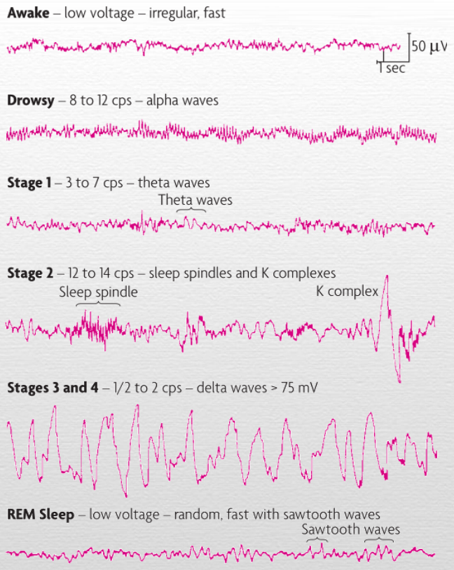
    - 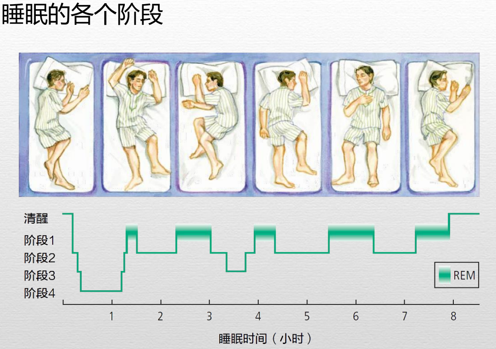
    - 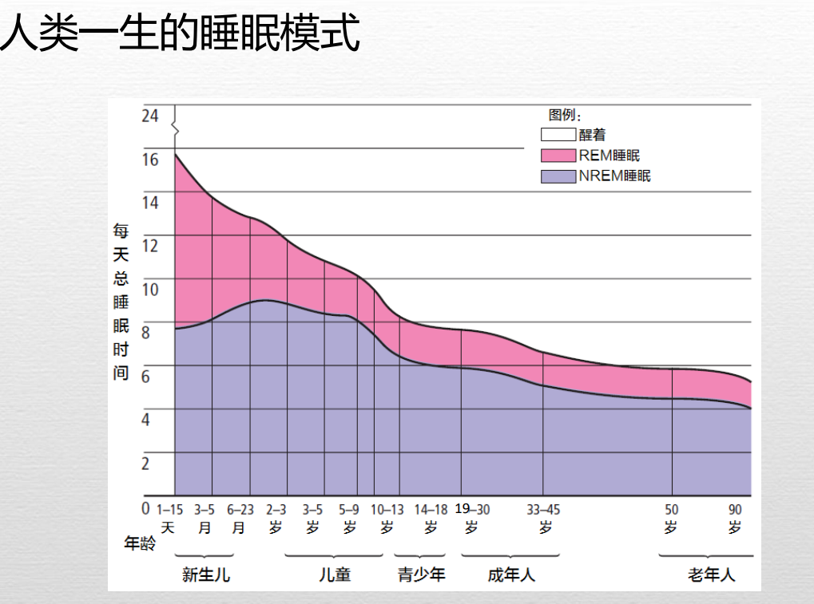
- 为什么需要睡眠
  - NREM睡眠的两个最普遍的功能是保存和恢复
    - 可以使动物无需寻觅食物,寻求配偶或工作时保存能量
    - 为大脑阻止损伤,修复脑细胞提供了机会
  - REM睡眠的功能
    - 剥夺REM睡眠会让第二晚的REM睡眠增多,说明REM睡眠也具有必要功能
    - 在婴儿期,REM睡眠是视觉系统等正常功能的发育所必需的
    - 对成年人,REM睡眠对于学习和记忆发挥重要作用
- 睡眠障碍
  - 失眠症
    - 人们对他们的睡眠时间或质量不满意;
    - 不能很快入睡,经常醒来或早醒.
    - 可能有主观性失眠
  - 发作性睡病
    - 白天突然感到不可抗拒的睡意为特征的睡眠障碍
    - 通常伴有猝倒症,即由于情绪激动引起的肌肉无力或失去肌肉控制而使人突然跌倒
    - 家族中流行,有相关基因
  - 睡眠窒息症
    - 上呼吸道睡眠障碍,患者在睡眠时突然停止呼吸.
    - 疾病发作时,血样水平下降,应激激素分泌,导致患者醒来并恢复呼吸(周期性).
    - 早产儿经常发生
  - 夜游症
    - 与NREM有关,儿童相对多发
    - 保持睡眠状态的同时,离开床四处走动
  - 梦魇和夜惊
    - 一个梦让人感到无助或失去控制而受到惊吓
    - 高峰:3-6岁;创伤事件
    - 睡眠者突然醒来并进入极度唤醒状态(常常以惊恐的尖叫为标志)
    - 高峰:5-7岁

### 梦

- 睡眠实验室的研究
  - 从REM睡眠阶段唤醒,82%报告在做梦;从NREM阶段唤醒,54%报告做梦
  - NREM状态时做的梦,其中包含的故事内容不太可能涉及情绪
- 弗洛伊德对梦的分析
  - 把梦称为"通向潜意识的捷径"
  - 隐形梦境==>显性梦境(梦的工作)
- 释梦的非西方途径
- 梦的内容的当代理论
  - 激活-整合模型:从脑干发出的神经信号,刺激额叶和相关皮层区域,从而产生了关于做梦者的随机记忆以及与过去经验的联系
- 清醒梦境
  - 有意识地觉知自己正在做梦,是一种习得的技能
  - 可由常规的练习获得
  - 做梦者能够控制梦的方向

### 意识的其他状态

- 催眠
  - 以一些人对暗示有特殊的反应能力,并在知觉,记忆,动机和自我控制感方面发生变化为特征的另一种觉知状态
  - 可催眠性 (个体为体验催眠反应,对标准化暗示的反应程度)- 专注
  - 催眠的效果
    - 运动能力
    - 知觉经验
    - 催眠性痛觉缺失
    - EEG及脑成像研究
- 冥想
  - 冥想是一种改变意识的形式,它通过获得深度的宁静状态而增强自我认识和幸福感

### 改变心理的药物

- 人们服用各种药物放松,应对压力,逃避令人不快的现实,在社交情景中感到舒适,或体验意识的一种其他状态
- 精神促进药物是通过暂时改变对现实的意识觉知来影响心理过程和行为的化学物质
- 成瘾
  - 耐受性:持续使用某种药物会产生耐受性,即若再获得同样的效果则需要更大的剂量
  - 生理依赖:身体逐渐适应与依赖某种物质的过程,部分时因为药物频繁出现导致神经递质耗竭
  - 心理依赖:当个体发现使用药物如此令人向往或欣快甚至出现渴求,那么不管成瘾与否,都称作心理依赖
- 各种精神促动药物
  - 迷幻剂
  - LSD,PCP,THC,etc.
  - 幻觉(hallucination):在没有客观刺激的情况下出现生动知觉.
  - 阿片类药物
    - 海洛因,吗啡,etc.
  - 镇静剂
    - 抑制或减少中枢神经系统冲动的传导,来减缓(抑制)个体的心理和生理活动
    - 巴比妥酸盐,苯二氮䓬,酒精,etc.
  - 兴奋剂
  - 安非他命,甲基安非他命,可卡因,etc.
  - 咖啡因与尼古丁
- 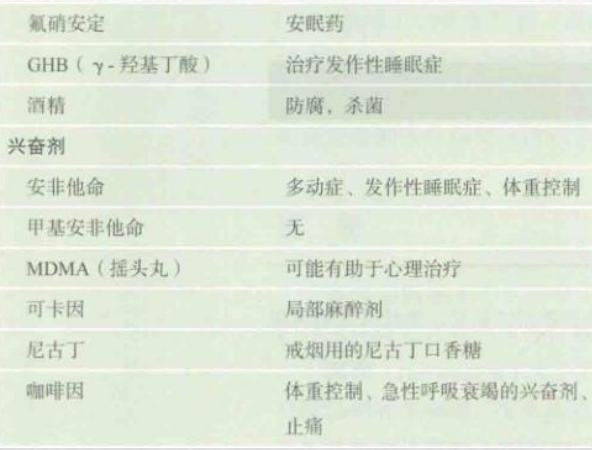

## 6 学习与行为

### 学习的研究

- 学习
  - 学习是基于经验而使行为或行为潜能发生相对一致变化的过程
    - 基于经验的过程
      - 经验包括吸收信息(以及评估和转换信息)和做出影响环境的反应.
    - 行为或行为潜能的变化
      - 学习—行为表现差异:学到的和在外显行为中表现出来的内容之间的差异
    - 相对一致的变化
    - 习惯化和敏感化
      - 习惯化:当刺激重复呈现时,行为反应会变弱.
      - 敏感化:对于重复出现的刺激的反应会变得更强烈(刺激强烈 or 令人感到不适)
- 行为主义:约翰华生
  - 心理学的主题不是主观的内省法,而应是可观察的行为
  - 心理学的首要目标应是预测和控制行为
- 激进行为主义:斯金纳
  - 心理活动(如思维和想象)并不能产生行为;相反,它们都是环境刺激引起的行为样本
  - 环境事件
    - 动物的行为可以通过环境事件如食物剥夺和运用食物作为强化来得到解释
    - 不能被直接观察和测量的主观饥饿感,并不是行为产生的原因,而是食物剥夺的结果
  - 行为分析
    - 寻找学习和行为的环境决定因子
    - 复杂形式的学习代表着简单学习过程的组合和加工,而非与之有着质的区别

### 经典条件作用

- 经典条件作用

  - 一种由一个刺激或事件预示着另外一个刺激或事件即将到来的基本学习方式
  - 有机体学习在两个刺激(一个先前不能诱发反应的刺激和一个天生能诱发反应的刺激)之间形成一种联系

- 巴普洛夫的狗

  - 任何有规律的先于食物出现的刺激都能诱发狗的唾液分泌
  - 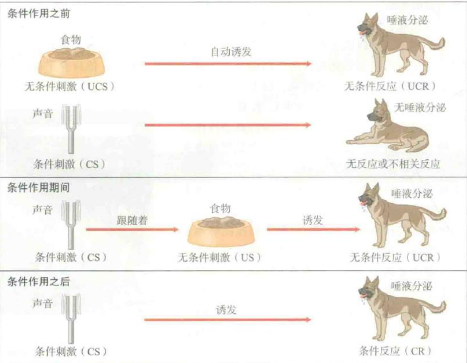
  - 经典条件作用的核心是反射性反应,如分泌唾液,收缩瞳孔,膝跳反应或眨眼睛.
  - **反射**:一种对有机体有生物学意义的特定刺激所自然诱发的反应
  - **无条件刺激**:任何能自然地诱发反射行为的刺激(UCS)
  - 由无条件刺激引发的行为称作**无条件反应**(UCR)
  - **条件刺激**(CS):中性刺激,所诱发的行为的力量是以其与UCS的联系作为条件的
  - **条件反应**(CR):条件反应作为学习的结果是由条件刺激所诱发的任何反应

- 条件反应的主要过程

  - **习得**:CR首次被诱发出来并且在重复实验中频率不断增加的过程
    - CS必须和UCS多次配对,才能可靠地诱发CR
    - "时机"的重要性:通常在CS开始呈现到UCS开始呈现的间隔时间很短的延迟条件作用模式最有效
      - 产生最佳条件作用的CS和UCS之间的确切时间间隔取决于几个因素,包括CS的强度和被条件化的反应的类型
    - 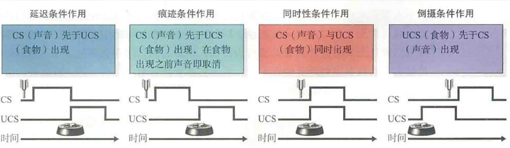
  - **消退**:当CS不再预示着UCS时,CR会随着时间的推移变得越来越弱,最终不再出现
    - 条件作用并不必然是有机体行为库中的一种永久性行为
    - 学习的效应没有消失
    - 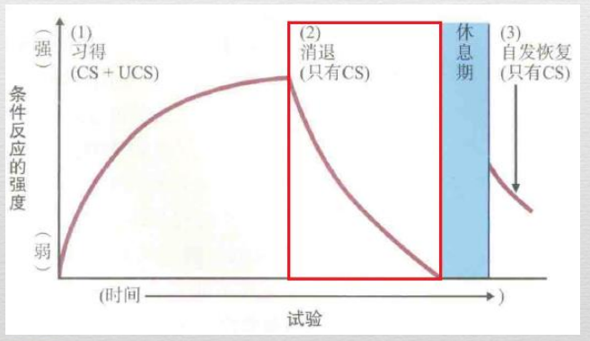
    - **自发恢复**
      - 消退后,当CS再次单独呈现时,CR会以一种较弱的形式再次出现.这种无需与UCS匹配,CR即可突然出现.
    - 当最初的配对又恢复时,CR会迅速变得强大,表现出对学习的节省
  - **刺激泛化**:条件反应自动扩展到从未与初始UCS配对的刺激的现象.新刺激与最初的CS越相似,反应就越强.
    - 当我们测量在某一维度上差异逐渐增大的刺激所诱发的反应强度时,就能得到一个泛化梯度
    - 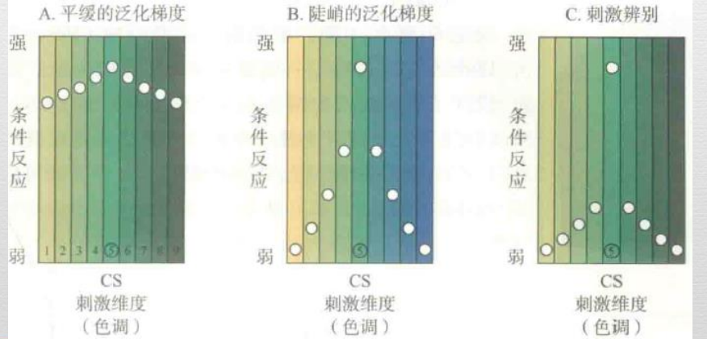
  - **刺激辨别**:有机体学会对某些维度上与CS不同的刺激做出不同的反应的过程
    - 有机体对相似刺激的辨别能力可以通过辨别训练得到加强

  - 经典条件反应的习得是如何发生的
    - 巴普洛夫:经典条件作用来自于CS和UCS的简单配对,时间上接近的配对导致经典条件反应
    - 罗伯特.雷斯科拉:除时间上的接近外,CS还需要可靠地预期UCS的出现
      - 雷斯科拉演示相倚的重要性
        - 阶段一
          - 训练狗跳过障碍物以躲避电击
          - 以跳跃频率作为恐惧条件作用的指标
        - 阶段二
          - 随机组:CS与UCS是否出现无关
          - 相倚组:CS的出现能够预示UCS的出现
        - 阶段三
          - 放回穿梭箱重新测量
          - 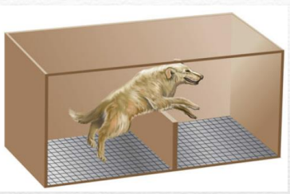
        - 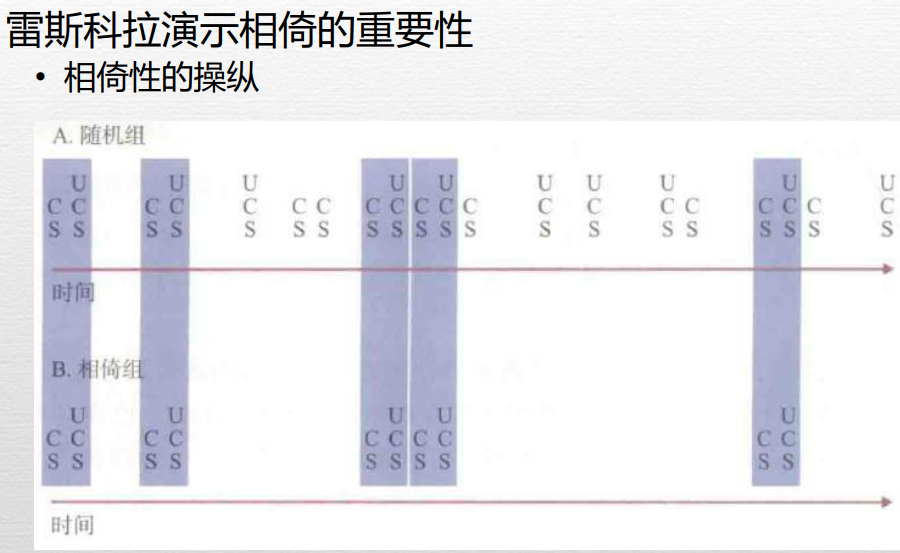
        - 结论:除了CS和UCS相接近以外,CS还必须可靠地预期UCS的出现
          - 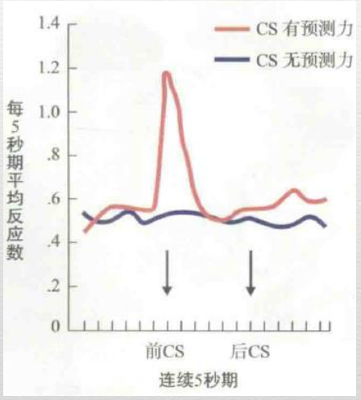
    - 除了相倚之外,刺激还必须在环境中能够提供信息
      - e.g. 老鼠习得声音对电击的预测;加入灯光,声音和灯光同时预测电击;灯光单独呈现,是否引起CR
      - 解释:实验第一阶段对声音的条件作用阻断了随后的对灯光的条件作用.灯光没有比声音提供更多的信息
      - 信息性:当CS从许多可能存在于环境中的其他刺激中凸显出来时,条件作用发生的最快;刺激越强,与其他刺激对比越强烈,越容易被注意到.
    - 总结:经典条件作用的产生条件
      - CS与UCS配对,二者时间上接近
      - CS可靠地预期UCS的出现
      - 刺激在环境中能够提供信息

- 经典条件作用的应用

  - 影响情绪和偏好
    - 你认为自己愿意喝某个已消过毒的蟑螂的苹果汁吗
    - 小阿尔伯特与恐惧条件作用
    - 广告商的诡计
  - 了解药物成瘾的原因
    - 对毒品有高耐受性的吸毒者为何会在少量毒品注射时死于药物过量?
      - 毒品为UCS,毒品引发的机体对药物的对抗反应(UCR)
      - 毒品的使用情境为CS
      - 条件反射建立后,CS本身即可引发机体对药物的对抗反应(CR)
      - 因此,抗药力的增加只限于此情境
  - 生物制约性
    - 有些条件作用不仅取决于刺激与行为的关系,还取决于生物体对环境刺激预置的遗传倾向
    - 生物预备性使该物种成员只需比正常情况更少的学习经历便能获得条件反应
      - 先天偏好:将特定刺激与特定结果相关联
      - 味觉-厌恶学习
        - CS(新异味道)与其后果(潜在的UCS--实际引发疾病的成分--导致的结果)一次配对即可形成;时间间隔影响不大,经历一次便能永久保持.(CS ==> UCS)

### 操作性条件作用:对行为结果的学习

- 桑代克的猫
  - 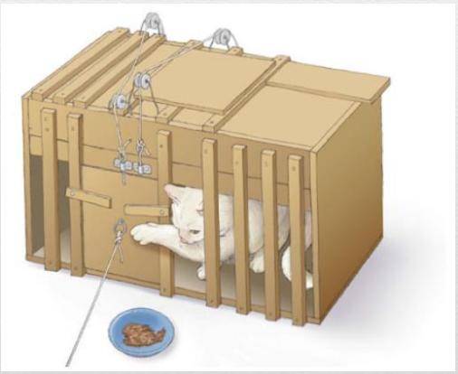
  - 所有的其他未成功的冲动消失了,指向成功的特定冲动则因愉快的结果而保留了下来
  - 猫学会了预期结果(逃离牢笼)与适当反应(例如,抓按钮或门环)间的联系
- **效果律**:带来满意结果的反应出现的可能性会增加,而带来不满意结果的反应出现的可能性会减小
  - 学习是环境中的刺激与动物学会做出的反应之间的一种联系:刺激--反应联结

- 行为的实验分析(斯金纳)
  - 操作性条件作用:在该实验程序中,实验者操纵有机体行为的结果,以考察这些结果对有机体随后行为的影响.
  - 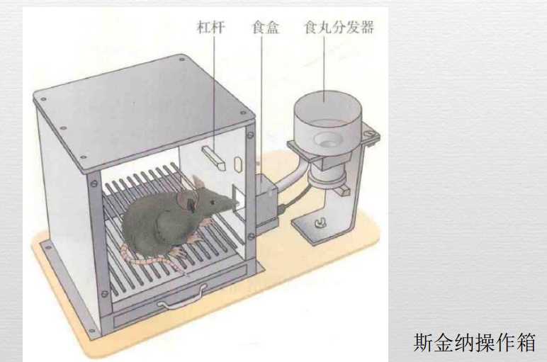
  - 操作:有机体做出的任何行为,可依据其对环境的可观察性的影响来描述.
- **强化相倚**:某一反应与其引发的环境变化之间的一致性关系
  - 强化耦合:鸽子啄食圆盘伴随谷物呈现,这种一致性关系通常增加鸽子的啄食频率
- **强化物**:能通过与某一行为相倚而增加该行为之后出现可能性的任何刺激
  - **强化**:反应出现之后给予强化物
  - 某一行为之后伴随喜爱的刺激出现,则该事件为正强化
  - 某一行为之后伴随着令人讨厌的刺激的解除,这一事件为负强化
    - 逃脱型条件作用:动物学到某种反应可以使它们逃离令其厌恶的刺激(下雨打伞)
    - 避免型条件作用:动物学到令它们厌恶的刺激免于出现的反应(安全带的蜂鸣器)
  - 操作性消退:强化撤销之后出现;某一行为不再产生可预期的结果
  - 自发恢复
- **惩罚物**:能通过与某一行为相倚而降低该反应将来发生概率的任何刺激
  - 某一行为之后伴随着厌恶刺激时,该事件为正惩罚
  - 某一行为之后伴随着喜爱刺激的消除,该事件为负惩罚
  - 惩罚总是减少某一反应再次发生的概率,与强化定义相反
- 三项相倚
  - 辨别性刺激 - 行为 - 结果
  - 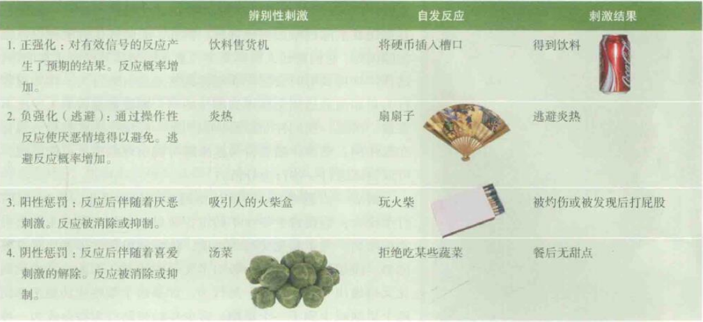
- 强化物的特性
  - 条件性强化物
    - 金钱,分数,赞许的微笑等等
    - 条件性强化物比初级强化物可能更有效且更易于使用
      - 初级强化物:强化特性是由生物因素决定的,比如食物或水
      - 原本中性的刺激渐渐与初级强化物联系在一起,对操作性反应起着条件性强化物的作用
      - 几乎任何刺激都可以通过与初级强化物配对而成为条件性强化物
  - 反应剥夺和阳性强化物
    - 反应剥夺理论:当阻止动物进行某项行为时,这种行为变得更受喜爱而被强化
    - "你完成作业后,可以玩视频游戏"的策略如何起作用?
- 强化程序
  - 部分强化效应
    - 在部分强化程序表中习得的反应比那些在连续强化中习得的反应更能抵抗行为的消退
  - 强化程序表
    - 固定比率 FR
      - 强化物在有机体做出一定次数的反应后出现(FR-1:每次反应之后都伴有强化)
      - 比率过大时,动物需要做出大量的反应才能得到强化物,而事先却没有训练动物做出如此大量的反应,就可能导致消退(销售人员接受FR程序强化:卖出一定的货物才能得到报酬)
    - 可变比率 VR
      - 强化物之间的平均反应次数是预先确定的(VR-10:平均10次反应后伴随一次强化)
      - 赌博受到VR程序控制
      - VR程序产生的反应率最高,最不容易消退
    - 固定间隔 FI
      - 强化物在间隔一段固定时间的第一次反应后出现(FI-10)
      - 每次强化反应一结束,动物几乎不再作出反应.随着回报时间的临近,动物的反应越来越多.(微波炉定时)
    - 可变间隔 VI
      - 强化物出现时间间隔的平均值被确定(VI-10)
      - 反应率中等但是很稳定;消退行为是渐进的,并且比FI程序要慢的多(不定期测验)
    - 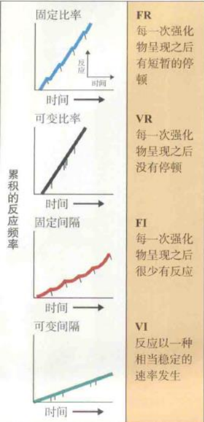
- 连续接近塑造法
  - 对任何连续接近并最终与与预期反应匹配的行为进行强化
  - 要让**塑造**起作用,必须规定什么算接近目标的行为,并运用**区别强化**来使这一过程中的每一步都更为精确
- 生物制约性
  - **本能漂移**:即使动物学会了完美地做出操作反应,随着时间的推移,"习得的行为也会向着本能行为漂移"
  - 本能漂移可能比某些反应--强化学习更重要
  - 当目标反应堆的设定有生物学意义时,条件作用就很有效

### 认知对学习的影响

- 比较认知
  - 比较认知追踪不同物种之间认知能力的发展轨迹
  - 认知地图
    - 鸟,蜜蜂,老鼠,人和其他动物有着令人印象深刻的空间记忆能力
    - 动物运用空间记忆来辨认和识别环境特征
    - 动物运用空间记忆来发现环境里重要的目标物
    - 动物运用空间记忆来设计环境中的行进路线
  - 概念性行为
    - 鸽子具有利用概念性差异的认知能力
- 观察学习
  - 个体仅仅是观察到他人的行为被强化或被惩罚,就会在之后做出或者抑制类似的行为
  - 班杜拉的观察学习实验
    - 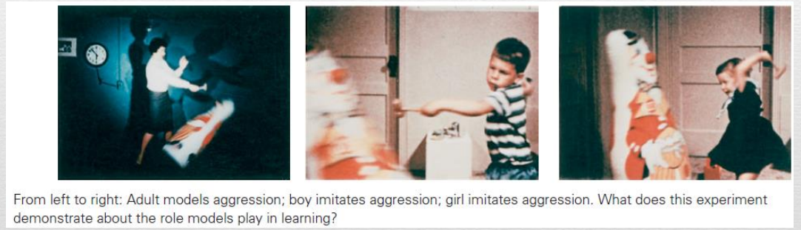
    - 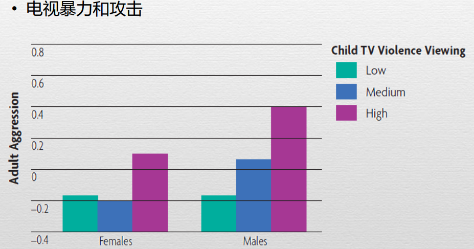

## 7 记忆

### 什么是记忆

- 记忆:编码,存储和提取信息的能力
  - 让你有意识地会想起个人和集体的过去
  - 使你每天的经验具有连贯性
- 记忆的外显使用:有意识地努力编码或提取信息的情形
- 记忆的内隐使用:无需意识努力地编码或提取信息的情形
- 陈述性记忆和程序性记忆
  - 陈述性记忆:关于事实和事件的记忆
  - 程序性记忆(拨号)
    - 关于怎样做事情的记忆
    - 通过足够多的练习,能够获得,保持和使用关于知觉技能,认知技能和运动技能的程序性记忆
  - 二者的联系
    - 陈述性知识可以转化为程序性记忆
    - **生成汇编**使程序性知识不易被被描述
      - 生成汇编:生成不同的心理指令汇编在一起
    - 生成汇编也会导致错误
      - 例如,熟练的打字员也经常出错,如在敲击t和h之后,自动敲出e,即便真正试图打出的字是throne或thistle
- 记忆过程概述
  - 编码:对信息的初始加工,从而在记忆中形成一种表征
  - 储存:被编码的材料随时间的保持
  - 提取:储存的信息在随后的某一时间的恢复
  - 编码是信息输入,储存是信息保存,提取是把信息取出来
  - 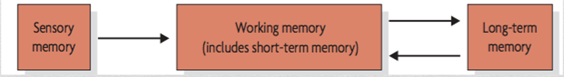

### 记忆的短时应用

- 映像记忆

  - 是一种视觉领域的记忆系统,能使大量信息存储非常短的时间
  - 映像记忆是感觉记忆的一个例子:每个感觉系统会有一种记忆库,它可以保存环境刺激的物理特征的表征,持续时间至多几秒钟
  - 斯佩林的实验
    - 给参与者呈现一些由三行字母和数字构成的阵列
    - 要求参与者完成两种不同的任务
      - 全部报告程序:参与者要努力尽可能多地回忆看过的项目:通常他们能报告的大约只有4个项目
      - 部分报告程序:参与者只需报告一行而非整个阵列的内容;在阵列呈现后立即发出一个高音,中音或低音信号,参与者根据声音提示报告三行中的一行:不管参与者报告哪一行,他们的回忆成绩都很好
      - 结论
        - 呈现的所有信息一定都进入了映像记忆:映像记忆的大容量
        - 全部和部分报告程序的差异:信息会迅速衰退
        - 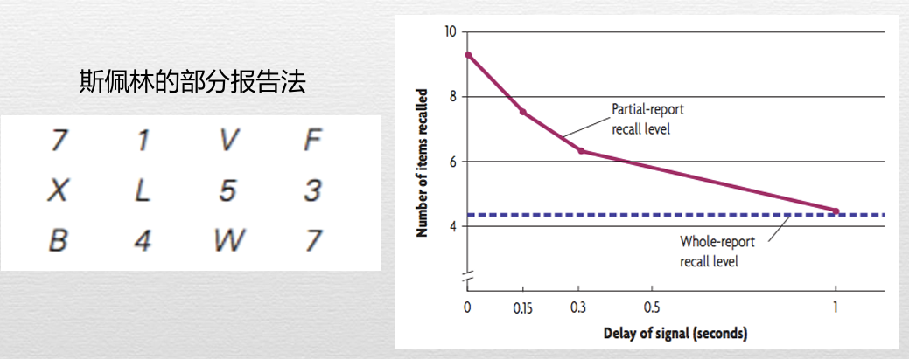

- > 遗觉像:(照片式记忆)

- 短时记忆:一种集中认知资源于一小部分心理表征的内在机制

  - 短时记忆的容量限制

    - 记忆广度测验
      - Miller(1956):7(+-2)
        - 参与者可以通过其他的信息源来完成任务
        - Cowan(2001):短时记忆的纯粹贡献只有3-5个(7个)

  - 复述:当没有复述时,短时记忆随时间而削弱

    - 没有复述的短时记忆回忆
    - 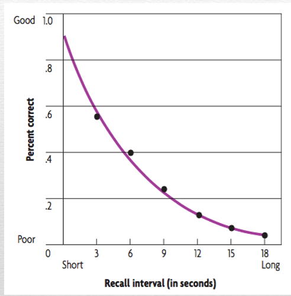

  - 组块:重新组织项目的过程

    - 依据相似性或其他组织原理将项目分组或是组合成更大的模式,是一个重新组织项目的过程
    - 一个组块就是一个有意义的信息单元
    - 组块帮助增加记忆的广度

  - 工作记忆:用于完成诸如推理和语言理解等任务的记忆资源

    - > 试图记住电影的播出时间,同时寻找笔和便签将它记下来 •
      >
      > 短时记忆让你把播出时间保存在头脑里,而更广义的工作记忆资源使你能够执行心理操作完成有效的搜索.

    - 为思维和行为每时每刻的流畅性奠定了基础

    - 有助于你保持心理上的存在感

    - 艾伦.巴德利:工作记忆的四个成分

      - 语音环路:保持和处理基于言语的信息
      - 视觉空间画板:保持和处理视觉和空间信息
      - 中央执行系统:控制注意并协调来自语音环路及视觉空间画板的信息
      - 情境缓冲区:由中央执行系统控制的,容量有限的一个存储系统

    - 工作记忆容量(WMC)的个体差异

      - 运算广度测量
      - 工作记忆容量大的人能够更好地聚焦自己的注意力

### 长时记忆:编码和提取

- 长时记忆

  - 内容

    - 从感觉记忆和短时记忆中获得的所有经验,事件,信息,情绪,技能,单词,范畴,规则和判断等的存储库
    - 构成了每个人关于世界和自我的全部认识
    - 当你编码信息的背景与你试图提取它的背景存在很好的匹配时,你的记忆能力最强

  - 提取线索:搜取一段特定记忆时可以利用的刺激

    - 回忆和再认
      - 回忆:再现先前接触到的信息
      - 再认:认识到某个特定的刺激事件是你以前看到过或听到过的
      - 回忆和再认都需要使用线索进行搜索,但再认的线索要有用的多
    - 情境记忆:独立地保存亲身经历过的特定事件
    - 语义记忆:通用的或类别的记忆,如词语和概念的含义等,与时间和地点无关
    - 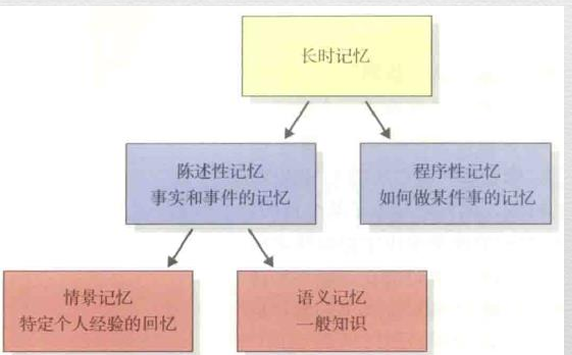

  - 背景与编码

    - 编码特异性:当提取的背景与编码的背景相匹配时,记忆能最有效地浮现

    - 图尔文和汤姆森,1973

      - 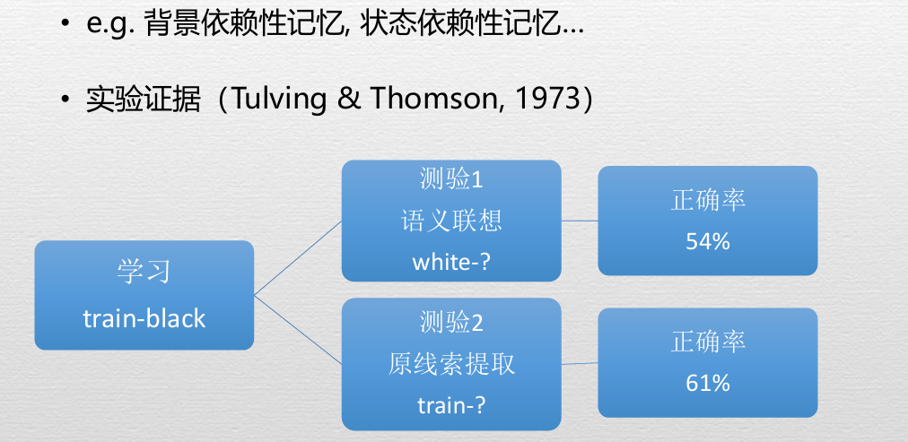

    - 背景依赖性

      - > 学习钢琴的学生,在他们第一次学习某小段乐曲的钢琴上再演奏那一段时,其准确性更高

    - 状态依赖性

      - > 学习和测验前饮酒或服用安慰剂,学习和测试前均饮酒的参与者比只在学习或测试前饮酒的参与者回忆的信息更多

    - 系列位置效应

      - 任务
      - 记忆不同长度的单词序列(6个,10个和15个)
      - 用"序列回忆"或"自由回忆"去回想每个单词序列
      - 首因效应:头
      - 近因效应:尾
      - 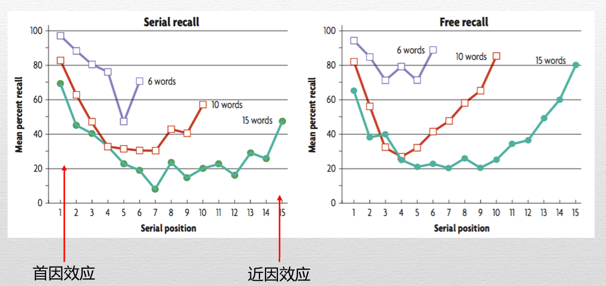
      - 时间区辩性:某一特定项目再时间上凸显于或不同于其他项目的程度

  - 编码和提取过程

    - 迁移适宜性加工

      - 当编码时的加工类型能够迁移至提取时所需的加工时,记忆表现最好

    - 加工水平

      - 信息的加工水平越深,越可能进入记忆

    - 加工深度经常根据参与者对实验材料所做的判断来定义

      - > 例:对GRAPE的不同加工水平
        >
        > 外形判断(由大写字母组成)
        >
        > 押韵判断(与tape押韵)
        >
        > 语义判断(代表一种水果)

    - 加工和内隐记忆

      - 内隐和外显这一维度既适用于编码也适用于提取过程
      - 启动效应:参与者的第一次经历会在随后的经历中启动记忆
      - 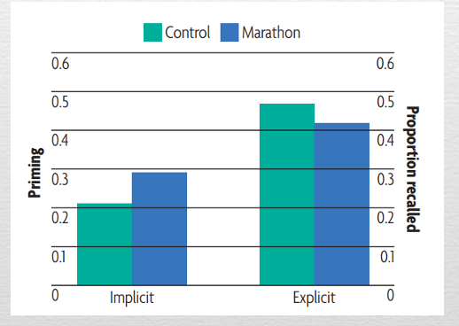

  - 遗忘的原因
  
    - 艾宾浩斯对于遗忘的量化
      - 对于记忆的"纯的测量"
        - 无意义音节法(如CEG或DAX)

          - > [!note]
            >
            > 无意义音节,使用两个辅音(consonant)字母和一个元音字(vowel)母形成一个无意义音节(CVC)
            >
            > 无意义音节作为识记的单位大致是相同的,这样便于控制学习材料的数量,并且使学习少受个人有关经验的影响

        - 不断重复直至能按正确顺序背诵所有条目
        - 强迫学习其他词表分心,不去复述最初的音节词表
        - 计算重学最初音节序列所需要的遍数量化记忆
        - 使用节省成绩作为测量指标

          - > [!note]
            >
            > 每一个时间点都是一个独立的实验
        - 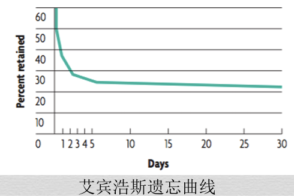
    - 干扰
      - 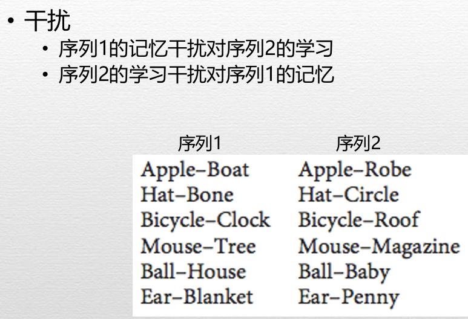
      - 前摄干扰:过去获得的信息使你获得新信息更为困难
      - 倒摄干扰:新信息的获得使你对旧信息的回忆变得更困难
      - 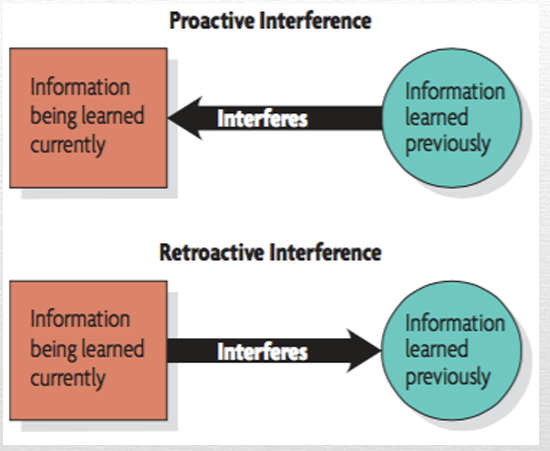
  
  - 改善对非结构化信息的记忆
  
    - 精细复述:当你复述信息,也即第一次将其存入记忆时,精细地加工材料以丰富编码
      - 例如,创造合理联系,搭配心理图画
  
      - 精细复述可以帮助避免"下一个"效应
  
    - 记忆术
      - 地点法:将需要记的一系列名字或物体的顺序与熟悉的一些地点的某种顺序联系起来
  
      - 桩—词法:将序列中的项目与一系列线索相联系.该方法的线索通常是一系列将数字与单词相联系的押韵词.
  
  - 元记忆
  
    - 知道感:(feelings-of-knowing)你确实把信息存储在记忆中的主观感觉
  
      - > 问题:"太阳系中最大的行星是什么?"
        >
        > 参与者评定知道感,如对"尽管我现在想不起来但是如果给我 一些选项,我可以选出来"的程度做强度评定
        >
        > 相比于弱知道感,知道感强的参与者更有可能从备选项中选出正确答案
  
    - 你的记忆是如何工作的或你如何知道你拥有什么信息
  
    - 学习判断:是你对自己学的有多好的估计
  
### 长时记忆的结构

- 记忆结构

  - 归类:将个别经验进行归类的能力是具备思维能力的有机体最基本的能力之一

  - 概念:对类别形成的心理表征

    - > 小狗

  - 层级:概念通常按层级排列成有意义的组织

  - 基础水平:概念层级中存在一个水平,在这个水平上人们可以最好地对物体进行归类和思考

  - 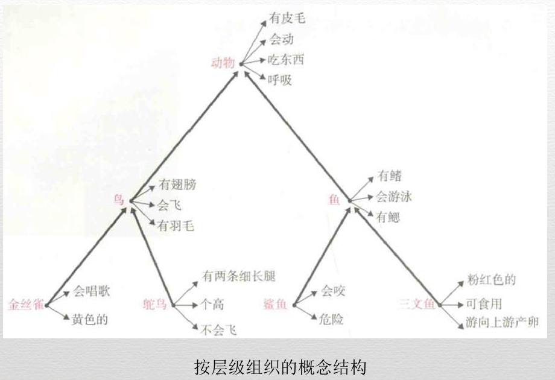

  - 图式:

    - 是关于物体,人和情境的概念框架或知识群

    - 是对你关于环境结构的经验进行综合概括和编码的"知识包"

    - 图式并不包括所有不同体验的每一个细节

    - 图示代表的是对环境中的诸多情境的一般经验,随生活事件的变换而变化

    - > 厨房,赛车手和教授,惊喜派对

  - 脚本:是一种更具体的记忆表征,详细说明事件如何随时间而展开

    - > 详述你在去餐厅或去看医生会发生什么脚本

  - 使用记忆表征

    - 如何使用记忆中的概念来对客体进行分类?
      - 原型:一个类别中最核心或最典型成员的表征
        - 比较客体和记忆中的原型来识别客体
      - 范例:将客体与记忆中的范例相比来识别客体
      - 研究支持范例观点:人们通过将遇到的物体与记忆中的多个表征进行比较来对其进行分类
      - B是原型,C是范例子集,A是待识别客体
      - 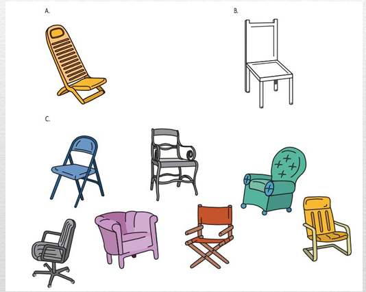
    - 记忆表征让你理解世界上不同寻常的事物

  - 重构性记忆:基于记忆中**更概括**的知识来重构信息

    - 第三章是否有"的"这个字
    - 1991年包括7月7日这一天吗
    - 你在昨天下午2:05到2:10这段时间里呼吸了吗?

  - 不使用特定情景记忆而使用概括化的知识来重构记忆

  - 重构性记忆的准确性

    - 巴特利特

      - 重述"幽灵的战争"
      - 故事扭曲涉及三种重构加工
        - 趋平化 -- 简化故事
        - 精细化 -- 突出和过分强调某些细节
        - 同化 -- 改变细节以符合参与者自己的背景或知识

    - > "迪斯尼乐园中的兔八哥"
      >
      > 回忆10岁前是否"在主题乐园与最喜欢的卡通角色握过手" (Braun et al., 2002)
      >
      > 生活经历问卷,其中阅读一则迪斯尼广告,以唤起关于家庭旅行的想法.广告中描述了可以遇见兔八哥并且与之握手的景象.
      >
      > 相比于控制组(7%),读过广告的参与者(16%)更有可能报 告有在迪斯尼中与兔八哥握过手的经历.
      >
      > 然而,兔八哥并不是迪斯尼中的人物.

  - 闪光灯记忆:

    - 记忆是如此生动,好像当时情景的照片一样
    - 闪光灯记忆是否真如人们认为的那样准确?
      - 比较对9.11袭击的记忆与对日常生活时间的记忆
      - 人们想牢牢记住那些引发强烈情绪的事件的渴望,使他们很难考虑到这些记忆有可能不准确
      - 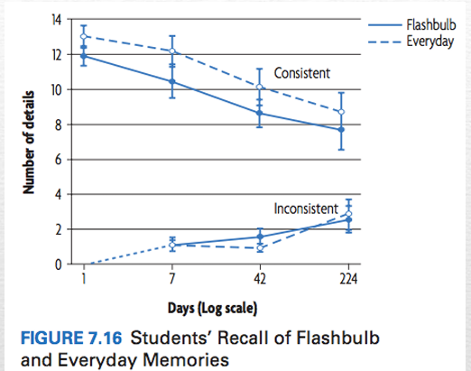

  - 目击者记忆

    - 目击证人对于所看到事件的记忆很容易因事后信息而出现扭曲
      - 错误信息效应
        - 观看车祸电影后,询问参与者问题
          - g1:当两辆车相撞时,他们开得有多快
          - g2:当两辆车接触时,他们开的有多快
        - 参与者估计车速
          - g1:超过40英里/小时
          - g2:30英里/小时
        - 一星期后,询问参与者"是否看到了玻璃碎片"
          - g1:1/3报告看到
          - g2:14%看到
        - 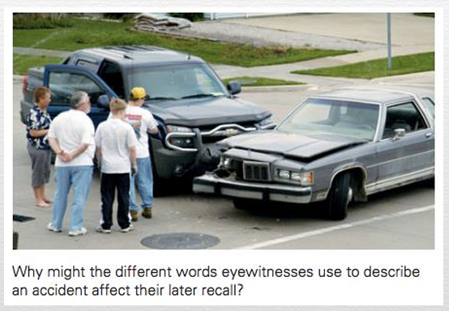
      - 共同目击者信息的污染:
        - 共同目击者可能成为目击者自己的记忆的信息污染源
          - 如果与共同目击者讨论所目击的事件,他们的记忆表现会受损
          - 在一个样本中,86%目睹了人身攻击或故意损坏财物等严重事件的人会与共同目击者讨论相关的事件
          - 在曾被警察询问的目击者中,只有14%的人被劝阻不要进行这样的谈话

### 记忆的生物学

- 寻找记忆的痕迹

  - 卡尔拉什利
    - 训练大鼠走迷宫  切除皮层的不同部分  测验对迷宫的记忆
    - 发现皮层损伤越多,记忆损害越严重;记忆并不受被切除脑组织位置的影响
    - 结论:记忆痕迹并不存在于特定的脑区,而是广泛分布于整个皮层
  - 然而,迷宫学习设计了不同类型记忆的参与

- 记忆痕迹的主要大脑组织

  - | 小脑     | 程序性记忆                                   |
    | -------- | -------------------------------------------- |
    | 纹状体   | 形成习惯和刺激反应联结                       |
    | 大脑皮层 | 感觉记忆及不同感觉间的关联                   |
    | 海马     | 事实,日期,名字等陈述性记忆及空间记忆的巩固 |
    | 杏仁核   | 具有情绪意义的记忆的形成和提取               |

- 记忆障碍

  - 顺行性遗忘症
    - 不能形成损伤之后发生事件的外显记忆
    - 如,长期酗酒导致的Korsakoff综合症包含顺行性遗忘症状
  - 逆行性遗忘症
    - 遗忘损伤前发生过的事情
    - 如,车祸引起脑部受重击
  - 内隐记忆与外显记忆的分离
    - 在陈述性知识缺失的情况下,程序性知识似乎仍是完好的
    - 记忆的外显使用和内隐使用涉及不同的脑区
  - 阿尔兹海默病

- 脑成像

  - 情境信息编码和提取中的脑活动
    - (pet)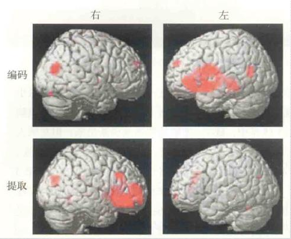
  - 预测成功记忆的脑区
    - 观看喜剧判断,同时接受磁共振扫描
    - 三周后,完成问卷,回答与剧情有关的问题
    - 确定信息正确编码时大脑的活跃区域
    - 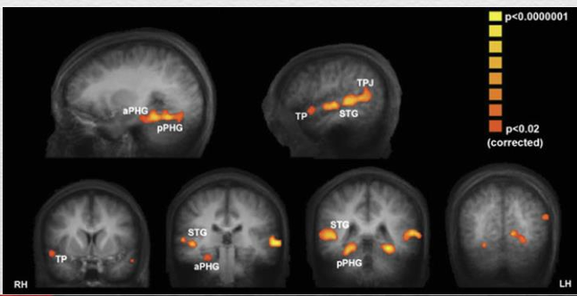

## 8 认知过程

- 认知是一个所有形式的"知"的通用术语
  - 内容:概念,事实,命题,规则和记忆
  - 过程:是指为了解释周围世界并为生活中的困境找到创造性解决办法,你如何操纵这些心智内容


- 解释心理过程
  - 唐德斯(F. C. Donders)的实验
    - 心理过程的速度:完成一项任务时,额外的心理步骤经常会使人们花更多的时间
    - 任务1:在所有的大写字符上画C
    - 任务2:在大写的元音字母上画V,在大写的辅音字母上画C
    - 任务3:在所有的大写字母上画V
  - 研究者经常利用**反应时**(参与者完成特定任务所花费的时间)来检验关于某种特定认知过程的一些解释
  - 序列过程:多个过程依次执行
  - 平行过程:多个过程同时执行
  - 理论家通过估计心理过程需要占用多少心理资源来确定心理过程是序列的还是平行的
    - 关键假设
      1. 人的加工资源有限并且必须分配给不同的心理任务
      1. 注意过程负责分配这些资源
  - 受控-自动维度
    - 受控过程:需要注意,一次执行一个以上的受控过程是困难的
    - 自动过程:一般不需要注意,常常能够无干扰地与其他任务同时执行
    - 充分练习:受控过程 >>> 自动过程
    - 任务变难:自动过程 >>> 受控过程
    - Ganor-Stern的实验
      - 圈出每对数字中字号更大的数字:List A比List B更困难(数值的大小会影响到对其字号大小的判断)
      - 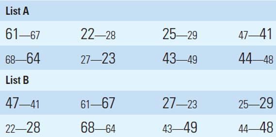
  
- 语言生成

  - 听众设计

    - 说话者在产生话语时,会考虑话语所针对的听众,以及与听众共享哪些知识

  - 赖格斯(Grice,1975)的合作原则
  
    - | 合作的说话者的四条格言                                       | 对说话者的价值                                               |
      | ------------------------------------------------------------ | ------------------------------------------------------------ |
      | 量:让你说的话提供的信息恰好满足需要,而不超出所需           | 必须尽力判断你的听众真正需要的信息有多少;评估听众可能已经知道什么 |
      | 质:尽量让你说的话真实.不要说你自己认为站不住脚的话.不要说缺乏证据的话. | 当你说话时,听者会假设你能够用合适的证据支持你的断言.当你计划说每句话时,你都必须考虑这句话所基于的依据. |
      | 关系:让你所说的话前后相关联                                 | 保证听者能够理解你正在说的如何与你以前所说的相关联.当转移话题时,必须做出解释. |
      | 方式:显而易见.避免表达模糊和歧义.让你说的话简洁有序       | 以尽可能清晰的方式说话.尽管你会不可避免地犯错,但你必须保证你的听者能够理解你的信息 |
  
    - 克拉克(Clark,1996):判断共同基础的三个根据

      - 团体成员身份
      - 行动同现:共同经历的某些事件或行动,包括双方稍早之前的交谈
      - 知觉同现:说话者与听者共同面对同一知觉事件

  - 言语执行和口误
  
    - **斯本内现象**(spoonerism)
  
      - 在一个短语或句子中两个或更多个词的首音互换
  
        - > You have tasted the whole worm
          >
          > You have wasted the whole term
  
      - 不是随机的
  
        - > "slips of the tongue"会被说成"tips of the tongue",但不会被说成"tlips of the tongue",因为"tl"不能作为起始声音
  
      - **SLIP技术**(实验室诱导产生的斯本内现象):(darn bore)有时会被说成(barn door)
  
        1. 要求参与者默读一些由词对构成的词表,这些词对为希望出现的斯本内现象的声音结构提供了模型.例如 (ball doze) (bash door) (bean deck) (bell dark)
        2. 要求参与者大声说出像(darn bore)这样的词对
  
      - 当口误所产生的仍然是真实存在的词时,斯本内现象更可能出现
  
    - | 计划类型                                                     | 正确用法                                      | 口误                                          |
      | ------------------------------------------------------------ | --------------------------------------------- | --------------------------------------------- |
      | 选择最符合他们想法的内容词                                   | Grizzly和ghastly                              | grastly                                       |
      | 把所选的词放在话语中的正确位置.因为说话者在产生话语时会计划话语的整体单元,所以,内容词有时会发生错位. | A tank of gas;Wine is being serverd at dinner | A gas of tank ;Dinner is being server at wine |
      | 必须说出想说的词.因为说话者要事先计划,所以有时会出现声音的错位. | Left hemisphere Pass out                      | Heft lemisphere Pat ous                       |
  
  - 声音,词和结构的选择
  
    - 声音:特定的声音出现在特定位置的相对频率
    - 词:刚刚说过的单词会使与之有关联的单词更难被接着说出
    - 结构:最近听到的和理解的语言的句子结构会诱导产生与之结构相同的句子
    - 
  
- 语言理解

  - 歧义
    - 词语歧义
      - bank 既可以指银行也可以指河岸

    - 结构歧义(树形图分析法)
      - The mother of the boy and the girl will arrive soon.
      - 
      - 

  - 消解歧义
    - 语境的信息可以帮助个体消解词语歧义
      - 均衡歧义:To their surprise, the bark (树的外皮 或 犬吠声) wa unusual because it sounded high-pitched and hoarse.
      - 有偏歧义:Last year the pen (钢笔 或 动物的围栏) was abandoned because it was too dirty for the animals to live in.
      - 对于以上的的两种类型的歧义,大脑会以不同的方式做出反应
        - 

    - 语境的信息也可以帮助个体消解结构歧义

  - 理解的产物:命题
    - 语句的主要思想,是意义表征的基本单元
      - 

    - 如果一句话中的两个词属于同一个命题,那么即使它们在实际的句子中并不接近,在记忆中也会表征在一起
    - 我们通常能记得一句话的大致意思,但很难逐词记忆(语言加工过程执行的一个主要操作是抽取命题,而那些呈现命题的确切形式很快就会丢失)
    - 听者经常使用推论(inference)(根据记忆中的信息而做出的逻辑假设来填补空白)
      - 我要去熟食店见唐娜
      - 她答应买一块三明治给我当午餐
      - 推论1:她指唐娜
      - 推论2:熟食店是一个可以买到三明治的地方

    - 读者对文本的整个语境所形成的模型会影响他们的推论

- 语言的演化

  - **语言结构**
    - 人类语言的特殊之处在于,使用有限的单词表达无限的意义
    - 人类是唯一在生物学上有所准备的,能够学习如此复杂的语言规则的物种
      - 苏.萨维奇.朗博(Savage-Rumbaugh,1998):倭黑猩猩可以通过观察其他生物(人类和倭黑猩猩)使用符号进行交流的过程来习得符号的意义,能理解一些英语口语,但是它们不能掌握可产生无数言语的语法规则

- 语言,思维和文化

  - 语言相对论:人们所使用的语言结构影响其思考世界的方式
    - 颜色词对颜色类别知觉的影响:纳米比亚的辛巴语不对蓝绿色调进行词义的区分,它使用一个词来表示大部分的蓝绿色调.辛巴人对于相应颜色的分类判断受到其语言的影响.

- 视觉认知

  - 
  
- 使用视觉表象

  - 表象的使用与真实视知觉的特点在很多方面一致

    - 心理旋转
      - 

  - 当一个物体真实存在或存在于视觉表象中时,个体都可以聚焦注意力获取更多信息

    - 将头脑中的视觉表象并排排列来回答相对大小的问题
    - 帮助回忆客体的视觉特点

  - 视觉表象的使用存在一些限制

    - 想象一张大白纸.在心里把它对折50次.当你做完时,纸大概有多厚?(8046.7万千米)

  - 数据支持

    - 知觉和想象对应的脑活动有很大的重合
    - 负责想象的脑区只是负责知觉的脑区的一个部分(参与者并没有使用任何特殊的脑区来创建视觉表象)

    - 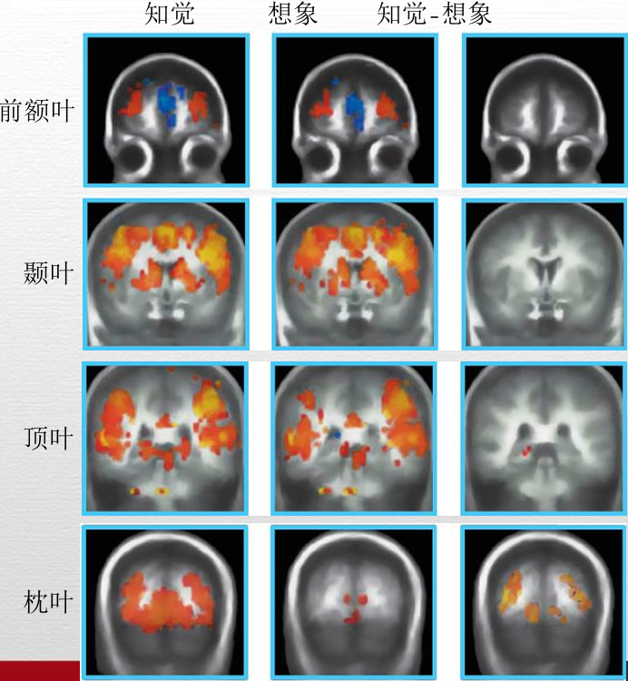

- 言语和视觉表象的结合

  - 言语描述使个体形成视觉表象
    - 例如:一只长着三条尾巴的猫
    - 形成空间心理模型
      - 你能够运用想象把自己投射到一个场景之中.好像你真的站在房间里一样.同说出什么东西在**身后**相比(雕塑),说出什么东西在**面前**所花的时间更少(灯)
      - 言语经验 ==> 视觉的,空间的经验
      - 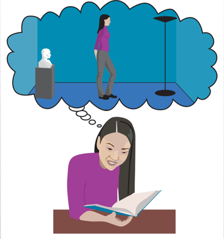

- 问题的解决

  - 问题的定义

    - 初始状态:开始时不完整的信息或令人不满意的状况
    - 目标状态:你希望获得的信息或状态
    - 一套操作:为了从初始状态迈向目标状态,你可能采取的步骤
    - 以上三个部分共同定义了问题空间

  - 定义良好的问题 定义不良的问题

    - 遇到定义不良的问题时,问题解决这的首要工作是尽可能找出问题究竟是什么,即明确初始状态,理想的解决方案以及可能的手段

  - 问题解决的两种方法

    - 算法
      - 总能为特定类型的问题提供正确答案的按部就班的程序
      - 对于定义良好的问题更有用

    - 启发式
      - 通过一些策略或经验法则解决问题
      - 对于判断和决策也至关重要

  - 研究方法:出声思维报告法

    - 要求参与者描述他们正在进行的思维

  - 挑战

    - 解决一个特定问题所需的心理资源超过了加工资源

  - 改进

    - 找到一种问题表征方法,使问题解决的每个操作**在现有的资源条件下都可行**.

      - 对解决办法的每一个成分都进行练习(eric:优化,减少占用的资源)

    - 对问题空间形成适当表征

      - > 
        >
        > eric:证明,但不要联想到数学和言语表征,使用视觉表征

      - 功能固着:一种心理上的阻断,它通过抑制人们感知常与某些功能相联系的物品的新用途,从而对问题解决产生不利影响

  - 创造性

    - 就特定环境而言,个体产生新异且适宜的思想和产品的能力.
    - 创造性的评定
      - 发散思维:对一个问题产生许多不寻常的解决方法的能力.
        - 测量发散思维的问题使测验对象有机会展示流畅性和灵活性思维.

      - 聚合思维:通过整合不同来源的信息解决问题的能力.
        - 远距离联想测验
        - 顿悟:突然想到问题解决办法的情况

      - 创作出具有创造性的作品
  
- 演绎推理

  - 正确运用逻辑规则,得出有效结论
    - 前提1:这家饭店接受所有的主流信用卡
    - 前提2:美国运通卡是一种主流信用卡
    - 结论:这家饭店接受美国运通卡
    - eric:由小推大(venn)正确的

  - 实际情境中的演绎推理既受到特定知识的影响,也受到针对特定问题个体所能使用的表征资源的影响
    - 前提1:所有带有发动机的东西都需要油
    - 前提2:汽车需要油
    - 结论:汽车有发动机
    - eric:由大推小(venn)错误的

  - 信念偏差效应
    - 人们倾向于把那些他们认为可信的结论判断为有效,而把那些他们认为不可信的结论判断为无效
    - 面对不确定时,与先前知识一致的演绎结论会产生做出"有效"判断的反应偏差;与先前知识不一致的结论会产生做出"无效"判断的反应偏差
    - 有些情况下,运用过去经验的能力有助于在推理任务中表现更好
      - 沃森选择任务:印有AD47的四张卡片,为了检验元音字母背面是偶数这一规则,必须翻开那些卡片?
      - 若评估规则"喝啤酒必须年满18岁",则经验会使得推理变得简单
      - 

- 归纳推理

  - 利用可获得的证据,产生可能而非确定的结论
  - 基于概率而不是逻辑的必然
  - 例子
    - 利用过去的信息产生关于当下和未来的期望
    - 类比式问题解决
      - 当前情形的特征与先前情形的特征之间建立一种类比

    - 心理定势:先前存在的心理状态,习惯或态度
      - 在某些情况下,可以提升感知和问题解决的质量和速度.而当先前的思维和行动方式在新的情境中没有价值时,同样的定势可能抑制或破坏心理活动的质量.

- 判断和决策

  - 判断
    - 形成看法,得出结论或对事件和人做出关键评价的过程

  - 决策
    - 在备选项之间做出选择的过程

  - 启发式和判断
    - 人们的判断依赖于启发式而不是正式的分析方法
      - "适应性工具箱","快速而节俭"的启发式仓库
      - 在大多数情况带来正确的判断

    - 可得式启发式:根据记忆中易于获得的信息做出判断
      - 主要成分
        - 信息提取时相对容易或流畅
        - 容易提取的记忆的内容

      - 例子:在一段小说摘录中,是以字母"k"开头的单词更多呢? 还是第三个字母是"k"的单词更多?(大多数人相信"k"更 经常出现在词的开头,事实上"k"更常出现在第三个位置)
      - 不同的背景将影响提取信息的容易程度,进而影响判断
        - 当测试者先完成一些测验,涉及到"bike,poke,take"等单词后再回答上述问题,答案有所改变

      - 记忆偏差也可能导致我们做出错误判断
        - 由于人们更容易记得负面结果而非正面结果,所以学生们会高估他们将正确答案改成错误答案的概率,而低估将错误答案改成正确答案的概率

    - 代表性启发式:基于客体是否具有某类别成员的典型特点做出判断
      - 代表性编码:峰尾规则
        - 代表值通常是事件的峰值强度和结尾强度的平均

    - 锚定式启发式:对某个事件或结果的可能值所做出的判断,相当于对一个起始值的不充分调整--或者向上,或者向下
      - 请你花5秒钟估计一下下面几个数字的乘积,然后写下你的答案:
      - 1 × 2 × 3 × 4 × 5 × 6 × 7 × 8 × 9 =
      - 9 × 8 × 7 × 6 × 5 × 4 × 3 × 2 × 1 =

- 决策心理学

  - 对选项的一个特定的描述
  - 决策的后果
    - 后悔
      - 当决策结果很糟糕时
      - 选择机会广泛时
      - 当人们明确知道某个决策带来的损失时

    - 恶魔盒子实验
      - 当参与者错失更多机会时,随后会冒更大的风险
      - 壳核的激活为其他的脑结构提供信息,最终产生冒险模式

    - 决策者差异:知足者 最大化者

***

## 9 智力与智力测量

- 心理测量
  - 心理测量(psychological assessment)是指使用特定的测验程序来评估人们的能力,行为和个人特质
  - 心理测量通常是指对个体差异的测量,因为大多数测量都是针对在某一特定维度上,某个个体与其他人的差异或相似程度
- 测量的历史
  - 中国古代的测量技术 - 科举选拔制度
  - 西方智力测验:弗朗西斯.高尔顿爵士 <遗传的天才>
    - 提出治理测量的四条重要思想
      - 智力差异可以根据智力程度来量化
      - 智力的个体差异呈正态分布(钟形曲线)
      - 智力或心理能力可以通过客观测验测得
      - 两套测试成绩之间的相关程度可以通过统计程序确定
- 正式测量的基本特点
  - 应该满足三方面的要求
    - 信度,效度和标准化
  - 信度指某一测量工具给出一致分数的可信程度
    - 重测信度:同一批人先后两次接受同一种测验,计算两次所得分数的相关程度
    - 内部一致性测验:(例子)比较某人在测验的奇数项目和偶数项目上的得分.若两部分得分相当,则测验内部一致性好,具有较高信度.
  - 效度指测验能够测得它所要测量的东西的程度
    - 内容效度:当测量能够测量**欲测领域的所有方面**时,测验具有内容效度
    - 效标关联效度(效标效度):测验的成绩与和测验相关的其他标准上成绩的相关程度
    - 结构效度:指测验充分测量潜在结构的程度
  - 信度是某一测验与其自身的相关程度,效度是测验与外部的相关程度.
  - 通常,缺乏信度的测验也不具有效度,但具有信度的测验**也可能没有**效度.
  - 常模:是基于对大量人群施测所指定的标准,通过将个体的测验分数与测验常模相比较,可以得到对于测验分数的解释.
  - 标准化:指在同一条件下对所有人,以同样的方式实施测验.标准化是必要的,它使得常模具有意义.
- 智力测验的起源
  - 智力(intelligence)是一种一般性的心理能力,其中包含推理,计划,问题解决,抽象思维,理解复杂思想,快速学习以及从经验中学习等能力
  - 由于智力包含多种能力,所以对于智力的测量向来存在着争议
  - 第一份可实施的智力测验:比奈智力测验 (阿尔弗雷德.比奈和西奥多.西蒙,1905)
    - 客观智力测验,用于区分发育迟滞儿童与正常学龄儿童
    - 测验通过选择题的形式评定儿童的判断能力与推理能力
    - 不同年龄的正常儿童的平均分数被作为基准.每个儿童的测验结果以达到某一特定分数的儿童的平均年龄(即心理年龄)来表示.
- IQ测验
  - IQ,即智商,是对**智力的数量化和标准化的测量**
  - 斯坦福-比奈量表(刘易斯.推孟,1916)
    - 对比奈测验进行了标准化,通过对成千上万名儿童的测量结果得到了与年龄相关的常模.
    - 提出智商,IQ的概念,IQ = 心理年龄÷生理年龄×100
  - 韦克斯勒智力量表(WAIS)(大卫.韦克斯勒,1955)
    - 量表包括言语和非言语(或操作)分测验,可以分别估计言语和非言语IQ值.
      - 语言理解:相似性;词汇
      - 知觉推理:方块图形;图片填充
      - 工作记忆:数字广度,算数
      - 加工速度:符号搜索;划消
    - WAIS-IV适用于16岁及以上人群,WISC-IV适用于6-16岁儿童, WPPSI-III适用于2.5-7.25岁儿童,韦氏测验家族可以提供所有 年龄段的IQ分数,可用于追踪特定智力随时间的发展
- 极端智力
  - IQ=100是平均值,分数段85-115之间的个体被界定为正常
  - 智力缺陷:18岁以下的个体在智力测验中的有效IQ得分低于平均分约两个标准差时,他们就被界定为智力缺陷.此外,被归为智力缺陷的个体还必须表现出适应性行为缺陷,即"在日常生活中习得的概念技能,社交能力和实践技能的集合"存在缺陷.
  - 智力缺陷可能与基因和环境因素有关-----唐氏综合征,苯丙酮尿症与不良产前环境都可能导致智力缺陷
  - 智力缺陷个体与正常个体的分离教育被证明并不有效
  - 个体的学业成绩和所测得的IQ之间存在巨大差异会被诊断为学习障碍
- 特殊智力
  - 天才:个体IQ分数在130以上,且在能力,创造力和任务执着三个维度上都有高水平的表现
  - 天才往往比同龄人能够更好地进行社交和情绪调整,在生活上都很成功
  - 由于天才被认为是一种多维度建构,对于天才的教育应该更为灵活以适应学生个体的特殊天赋
- 智力的心理测量学理论
  - 心理测量学是心理学的一个分支领域,主要对心理能力进行全方位的测量,包括人格评定,治理评估和能力测量
  - 查理斯.斯皮尔曼在智力领域应用因素分析,发现个体在不同智力测验上的成绩高度相关,认为存在一般智力因素或g因素,这是所有智力操作的基础,每个维度还与其特殊智力相关联,即s因素.
  - 雷蒙德.卡德尔采用更为先进的因素分析方法,将一般智力分为两个相对独立的成分:晶体智力与流体智力.
    - **晶体智力**包括一个人所获得的知识以及获得知识的能力;
    - **流体智力**是发现复杂关系和解决问题的能力.
  - 斯滕伯格的治理三因素理论
    - 自卡德尔之后,许多心理学家都扩展了智力的概念范围, 加入许多传统IQ测验没有的操作.
    - 罗伯特.斯滕伯格提出了智力三因素理论,认为智力包括三种类型:
      - 分析智力:提供了人们对于许多熟悉任务的基础信息加工技能.
        - 知识获得成分,操作成分和元认知成分
      - 创造智力:指人们处理新异问题的能力.
      - 实践智力:包括对新的不同环境的适应,选择合适的环境以及有效地改变环境以适应你的需要.
  - 加德纳的多元智力理论
    - 霍华德.加德纳提出了多元智力理论,涵盖人类经验范围 的许多智力.每一种智力依据特定社会对它的需要,奖赏以及它对社会的作用,在不同的人类社会中其价值也有所不同.
    - 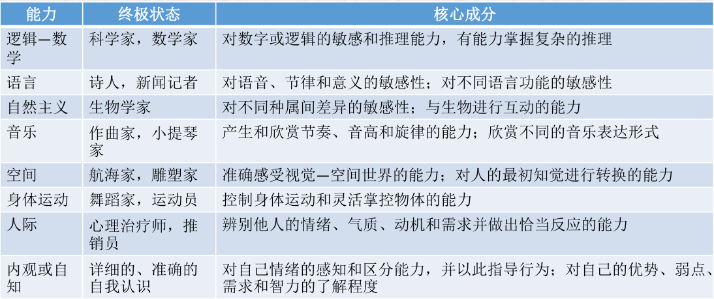
- 情绪智力
  - 情绪智力与加德纳的人际智力和内省智力的概念相关,也有一种主要观点认为情绪智力包括四种主要成分
    - 准确和适当地知觉,评价和表达情感的能力
    - 运用情绪来促进思维的能力
    - 理解和分析情绪,有效运用情绪知识的能力
    - 调节和管控情绪,以促进情绪和智力发展的能力
  - 情绪智力对于日常生活有非常重要的影响.
- 群组比较的历史
  - 几乎从一开始,智力测验就被用来对少数种族和民族群体做出负性评价.
  - 智力的差异可以被归因于先天的遗传因素,但也要考虑环境对于IQ的重要影响.
- 遗传,环境与IQ
  - 双生子研究通过比较同卵双生子,异卵双生子和其他基因有重叠的亲戚之间的表现差异,确定对于某 项特质遗传因素的贡献.
  - 对于IQ的双生子研究用于 对IQ进行遗传力估计,即估计基于IQ的测验分数可归因于遗传因素的变异比例.
  - 研究发现30%-80%的IQ分数变异来源于遗传.
  - 研究同时发现遗传力虽年龄的增长而增加.可能的解释为"遗传倾向将我们推向了能突显我们的遗传特质的环境,因而使遗传力随年龄增长而增加".
  - 遗传力估计是组内的估计,不能解释组间的差异.
  - 基因在个体IQ测验中起着相当大的作用,同时社会经济地位,教育水平等环境因素也在很大程度上影响着IQ.
- 文化与IQ测验的效度
  - IQ测验的成绩能否用于跨文化和种族的比较存在争议.
    - IQ测验对于不同文化下背景知识不同的受测者的难度存在差异;
    - 人们会在能力测验中受到刻板印象威胁的影响.
  - 刻板印象威胁通过以下三种破坏机制产生消极影响:
    - 导致应激生理反应从而影响注意力集中;
    - 促使个体密切监控自己的表现,从而导致做出更谨慎,更缺乏创造性的反应;
    - 当个体体验到刻板印象威胁时,心理资源会部分用于压制由此 引发的负性想法和情绪.
    - 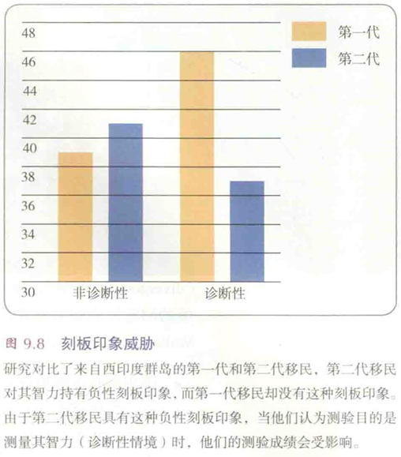
- 测量与社会
  - 心理测量领域充满争议,焦点是三个与伦理有关的方面:
    - 基于测验的决策的公平性;
    - 测量用于教育评价的可行性;
    - 根据测验分数进行个体分类的意义.
  - 尽管智力测验可用于预测,也可以作为个体当前表现的指标,但测验的结果不应该用来限制个体发展和改变的机会.
  - 当测量的结果将影响个体的生活时,所用的测量技术对该个体和测量目的而言,必须可信而有效.

## 10 人的毕生发展

- 发展心理学

  - 关注个体从受孕开始贯穿一生所发生的生理和心理机能的变化

  - 发现有机体怎样以及为什么会随着时间的推移而发生变化,也就是说对发展进行记录和解释

  - | 阶段     | 年龄段                |
    | -------- | --------------------- |
    | 胎儿期   | 从受孕到出生          |
    | 婴儿期   | 足月出生到大约18个月  |
    | 童年早期 | 从大约18个月到大约6岁 |
    | 童年中期 | 从大约6岁到大约11岁   |
    | 青少年期 | 从大约11岁到大约20岁  |
    | 成年早期 | 从大约20岁到大约40岁  |
    | 成年中期 | 从大约40岁到大约65岁  |
    | 成年晚期 | 大约65岁以后          |

### 研究发展

- 在描述发展时,常使用"变化"这一概念
  - 收获与丧失的权衡
- 发展是个体与环境主动互动的过程
- 常模研究
  - 试图刻画某个特定年龄段或发展阶段的特征,确定发展的关键点
  - 提供了发展或成就的标准模式,即常模
- 常模标准可供区分生理年龄与发展年龄
  - 生理年龄:一个人自出生以来的岁月
  - 发展年龄:一个人能表现出大部分人所具有的特定生理或心理发展水平时的生理年龄

- 研究设计

  - 纵向设计
    - 连续多年不间断地持续观察和测试同一个体
    - 优点
      - 避免年代条件变化的影响
    - 不足
      - 只能适用于与参与者生活在同一年代的人
      - 花费巨大
      - 数据易缺损
  - 横断设计
    - 在同一时间观测,比较处于不同生理年龄阶段的参与者
    - 不足
      - 同辈效应(与年龄有关的变化混淆在因出生于不同年代而经历不同的社会和政治条件而产生的差异中)
  - 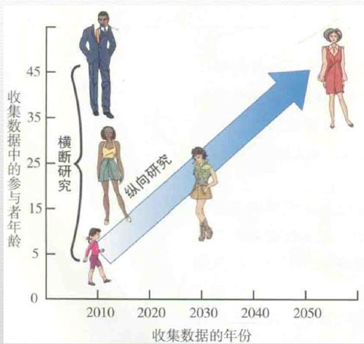

### 毕生的生理发展

- 孕期和儿童期的发展
  - 胚种期
    - 受精卵形成的最初两周
    - 细胞迅速分裂,一小团极微小的细胞将自己植入母亲的子宫壁
  - 胚胎期
    - 3-8week
    - 细胞继续迅速分裂,开始分化形成不同器官
    - 出现第一次心跳
    - 4week 可以观测到对刺激的反应(不到一英寸)
    - 8week 可以观察到胚胎自发的移动
  - 胎儿期
    - 8week结束 至 婴儿出生
    - 16周时母亲可以感受到胎动(大约18cm)
    - 神经元细胞的繁殖即迁移到正确的位置
  - 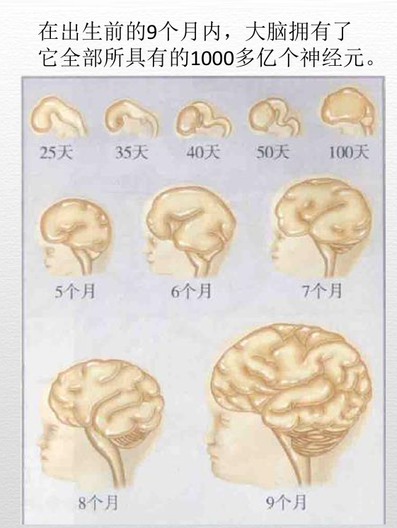
  - 致畸物
    - 任何能够造成胎儿组织异常的环境因素
    - 孕期感染:最初6周几乎一定会导致胎儿先天缺陷
    - 孕期饮酒:胎儿酒精综合症
    - 孕期吸烟:流产,早产和婴儿体重过轻
    - 毒品:终身的智力缺陷和注意控制缺陷
  - 婴儿生存的先天机制
    - 反射
      - 觅食反射,吮吸反射
    - 听觉
      - 对母亲声音的偏好,但对父亲的声音没有偏好
    - 视觉
      - 出生后的头6个月,婴儿的视敏度迅速得到提高
      - 4个月大的婴儿开始能利用一些深度线索
      - 4个月大的婴儿偏爱轮廓鲜明的物体,构造复杂的物体,整体的面孔(3天大的婴儿就对"头重脚轻"的模式有所偏好 - 人脸)
    - 其他感知能力
      - 学会爬行的婴儿开始惧怕深度(视崖)
  - 童年期的发育和成熟
    - 身体各部分的生理发育并不是同时进行的
    - 在生命的第一年里,神经发育的非常迅速,它比总体的生理发育要快很多,与此对照,生殖器的成熟只有到青少年期才开始发育
  - 儿童期发育和成熟
    - 生理发育伴随着运动能力的成熟
      - 一个物种的所有成员在其物种通常的生活环境中被抚养长大的典型生长过程
      - 由遗传和环境的相互作用决定
      - 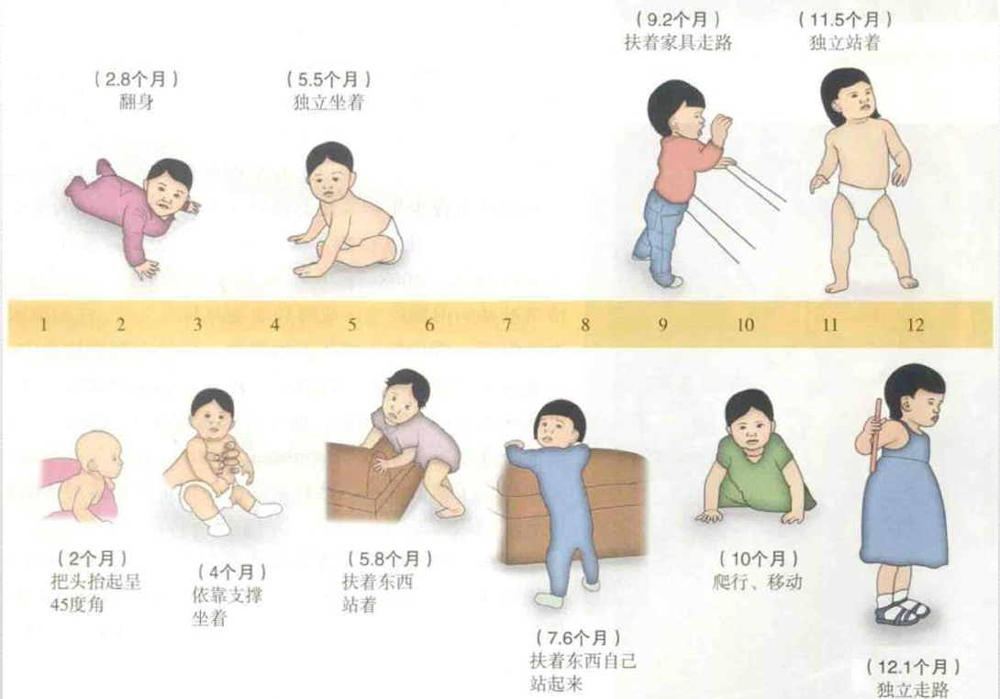
- 青少年期的生理发育
  - 青春期生长突进
    - 女孩10岁,男孩12岁左右,生长激素进入血液,身高和体重迅速增加到与成人同一水平
  - 青春期或性成熟期
    - 男性的青春期以遗精为开始标志
    - 女性则是以月经初潮为开始标志
  - 大脑的持续发育
    - 边缘系统:负责调节情绪过程
    - 前额叶:负责计划,控制情绪
    - 边缘系统比前额叶更早发育成熟
      - 青少年往往容易做出一切危险行为
- 成年期的生理变化
  - "用进废退"
  - 视觉
    - 老花
    - 夜间视物困难
    - 颜色视觉衰退
  - 听觉
    - 听高频音困难(男性更为明显)
    - 理解言语困难
  - 生育和性功能
    - 女性经历更年期,月经和排卵停止
    - 男性精子质量降低,数量减少
    - 不一定损害性体验的其他方面

### 毕生的认知发展

- 皮亚杰关于心理发展的观点

  - 图式

    - 促进个体能够理解世界的心理结构,是发展变化的基本单元

  - 同化和顺应协同工作可以达到认知的发展

    - 同化
      - 对新的环境信息加以修改,使之更适合个体已有的知识结构
      - 使用已有的图式来对新感觉到的数据加以组织
    - 顺应
      - 对儿童已有的图式进行修改或重新构建,以使新的信息得到更为全面的理解

  - 认知发展的阶段:四个有序但不连续的阶段

    - | 阶段/年龄         | 特征和主要成就                                               |
      | ----------------- | ------------------------------------------------------------ |
      | 感知运动阶段 0-2  | 儿童用生来就有的一小部分感觉运动反应开始了生活.儿童发展出客体恒常性和开始了符号思维 |
      | 前运算阶段 2-7    | 儿童的思维具有自我中心的特点.提高了符号思维的能力            |
      | 具体计算阶段 7-11 | 儿童理解了守恒,可以对具体的,实实在在的物体进行推理           |
      | 形式运算阶段 11+  | 儿童发展出了抽象推理和假设思维的能力                         |

    - 感知运动阶段

      - 客体恒常性:儿童理解了客体可以独立于他们的行为和知觉而存在或运动

    - 前运算阶段

      - 自我中心:他们不能站在别人的角度来思考问题
      - 中心化:他们往往只会关注情境的某一方面,而忽略其他相关方面

    - 具体计算阶段

      - 守恒:即使物体的外表发生了变化,但如果不增加或删减,物体的物理属性不会改变
        - 
      - 可逆性:物理活动和心里操作都是可逆的

    - 形式运算阶段

      - 青少年能够意识到,他们所感知的特定现实只是众多可以想象到的现实中的一个,开始思考真理,公平和存在等深刻的问题

- 关于早期认知发展的当代观点

  - 婴儿的认知
    - 3个月大的婴儿已经发展出了客体恒常性的某些方面
    - 7个月大的婴儿已经开始区分行为是否具有目的性
    - 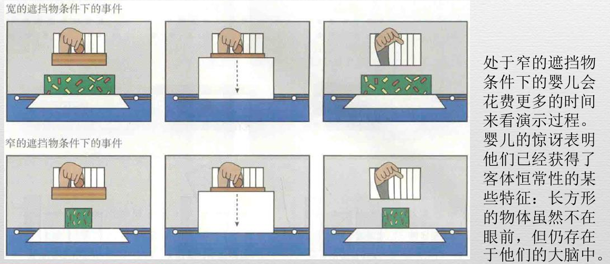
  - 儿童的基础理论
    - 儿童发展起基础理论,即儿童最初理解世界的框架,来解释他们在世界中的经验
    - 心理理论
      - 儿童基于对他人的心理状态的理解来解释和预测他人行为的能力
    - 科学概念的发展
      - 儿童开始发展一个一般性的结论,然后利用一系列新的经验不断对该理论进行修正
  - 社会对认知发展的影响
    - 维果斯基的社会理论
      - 儿童通过内化(儿童吸收来自社会环境的知识)的过程而获得发展
  - 文化对认知发展的影响
    - 跨文化的研究质疑了皮亚杰认知发展理论的普遍性
      - 在许多文化中,儿童并没有表现出形式运算
    - 儿童的认知发展可以执行文化价值的功能

- 成年期的认知发展

  - 记忆
    - 在记忆测验中表现下降
    - 仍能够提取一般性知识和多年前发生的事件的信息

### 语言获得

- 理解言语和词汇
  - 音素区分能力
    - 音素是语言中区分词的最小单位
    - 人类出生伊始就具有感知声音差异的能力,但当这些差异在母语中并不存在时,会很快失去感知其中某些声音差异的能力
  - 婴儿指向型言语或儿童指向型言语
    - 放慢语速,夸张的高语调,结构简单的语言形式
    - 能够让婴幼儿更好地从周围语言中获得音素和词汇
  - 6-7.5 m 开始意识到重复的声音具有某种意义
  - 4.5m 对自己的名字表现出认知偏好
- 学习词的意义
  - 命名爆炸阶段
    - 从18个月到6岁之间,儿童以极快的速度学习新词,特别是物体的名称
    - 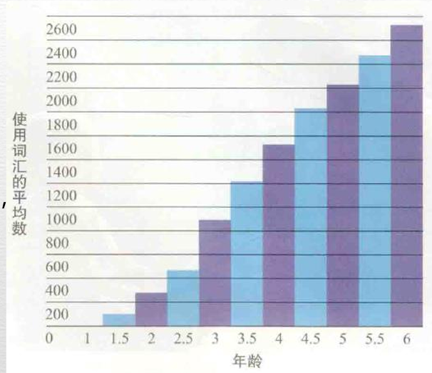
  - 快速映射
    - 从极少的经验中学习新词的含义,有时甚至只需一次
    - 对词义建立一些假设,对词义外延的理解可能扩大或缩小
      - 对比原则
- 获得语法
  - 先天的,由基因决定的
    - 诺姆乔姆斯基:儿童一出生就具有帮助他们理解和产生语言的心理结构
    - 儿童在缺乏很好的输入(如严重丧失听力)的情况下仍能获得完整的语法结构
  - 儿童在学习语言时利用了先天制约机制
    - 语言生成能力的操作原则(丹'斯洛宾)
    - 记住词出现的顺序与其意义之间的关系
      - 主格 动词 宾格
      - 电报句
      - 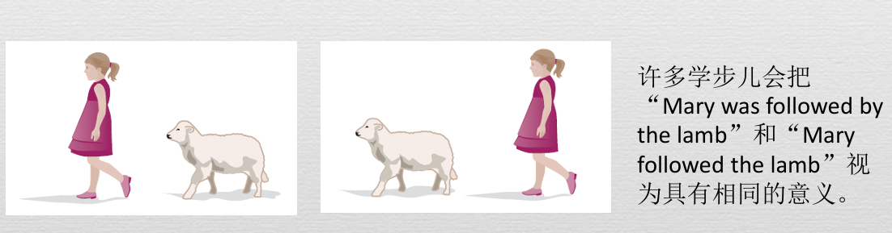
    - 扩充:使用同一个意义单位(词素)来表达同一个概念
      - 过度规则化错误(doed,breaked,foots,mouses)

### 毕生的社会性发展

- 埃里克森的社会心理发展阶段

  - 个体必须成功通过一系列的心理社会发展阶段,每个阶段都会出现一个主要冲突或危机
  - 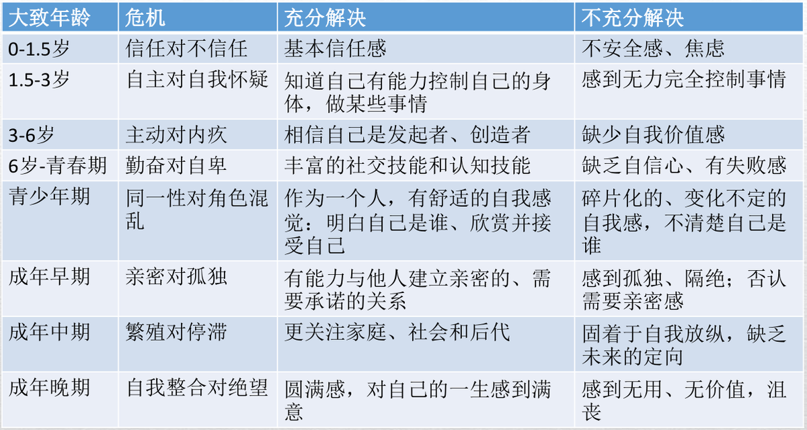

- 儿童的社会性发展

  - 气质

    - 对环境做出反应的那些情感和行为的生物学基础水平
      - 害羞或拘谨
      - 勇敢和无拘束
    - 奠定了其之后的社会化发展的基础,对人生全程有影响

  - 依恋

    - 婴儿与父母或其他主要照料者之间强烈的持久的社会-情感关系

    - 印刻(某些动物的幼雏):某些物种的幼雏会自动地对第一次看到的或听到的移动客体产生印刻

    - 约翰鲍尔比:婴儿和成人之间有生物学基础,从而会形成依恋

    - 依恋关系的经验提供给个体一个终身的有关社会关系建立的图式 -- **内部工作模型**

      - > 一种记忆结构,收集了儿童与其照护者的互动历史.正是这些互动产生了特定的依恋模式.内部工作模型为个体提供了一个模板,个体通过它产生对未来社会关系的预期.

    - 玛丽,安斯沃斯:陌生情境实验法

      - 第一步:儿童被带进一个有很多玩具的陌生房间.有母亲在场的情境下,儿童被鼓励去探索房间和玩玩具
      - 第二步:几分钟后,一个陌生人走进屋与母亲交谈,并接近这个儿童
      - 第三步:母亲离开房间
      - 第四步:短暂分离后,母亲返回,与儿童重新在一起
      - 第五步:陌生人离开
      - 研究人员记录下儿童与母亲分离和重聚时的行为

    - 依恋类型

      - 安全型依恋 65%
        - 儿童在母亲离开房间时显得忧伤;在母亲回来后要寻求亲近,安慰和接触;然后慢慢地又去游戏
      - 不安全依恋 回避型 20%
        - 儿童显得冷淡,在母亲返回后主动躲开或忽视她
      - 不安全依恋 矛盾型 15%
        - 儿童在母亲离开后变得极为不安和焦虑;在母亲返回后也不能安静下来,对母亲表现出生气和抵制,但同时又表现出接触的需要
      - 依恋类型能够有效预测儿童以后再许多情境中行为
        - 儿童在学校的行为
        - 成人恋爱关系的质量
      - 教养方式
        - 父母的教养方式可以从控制性和反应性两个维度来划分.控制性是指父母积极地充当儿童社会化的负责人.反应性是指父母能意识到儿童的个体特点.权威型的教养方式最为有效
        - 教养方式会影响儿童的依恋关系
        - 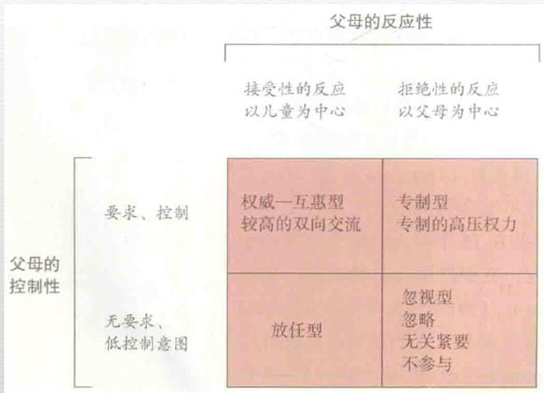

  -

  - 接触性安慰和社会经验

    - 碗柜理论:婴儿依恋是因为父母为他们提供食物
    - 哈里哈洛:婴儿可能会依恋那些给予他们安慰性接触的人

  - 人类剥夺

    - 生理发育,甚至生存

    - 依恋类型

    - 大脑发育

- 青少年的社会性发展

  - 风暴和压力理论
    - 青少年的个体有着极不稳定的情绪,不可预测和困难的行为
    - 控制情绪反应的脑区的发育
    - 家庭环境:与父母的冲突
    - 不适用于非西方文化
  - 詹姆斯马西亚:根据同一性状态对每个青少年进行分类 (可能需要扩充)
    - 同一性扩散
    - 同一性早闭
    - 同一性延缓
    - 同一性获得
  - 同伴关系
    - 从青少年开始,同伴在影响个体的态度和行为上才能够与父母的作用竞争
    - 友谊,朋党,团伙
    - 同伴会促使个体从事危险行为

- 成年期的社会发展

  - 亲密
    - 对他人做出完全承诺的能力,可能会出现在朋友关系和恋爱关系中
    - 是成年期心理健康的先决条件
    - 婚姻与家庭
      - 孩子的出生常常会威胁婚姻的幸福感
      - 父母与青春期孩子的冲突会导致婚姻满意度持续下降
      - 成年晚期,个体的婚姻更加幸福
      - 离婚
  - 繁殖
    - 超越自我,对家庭,工作,社会或后代的一种承诺,"关注他人"
    - 是一个人在三四十岁至关重要的发展阶段
    - 成年后期:以一种圆满和满意感回顾生命历程

### 性与性别差异

- 两性差异
  - 用以区别男女两性的生物特征,包括不同的生殖器官以及激素和解刨学上的差异
- 性别

  - 一种习得的,与性有关的行为和态度的心理现象
- 儿童首先认识到的差异完全是社会性的
- 睾酮
  - 胎内期的6w,男性胎儿开始产生睾酮
  - 使得男性和女性胎儿开始表现出差异,对胎儿出生时的性别十分重要
  - 产前接触对建立典型的性别行为和特征也具有重要作用
  - 对脑的发育有重要影响
- 两性大脑的差异激发了两性的行为差异
  - 大脑的结构差异,如前额叶的大小
  - 大脑在完成认知和情感任务时活动的差异:如观看情绪性照片杏仁核的活动

### 性别认同和性别刻板印象

- 性别认同
  - 个体对男性化和女性化的认同的程度
- 性别刻板印象
  - 关于特定文化中男女两性适宜行为的信念
- 儿童获得性别刻板印象的时序
  - 学龄前阶段 学习有关所处文化度两性期望的知识
  - 5-7y 形成性别刻板印象,最死板
  - 8y左右 开始懂得男孩和女孩之间也存在相似性
- 性别认同的性别刻板信息的信息来源
  - 父母
    - 衣服,玩具,交流方式等
  - 同伴
    - 总是和同性别的孩子凑在一起
    - 男孩:集体活动;追逐打闹
    - 女孩:一对一的交往;参加社会交际,彼此分享信息
- 儿童的性别类型化行为特别稳定

### 道德发展

- 道德发展

  - 道德
    - 一种关于人类行为正确与否的信念,价值和深层判断的系统
  - 进化论的观点
    - 某些情况在人类历史上反复出现,而道德行为恰是这类情况适 应性解决办法的进化结果
    - 早期人类的许多活动(如猎杀大型动物或保护领地)都需要很 多人合作完成→"合作解决日常社会事务"的倾向

- 柯尔伯格的道德推理阶段

  - 道德推理

    - 人们对在某种情形下什么行为是正确的,什么行为是错误的所 做的判断

  - 深受皮亚杰观点的影响

    - 随着儿童认知能力的发展,他们开始从单纯注意后果转换到既 考虑后果也考虑意图

  - 道德发展阶段

    - 每个阶段都有不同的可做出道德判断的基础

    - 道德两难问题:不同的道德原则处于交锋境地,打分的标准是 儿童做出判断的理由,而不是判断本身

      - > 一个名叫海因茨的人视图买到药来挽救他患癌症的妻子.一个 贪婪的药剂师答应海因茨付出比此药成本高10倍的价格时才肯 把药卖给他.这个价格超过了海因茨的承受能力.海因茨为了 救妻子,只好不顾一切闯进药店,偷走了那副药.海因茨应该 这样做么?为什么?

  - 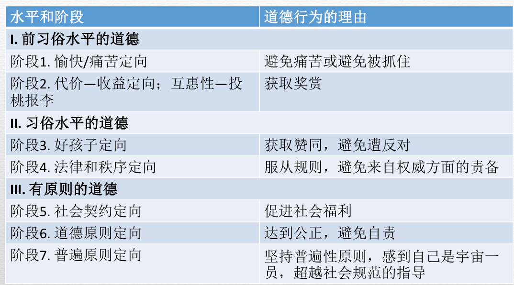

  - 制约原则

    - 个体在某个时间只能处于某一个阶段
    - 每个人都以相同的顺序经历每个阶段
    - 每个阶段都比前一个阶段更为全面,更为复杂
    - 每种文化中都存在同样的阶段

  - 对柯尔伯格理论的争论(主要围绕阶段3以后的阶段)

    - 并不是所有人都会达到阶段4-7
    - 主观性,且难以理解
    - 并未在所有的文化中被验证

- 关于道德推理的性别和文化观点

- 性别差异

  - 道德敏感性:女性更能意识到自己的行为会如何影响他人

- 文化差异

  - 在不同文化中,三类关注点的重要性各不相同,对相同的行为 可能会有不同的道德判断
    - 自主性
    - 共同体
    - 神德

### 学会成功老化

- "用进废退"
  - 生理和认知
- 成功老化
  - 充分利用现有资源,同时尽量减少衰老导致的正常丧失所产生 的影响
- 补偿的选择性优化
  - 选择:个体在数量和程度方面缩少自己的目标
  - 优化:个体在优先选择的领域进行自我实践或训练
  - 补偿:个体利用替代性的方式来应对丧失

***

## 11 动机

- 动机

  - 定义
    - 对所有引起,指向和维持生理和心理活动的过程的统称
  - 动机概念的功能
    - 把生理和行为联系起来
    - 解释行为的差异性
    - 从公开的行动来推断内心的状态
    - 为行为分配责任
    - 解释逆境中的意志
  - 来源
    - 驱力和诱因
      - 驱力
        - 响应动物的生理需求而产生的内部状态
        - 消除紧张
      - 诱因
        - 与生物需求并无直接关系的外部刺激和奖赏
      - 行为是内部和外部动机共同作用的结果
    - 本能行为与学习
      - 本能
        - 对生存至关重要的预置的行为倾向
      - 早期的人类机能学说
        - 人类比动物更多地依赖于本能行为
        - 人类有很多社会本能
      - 跨文化人类学家
        - 发现了不同文化间的行为差异,与本能理论 相悖
      - 行为主义者
        - 反对本能研究中的循环论证
        - 重要的行为与情感是后天习得的
      - 认知取向的研究者
        - 本能和强化史不足以解释某个动物行为的所有细节
    - 动机的期望与认知取向
      - 重要的人类动机不是来自外部世界的客观现实,而是来自对现实的主观解释
      - 期望
      - 对行为结果的预期
      - 朱丽安∙罗特的社会学习理论
        - 个体从事某一行为的可能性是由他对达到目标的期望以及该目标 的个人价值决定的.
        - 期望与现实之间的差距能够驱使个体做出修正行为.
      - 弗里茨∙海德
        - 行为的结果可归因于内在因素或情境因素,这些归因方式影响着个体的行为方式
    - 需要层次
      - 马斯洛的需要层次理论
      - 在到达下一个更高等级之前,更低等级的每种需要都必须被 满足.
      - 核心
        - 每个人都具有成长以及实现最高潜力的需要.

- 饮食

  - 饮食生理学
    - 外周反应
      - 饥饿感
        - 胃部的运动对人们的饥饿感起着重要作用,但并不是饥饿的必要 条件
      - 停止进食
        - 由食物引起的胃部压力--不是由膨胀的气球引起的--将提示个体停止进食
        - 食物的口腔体验
          - 特定味觉饱食感
    - 中枢反应
      - 双中心模型
        - 外侧下丘脑LH:饥饿中枢
        - 腹内侧下丘脑VMH:饱食中枢
      - 对双中心模型的修正
        - VMH的信号依赖于食物类型,VMH的损毁可能会部分增强大鼠对食物的反射性反应.
        - 下丘脑的弓状核(ARC)和室旁核(PVN)对LH和VMH调节进食起补充作用
      - 中枢信号来源
        - 血液里调节糖和脂肪浓度的感受器
  - 饮食心理学
    - 文化对饮食的影响
      - 人们常常按照社会和文化标准来选择吃什么东西
      - 健康饮食的一些障碍是经济限制的产物
    - 肥胖与节食
      - 体重指数(BMI)
      - 为什么有些人会超重?
        - 遗传机制:如控制瘦素的基因
        - 基因与环境的交互作用决定着肥胖的风险
        - 个体对食物和进食行为的看法:限制性饮食 vs. 非限制性饮食
        - 许多超重者常常是限制性饮食者,如果生活中发生 了应激性事件,导致他们 放弃约束,随之而来的暴 饮暴食很容易导致体重增加.
    - 饮食障碍
      - 神经性厌食症
        - 当一个人的体重低于正常体重的最低值(体重指数18.5kg/m2)但 仍然表现出对变胖的强烈恐惧.
      - 神经性贪食症
        - 反复发作的失控性暴食,然后用自我催吐,滥用泻药,绝食等方 式来清除体内多余的热量.
      - 暴食症
        - 毫无节制地狂吃,但又不像神经性贪食症患者一样采取措施清除 体内多余的热量
      - 饮食障碍的风险因素
        - 遗传:在青春期受遗传影响更大
        - 完美主义
        - 高度的身体不满意
          - 与他们的实际身体状况无关, 却与他们不准确的身体感知相关
          - 文化规范和媒体的影响
            - 证据1:与黑人相比,白人女性对 自己的身体满意度更低
            - 证据2:进食障碍患病率的性别差异逐渐缩小

- 性行为

  - 动物的性行为
    - 主要动机:繁殖
    - 性唤起主要是由生理过程决定的
      - 脑垂体和性腺分泌的性激素
      - 刻板性行为模式
    - 性唤起也常常由外部环境的刺激所引起
      - 交配对象展现出仪式化的视觉和声音模式 是性唤起的一个必要条件
      - 雌性配偶的新颖性会影响雄性的行为
      - 触觉,味觉和嗅觉也可以作为性唤起的外部刺激物
  - 人类的性唤起与性反应
    - 性激素
      - 正常范围:无影响
      - 低于正常值:对性欲产生消极影响
    - 性唤起
      - 由对性刺激的生理和认知反应引起的兴奋而紧张的动机状态
    - 马斯特斯和约翰森的性反应研究
      - 男性和女性有相似的性反应模式
      - 尽管两性的性反应周期的阶段顺序是相似的,但女性的变化更多,而且往往反应更慢,但保持的性唤醒时间更长
      - 许多女性能有多次性高潮,而男性在相同的时间里却很少如此
      - 心理过程对于性唤起和性满足的核心意义
        - 性反应问题源于心理因素,而不是生理因素,并且可以通过治疗改善或克服
    - 性规范
      - 科学的影响下,许多文化中都出现了一种更开放地谈论性问题的总体趋势.
      - 性脚本
        - 从社会中学习到的性反应程序
      - 大学生的性行为
        - 性勾搭
        - 强暴:男性和女性行脚本存在毁灭性冲突
          - 约会强暴
    - 同性恋
      - 同性恋的先天和后天因素
        - 遗传性
          - 双生子研究
        - 大脑差异
          - 大脑形状和体积
          - 杏仁核与其他脑区间的联结模式
        - 生物学因素并不直接影响性偏好, 而是通过影响儿童的性情和活动 而产生间接影响
          - 相异感导致情绪唤起,随着时间的推移,这种唤起就会转化成性吸引.
      - 社会与同性恋
        - 社会对同性恋行为持续的敌意
          - 同性恋恐惧症
        - 是否把自己的性取向告诉父母
        - 与同性恋有关的压力不是来 自性动机本身,而是来自性动机公开之后人们的反应

- 个人成就动机

  - 成就需要

    - 反映了计划并努力实现目标对个体的重 要性的个体差异.
    - 主题统觉测验
      - 就一系列模棱两可的画面编故事
      - 利用参与者的想象来测量成就需要的强度
    - 对效率的需要
      - 并不意味着高成就需要的人总是愿意更努力地工作
    - 对成就的需要也能预测某些职业的成功

  - 对成功与失败的归因

    - 归因

      - 关于某一结果产生原因的判断,归因能对动机产生重要影响
      - 三种维度
        - 内部--外部
        - 稳定性--不稳定性
        - 整体--特殊

    - |                | 对成功的归因                     | 对失败的归因             |
      | -------------- | -------------------------------- | ------------------------ |
      | 乐观的归因方式 | 内部的;稳定的;整体的           | 外部的;不稳定的;部分的 |
      | 悲观的归因方式 | 外部的;不稳定的;整体的或特定的 | 内部的;稳定的;整体的   |

    - 工作和组织心理学

      - 在工作条件下,个人动机水平将部分取决于工作环境中 的人员和规章制度的总体情况
      - 公平理论
        - 员工关注他们的投入及其产出,然后 与其他员工的投入与产出进行比较
        - 相等:满意
        - 不相等:不满,行为或心理上的改变
      - 期望理论
        - 当员工预期他们工作上的努力和成绩会产生理想的结果时,他们就会受到激励.
        - 期望 *工具性* 效价

## 12 情绪,压力与健康

- 情绪

  - 一种身心变化的复杂模式,包括生理唤醒,感受,认知 过程,可见的表达(包括面部表情和身体姿势),以及针对知觉为有个人意义的情境所做出的的特定行为反应.
  - 与心境作对比
    - 情绪(emotion)
      - 对具体事件的具体反应
      - 持续时间较短,较为强烈
    - 心境(mood)
      - 不太强烈,并可能持续数天
      - 与触发事件的关系通常较弱
  - 基本情绪和文化
    - 查理.达尔文
      - 情绪与人类的和非人类的结构和功能的其他重要方面一起进化
      - 遗传而来的特化心理状态,其功能是应对世界上某类反复发生 的情境 (Hess & Thibault, 2009).
    - 是否存在一些天生的情绪反应?
      - 希尔文.汤姆金斯
        - 婴儿无须预先学习就会对巨大的声响表现出恐惧或者呼吸困难的反应.
        - 他们似乎对特定的刺激具有"预置"的情绪反应,这种反应非常普遍,足以适应各种环境.
      - 跨文化研究
        - 来自美国,日本和中国的11个月大的婴儿在经历愤怒和恐惧时, 会表现出相同的面部表情(Camras et al.,2007).
      - 习惯化反应
        - 5个月大的婴儿可以区分高兴与恐惧表情(Bornstein & Arterberry, 2003).
    - 面部表情是普遍的吗?
      - 保罗.埃克曼
        - 所有人的"面部语言"都有共同之处
        - 将恐惧,厌恶,快乐, 惊讶,轻蔑,愤怒和 悲伤与七张面孔匹配
        - 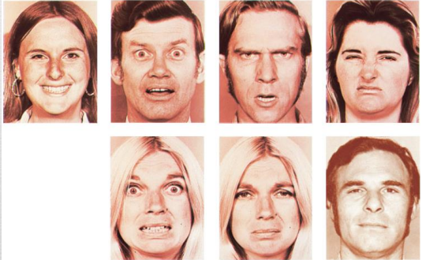
      - 匈牙利人,日本人,波兰人,苏门答腊人,美国人和越南人对 面部表情的判定具有很高的一致性(Biehl et al., 1997).
      - 不同文化的面部表情有不同的"方言"(Dailey et al., 2010; Elfenbein et al., 2007).
        - 当人们做出不同的面部表情时,面部肌肉的特定运动存在一致 的跨文化差异.
        - 观察面孔的习惯性差异,可能导致来自不同文化的人对面孔在表达特定情绪时"看起来是怎样的"有着不同的期待 (Jack et al., 2012)
    - 文化如何制约情绪表达?
      - 不同的文化对情绪应如何管理仍有不同的标准(压抑vs表达)
      - 

- 情绪理论

  - 情绪的生理学

  - 自主神经系统:
    - 轻微的,不愉快的刺激:交感系统
    - 轻微的,愉快的刺激:副交感系统
    - 强烈的情绪反应(如恐惧和愤怒)
      - 紧急反应系统,交感系统促使肾上腺释放激素
      - 紧急事件过后,副交感系统会抑制这些激活性激素的释放
  - 中枢神经系统:
    - 下丘脑与边缘系统:负责整合激素和神经方面的唤醒,它们是情绪以及进攻,防御和逃跑模式的控制系统
    - 杏仁核(边缘系统的一部分):给接收到的感觉信息,尤其是 负性体验,赋予意义
    - 皮层:通过其内部的神经网络以及与身体其他部分的联系来参 与情绪体验过程

  - 詹姆斯-兰格的身体反应理论

    - 情绪来源于身体反馈(eric:归因)
      - 
      - 对刺激的感知引起自主神经系统唤醒和其他的身体反应,而这些反应导致了特定的情绪体验
    - 外周主义理论
      - 认为情绪链中最重要的角色是内脏反应,而控制它的自主神经系统位于中枢神经系统的外周

  - 坎农-巴德的中枢神经系统过程理论

    - 对詹姆斯-兰格的身体反应理论的见解
      - 内脏反应与情绪无关
        - 即使通过手术切断内脏与中枢神经系统的联系,实验动物仍会有情绪反应
      - 自主神经系统的反应显然太慢了,不足以成为瞬间激发的情绪的源头
    - 身体和心理反应具有独立性
      - 
      - 唤醒情绪的刺激同时带来两种结果:通过交感神经系统导致身体的唤醒;通过皮层产生情绪的主观感受
      - 两者不存在因果关系

  - 情绪的认知评价理论

    - 情绪体验不能简单地理解为在个人或大脑中发生了什么, 而要考虑和评估前者与环境的交互作用.

    - 

    - 吊桥效应(Dutton&Aron,1974)

      - ```cmd
        吊桥效应(Capilano Suspension Bridge effect)的实验流程主要包括以下几个步骤:
        
        1. **实验地点选择**:实验一将实验地点设置在加拿大北温哥华的卡皮诺拉吊桥(The Capilano Suspension Bridge)和一个安全坚固,低矮的跨溪实木桥上.卡皮拉诺吊桥全长450英尺,宽5英尺,悬空吊桥左右摇摆,既令人激动又令人惊恐.
        
        2. **实验对象选择**:实验对象为18-35岁之间且没有女伴的男性.
        
        3. **实验过程**:在他们走过桥梁时,桥中央的实验助手会请求他们参与一项研究,要求对方填写调查问卷.问卷第一页收集一些基本信息,问卷第二页要求实验对象根据一张图片描写一个简短的,戏剧性的故事.如果实验对象同意参与实验,就在桥上完成问卷.
        
        4. **实验助手**:实验助手的性别选择了男性和女性分别在两座桥上开展,实验助手并不知道实验的真实目的.
        
        5. **后续联系**:完成问卷后,实验助理会给实验对象留下联系方式,并邀请每个实验对象之后进一步交流.
        
        6. **故事评分**:实验结束后,研究者对每个实验对象编撰的故事进行评分,根据故事中涉及到的性相关内容进行1(低性内容)-5(高性内容)的评分.
        
        7. **实验结果分析**:研究者比较了在吊桥和实木桥上完成问卷的男性对实验助手的吸引力评价以及他们联系实验助手的频率,以此来分析吊桥效应的存在.
        
        这个实验通过比较在不同情绪唤醒状态下(如恐惧或兴奋)的男性对同一女性的反应,来探讨情绪唤醒与性吸引力之间的关系.实验结果表明,在卡皮拉诺吊桥上的女性实验助手性吸引力更强,有更多的实验对象在实验结束后联系实验助手,且所描述的故事涉及的性相关内容更多.
        ```

      - 支持:人们通过评估环境线索来解释自己的生理唤醒

    - Zajonc:在一些条件下人们会有某种偏好-对刺激的情绪反应-却不知原因(2000,2001)

    - 认知评价是情绪体验的一个重要过程,但并不是唯一的(Izard,1993)

- 心境和情绪的影响

  - 人们体验到的心境对加工信息的方式有强烈的影响 (Clore & Huntsinger, 2007; Forgas, 2008).
    - Pickel, 2009
    - 学生们观看了一段记录犯罪过程的视频.一个版本中行凶者手 持一把手枪;另一个版本中行凶者拿着一张装在塑料盒里的音 乐CD.
    - 看完视频后填写问卷,以测试他们对行凶者外貌的回忆能力.
    - 当行凶者拿着手枪时,参与者的回忆要差得多.
    - 当持枪者是女性时,参与者的成绩最差.
  - 情绪唤醒能让人们把更多的心理资源聚焦于高优先级的刺激(Mather&Sutherland,2011)
  - 在一定程度上你能控制情绪对自己及他人的影响.你有情绪调节的能力,你可以改变情绪体验的强度和持续时间 (Gyurak et al., 2011).

- 主观幸福感

  - 个体对生活满意度和幸福度的总体评价
  - 遗传对主观幸福感的个体差异有影响
    - 挪威双生子研究(Nes et al., 2006)
      - 比较同卵和异卵双生子,遗传因素可以解释男性主观幸福感51% 的方差,而女性为49%.
    - 美国双生子研究(Weiss et al., 2008)
      - 遗传对主观幸福感有很大的影响.
  - 生活经历对主观幸福感的影响
    - 调查46个国家的8557名参与者(Kuppens et al., 2008)
      - 积极情绪对生活满意度的影响约两倍于消极情绪.
      - 存在文化差异,如在生存都成问题的文化里,生活满意度的判断 较少取决于积极的情绪体验.

- 生活压力

  - 应激(stress):
    - 当刺激事件打破了有机体的平衡,使其难以应付或超出其应对能力时,有机体做出的一种反应模式.
    - 这些刺激事件包括各种各样来自外界或内部的情形,统称为应激源.(要求有机体做出适应性反应的刺激事件)
    - 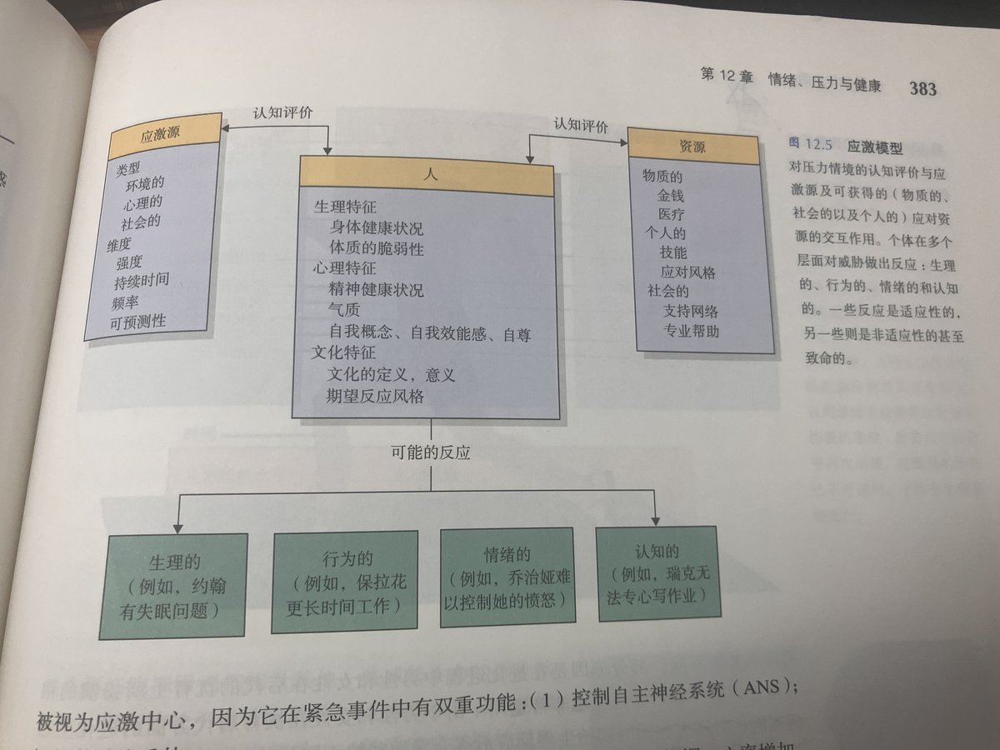
  - 生理应激反应
    - 慢性应激:长期的唤醒状态,会持续很长时间,它使人感到自己可获得的内在和外在资源达不到应对压力的要求.(没有时间去做所有想做的事而感到持久的沮丧)
    - 对于急性威胁的紧急反应
    - 战斗或逃跑反应
      - 下丘脑发起的对于危险的应激反应.
    - 照料和结盟反应
      - 在应激时期,首先要考虑孩子的需求,确保他们的安全
      - 与自己所在的社会团体里有着相同目标(降低孩子的风险)的 成员结盟.
    - 急性应激中的躯体反应
      - 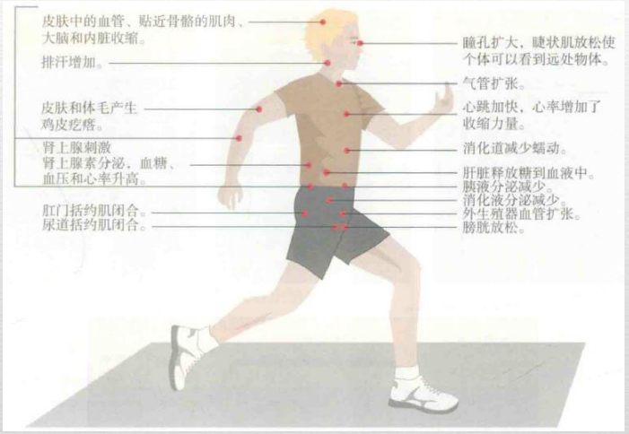
    - 一般性症候群和慢性应激
      - 报警 抵抗 衰竭
      - 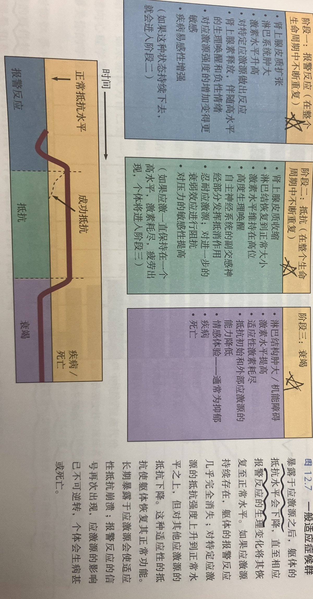
  - 心理应激反应
    - 重大生活事件 社会再适应量表
    - 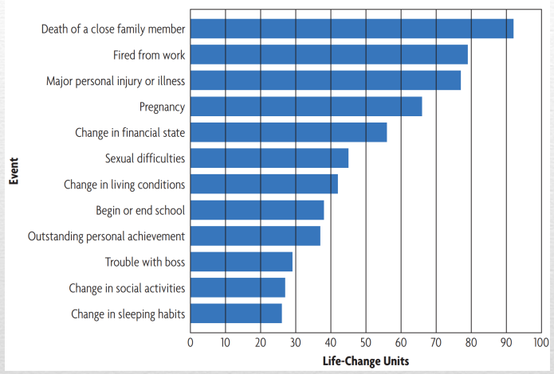
    - 并非所有的生活事件对所有人都有同样的影响
      - 
  - 创伤性事件
    - 一个消极且无法控制,无法预测或模棱两可的事件特别有压力.
    - 创伤后应激障碍(PTSD)
      - 
    - 慢性应激源
      - 一般来自社会和环境事件
      - 如犯罪,经济条件,污染,恐怖 主义的威胁等
    - 日常挫折
      - 挫折与健康问题有明显的相关 (Lazarus, 1981; 1984b).
      - 日常性挫折带来的影响可以被日常积极体验所抵消 (Lazarus & Lazarus, 1994).
  - 应对:
    - 处理那些被认为使个人资源紧张或超出个体资源的内在或外在 要求的过程.
    - 对压力的评估
    - 一般评估理论
    - 初级评估:对严重性的初始评估
    - 次级评估:评估可用于处理压力情境的个人和社会资源
    - 
    - 压力调节变量
      - 可以改变应激源对特定类型的应激反应的影响的变量.
        - 调节变量过滤或调节应激源对个体反应的影响
      - 例如疲劳水平和总体健康状况就是影响你对某个特定的心理或 生理应激源的反应的调节变量.
      - eg:认知评估
    - 应对策略的分类
      - 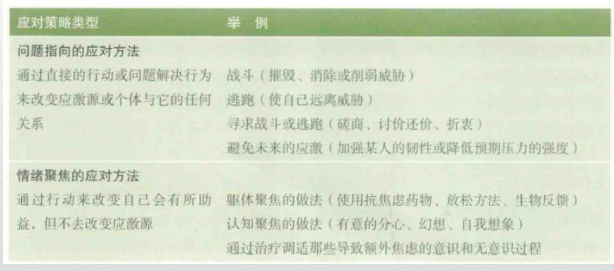
    - 改变认知策略
      - 重新评价应激源自身的性质
      - 重构你对于应激反应的认知
    - 压力免疫法 (Meichenbaum,1977,1985,1993)
      1. 人们努力提高对自己实际行为的认识
      2. 人们开始找出可以抵消非适应性的自我挫败行为的新做法
      3. 当适应性行为建立后,个体要对他们的新行为的结果进行评估,避免先前的那种自我贬低的内心独白
    - 确立对应激源的控制感
    - 将社会支持作为应对资源
      - 个体需要的支持类型与得到的支持类型需要相互匹配
      - 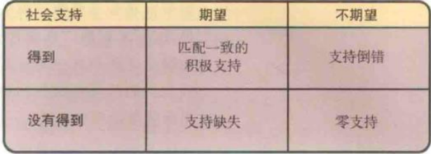
    - 应激的积极作用
      - 积极应激
      - 益处发现(人们从负面事件中寻找积极方面的能力)
      - 创伤后成长

- 健康心理学

  - 致力于研究人们保持健康的方式,患病的原因以及生病 后的反应方式.
  - 健康是指身体和精神在健全和活力方面的一般状态.
  - 健康的生物心理社会模型
    - 健康是一个动态的,多维度的体验,与心理状态和社会 环境相关.
    - 身心健康综合了身体,智力,情绪,精神,社会和环境 的方方面面.
  - 健康促进
    - 制订一般的策略和特定的方法来消除或减少人们患病的 风险.
  - 治疗
    - 遵医嘱
    - 利用心理治疗身体
      - 放松反应
      - 生物反馈
    - 心理神经免疫学
      - 心理状态会影响免疫功能
    - 心理对健康结果的影响
      - 压抑与个人创伤,失败,悔恨或羞耻经历有关的想法和感受, 对精神健康和生理健康有灾难性的损害.
      - 
  - 人格与健康
    - A型行为模式
      - 极端好胜,富有攻击性,缺乏耐心,有时间急迫感和敌意
    - B型行为模式
      - 较少有竞争性,较少敌意等
    - 乐观主义与免疫功能
  - 职业倦怠与医疗保健系统
    - 职业倦怠:
      - 一种情绪衰竭,去人性化,个人成就感降低的综合征.
      - 通常发生在那些需要不断同病人,来访者和公众进行高强度接 触的职业中.
    - 如何减少工作倦怠?
      - 减少看护者需要照顾的病人的数量
      - 更改工作日程表,避开高压力情境
      - 采用团队接触代替个人接触
      - 给予积极反馈

## 13 理解人类人格

- 人格和人格理论
  - 人格
    - 一组对个体的特征性行为模式有跨时间和情境影响的复杂的心 理品质.
  - 人格理论
    - 对个体人格结构和功能的假设性陈述.
    - 目标
      - 理解每个个体在人格的结构,起源以及关联因素上的独特性;
      - 理解每种独特性的人格如何引发典型的行为模式.
    - 人格理论家研究取向的不同体现在出发点,数据来源以及所要解释的现象等方面.

- 特质 (对特质的描述)

  - 持久的品质或属性,使个体倾向于在各种情况下表现出一致性.

  - 引起行为的内在倾向 vs. 描述性维度(总结观测到的行为模式)

  - 奥尔波特的特质理论

    - 特质可能作为中介变量将一系列乍看之下毫无关联的刺激和反 应联系在一起.
    - 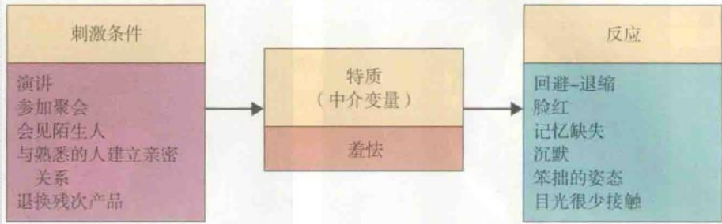
    - 三种特质
      - 首要特质:一个人整个生活都要围绕其组织的特质.并非所有人 都会发展出这种具有支配性的首要特质.
      - 核心特质:代表一个人主要特征的特质.
      - 次要特质:有助于预测个体行为,但对理解个体人格不太有帮助 的特定个人特征.
    - 决定个体行为的关键因素是人格结构而不是环境条件.

  - 确定普适的特质维度

    - 卡特尔:人格的16因素

      - 根源特质:外显行为的潜在根源

    - 艾森克:人格的三大维度

      - 外向性:内部导向与外部导向
      - 神经质:情绪稳定与情绪不稳定
      - 精神质:善良的,体贴的与有攻击性的,反社会的
      - 
  
  - 五因素模型("大五")

    - 通过对特质词群的统计分析得出.
    - 人们用来描述自己和他人的特质 背后仅有五个基 本维度.
    - 每个维度都有对立的两极.
    - 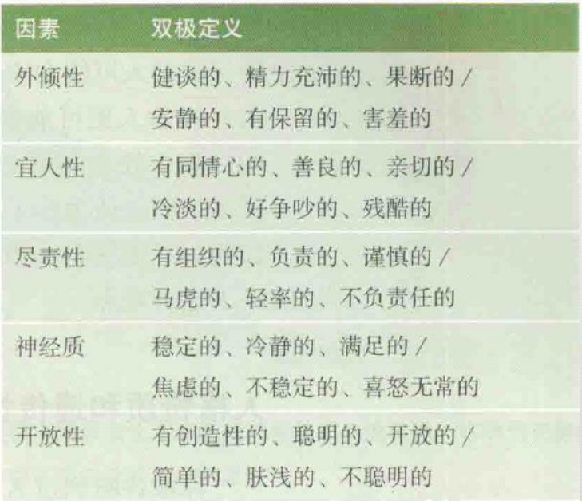
    - 普遍性
      - 许多独立的研究小组得出了相同的结论.
      - 在56个不同的国家和地区得到重复验证.
    - 五因素模型中的特质差异对应着个体脑功能的差异.
  
    - 特质维度的进化观

      - 从进化的角度解释为什么出现的恰好是这五个维度?
        - 将五个维度的差异视为对基本社交问题的回答
        - 外倾性:谁是好伙伴?
        - 宜人性:谁是善良的,支持性的?
        - 尽责性:谁会坚持不懈?
        - 神经质:谁的情绪是不稳定的?
        - 对经验的开放性:谁有奏效的想法?

      - 进化角度的分析有助于解释五因素跨文化的普遍性.
      - 为什么在这些维度上会存在如此大的差异?
        - 人类进化过程中的环境多样性
    - 特质与遗传性
  
      - 几乎所有的人格特质都受到遗传因素的影响
        - 行为遗传学
          - 双生子研究:人格跨时间的稳定性取决于遗传因素,而人格的变 化则是由环境因素造成的.
    - 特质能否预测行为
  
      - 一致性悖论
        - 在不同时间或由不同观察者做出的人格评定具有一致性,然而 对个体在不同情境下的行为评定却缺乏一致性.
        - 解释
          - 对情境的分类方式是错误的:一旦理论家们能够恰当地描述情境 的心理特征,这一悖论就会消失.
          - 研究者用"如果—就"式的人格标签来描述人们对性情与情境关 系的认知.
    - 对特质理论的评价
      - 识别和描述与行为相关的各种特质.
        - 按照人格结构现有的样子为之提供静态的或者稳定的描述.
  
      - 不解释"行为是如何产生"或"人格是如何发展".

- 心理动力学理论

  - 心理动力学人格理论的共同假设 :强大的内在力量塑造了人格并引发行为.
  - 弗洛伊德的精神分析理论
    - 驱力
      - 每个人被认为具有与生俱来的本能或者驱力,即由身体器官产 生的张力系统.这些能量源一旦被激发就会以各种不同的方式 表达出来.
      - 两种基本驱力:
        - 和自我生存相关的驱力
          - 饥饿,口渴等

        - 性本能
          - 性冲动和物种延续有关的本能.包括其他 所有的寻求快乐或与他人身体接触的尝试.
          - 力比多
          - 需要即时的满足:直接的行为或梦和幻想等间接的行为.

    - 心理性欲发展
      - 五个阶段:口唇期,肛门期,性器期,潜伏期,生殖期.
      - 俄狄浦斯情结
        - 4-5岁的小男孩都有一种将父亲视为争夺母亲注意力的性竞争对手 的内在冲动.
        - 在男孩对父亲的力量产生认同时得到解决.

      - 固着
        - 在某个阶段得到过多满足或挫折都会导致固着,即无法正常地进 入下一个发展阶段.
        - 每个阶段的固着都会导致成年后不同的性格特征.

    - 精神决定论
      - 所有心理和行为反应(症状) 都是由早期经验决定的.
      - 无意识:意识无法通达的信息仓库.
      - 行为能够被人所意识不到的 驱力所激发.
        - 基于焦虑的神经质症状,梦, 笔误或者口误.
        - 弗洛伊德式的失误.

    - 人格的结构
      - 人格的两个敌对部分(本我和超我)之间的一场无休止的战斗, 这场战斗由自我(人格的第三个部分)来调和.

      - 本我
        - 基本驱力的仓库
        - 快乐原则:无节制地寻求当下的满足而不计后果.

      - 超我
        - 个体价值观的仓库,包括从社会习得的道德态度.
        - 良心,理想自我:做正确的事情.

      - 自我
        - 个体关于物质和社会现实的个人观点,是其意识中关于行为的原 因和结果的信念.
        - 现实原则:理性选择置于快乐需求之前.

    - 压抑与自我防御
      - 压抑
        - 极端的欲望会被从意识推入无意识的私密空间中.
        - 一种自我保护的心理过程,使个体不必因为无法接受的或可能引 起危险的冲动,想法或记忆而体验到嫉妒的焦虑或内疚感.
        - 最基本的自我防御机制.

      - 自我防御机制
        - 自我用来保护自身的心理策略,使其在寻求表现的本我冲动与否 定它们的超我要求之间的日常冲突中免受伤害.
        - 焦虑:被压抑的冲突将要进入意识时所引发的一种强烈的情绪反 应.
        - 带有自我欺骗性,过度使用时会带来负面结果.
        - 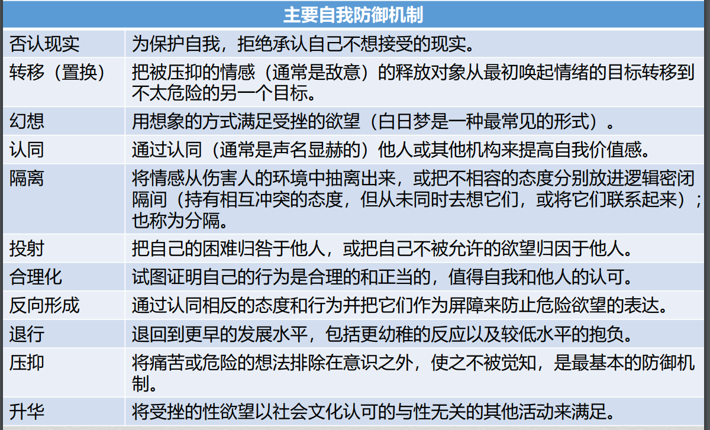

      - 批评
        - 一些概念是模糊的,没有操作性定义.
        - 不能可靠地预测将要发生什么,它的应用是回溯性的,是在事件发生之后利用精神分析理论理解人格,通常涉及对历史的重构,而不是对可能的行为和可预测的结果的科学建构.过分强 调当前行为的历史成因,忽视了可能引发和维持该行为的当前 刺激.
        - 是一个关于发展的理论,但从不对儿童进行观察或研究.
        - 弱化了创伤性经验的作用.
        - 男性中心主义偏见.

      - 修正与改善后的认可
        - 无意识
        - 防御机制

  - 弗洛伊德理论的拓展
    - 主要修正
      - 更强调自我的功能,包括自我防御,自我的发展,有意识的思 维过程和个人控制.
      - 认为社会变量(文化,家庭和同伴)对人格的形成具有重要的 影响.
      - 较少强调一般的性冲动或力比多的重要性.
      - 认为人格发展不仅限于儿童期,而是持续一生.

    - 阿尔弗雷德.阿德勒
      - 克服自卑感,追求卓越

    - 凯伦.霍妮
      - "子宫妒忌"
      - 强调文化因素
      - 强调目前的人格结构而不是婴儿性欲

  - 后弗洛伊德理论
    - 卡尔.荣格
      - 集体无意识:包含整个人类共享的基本心理现实.
      - 原始意象:特定经验或客体的原始符号表征.
      - 分析心理学:
        - 人格视为处于动态平衡的各种互补的内部力量的集合.

      - 否定力比多的重要性,提出两种同样强大的无意识本能.
        - 创造的需要以及成为一个自洽的完整个体的需要

- 人本主义理论

  - 自我概念
    - 关于自身典型行为和独特品质的一种心理模型.

  - 自我实现
    - 个体为了实现个人内在潜能而不断努力的过程.
    - 亚伯拉罕.马斯洛的需要层次理论

  - 卡尔.罗杰斯
    - 自我实现的驱力有时会与个体获得 自我和他人认可的需要相冲突.
    - 无条件积极关注
      - 儿童:父母
      - 成人:自我,与自己亲近的人

  - 凯伦.霍妮
    - 人们的"真实自我"需要一个良性的环境氛围才能得以实现.
    - 儿童缺乏良性的养育条件→根本性焦虑→求助人际或内部防御
      - 人际防御:亲近别人,对抗别人,远离别人
      - 内部防御:不现实的,理想化的自我意象,遵循僵化的品行规则 的尊严系统

  - 人本主义理论的特点
    - 整体论:依据个体的整体人格来解释其分散的行为.
    - 内在倾向性:创造性与成长
    - 现象学:个体参照系及对现实的主观看法,当前导向

  - 批评
    - 概念模糊不清,难以研究.
    - 不关注个体的独特特征.
    - 忽略环境因素.

  - 心理传记
    - 系统地运用心理学理论,将一个人的一生写成一个连贯而具有启发性的故事.

- 社会学习和认知理论

  - 学习理论
    - 人格被视为由个体的强化经历可靠地引发的显性和隐性反应的总和.

  - 认知理论
    - 人们在思考和定义任何外部情境时都存在重要的个体差异.

  - 罗特的期望理论
    - 期望
      - 人们对自己在特定情境 下的行为能够带来奖赏 的相信程度.

    - 奖赏的价值
      - 个体赋予某种特定奖赏 的价值.

    - 控制点
      - 内控:行为结果取决于 自己的行为.
      - 外控:行为结果取决于 环境因素.

    - 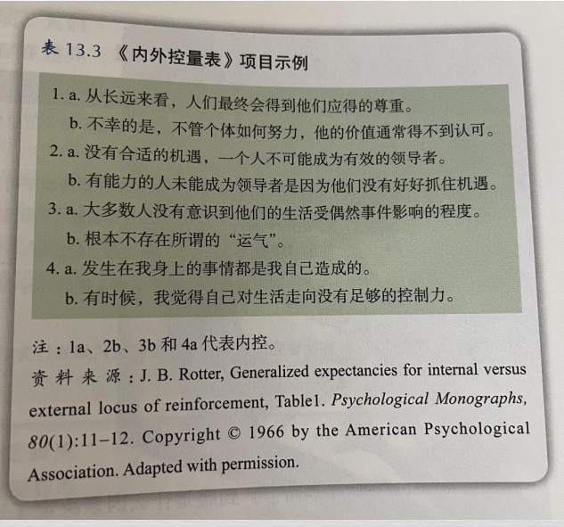

  - 米希尔的认知—情感人格理论
    - 理解行为如何从个体与情境的相互作用中产生.
    - 决定人们如何对特定的环境刺激进行反应的个人变量源自人们 的观察经验,以及他们与其他个体及无生命的客观环境之间的 互动经验.
    - 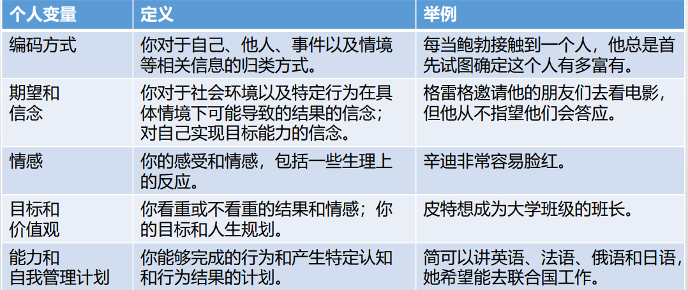

  - 班杜拉的认知社会学习理论
    - 交互决定论
      - 个体因素,行为和环境刺激三者之间复杂的相互作用,其中每 一个都会影响和改变其他元素.
      - 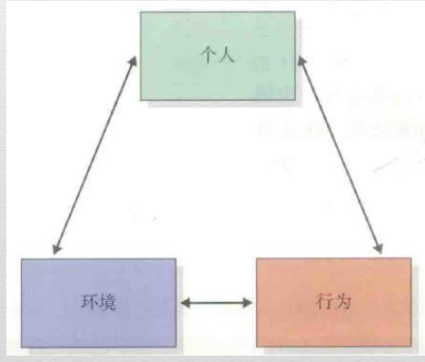

    - 观察学习
    - 自我效能感
      - 一种相信自己在某种情境下足以完成任务的信念.
      - 影响着你的知觉,动机和表现.
      - 环境的重要性:基于结果的期望
      - 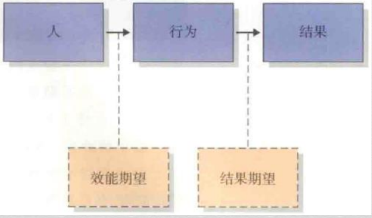

    - 对社会学习和认知理论的评价
      - 批评
        - 忽略情绪的重要性;未认识到无意识动机过程对行为和情感的 影响.
        - 对个人构念和能力形成方式的解释上的模糊性.

- 自我理论

  - 威廉.詹姆士
    - 物质我:躯体自我以及周围的物质客体
    - 社会我:对别人如何看待你的意识
    - 精神我:监控内在思想与情感的自我

  - 心理动力学理论的核心:自我
  - 自我概念:
    - 一个动态的心理结构,能激发,解释,组织,中介和管理个人 内部及人际间的行为和过程.
    - 成分包括:关于你自己的记忆;关于你的特质,动机,价值以 及能力的信念;你最想成为的理想自我;你预期要扮演的可能 自我;对你自己的积极或消极评价(自尊);关于别人怎么看 待你的信念.
      - 自我图式:组织关于你自己的信息.

  - 自尊:
    - 对自我的概括性评价.
    - 低自尊会损害人们确立追求积极结果的目标和应对消极生活事 件的能力.

  - 大多人会设法维护自尊,并维持完整的自我概念.
    - 自我提升
    - 自我妨碍:故意损害自己的表现,为失败找一个现成的借口, 从而不把失败归因于自己缺乏能力
      - 性别差异

  - 恐惧管理理论
    - 自尊有助于人们应对死亡的必然性.

  - 自我的文化建构
    - 不同文化约束影响自我的概念 和自我的发展
      - 个人主义文化:独立的自我构念
      - 集体主义文化:互依的自我构念
      - 测量工具:二十句测验
      - 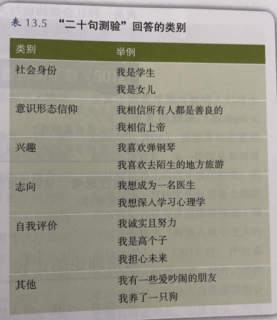

    - 研究案例

      - 西方文化的输出对集体主义文化中成员的自我概念的影响(二十句测验).
      - 从未接触过西方文化的肯尼亚游牧部族:82%社会性回答.
      - 生活在西方化的肯尼亚首都的工人: 58%社会性回答.
      - 生活在西方化的肯尼亚首都的大学生: 17%社会性回答.

      - 自我构念与恐惧管理理论.

  - 批评
    - 人格的自我理论取向没有边界.
    - 强调自我是一种社会建构也与人格中的某些成分来自遗传的证 据不完全一致.

- 人格测评

  - 客观测验
    - 计分和施测相对简单,有明确的规则.
    - 结果
      - 沿着某一单一维度分布的单独数字或者在不同特质上的一组分 数.与常模样本的分数同时报告.

    - 自陈式问卷
      - 人格量表

    - 明尼苏达多相人格问卷(MMPI)
      - 根据精神病学的标签来对个体进行诊断.
      - 采用实证策略编制
        - 是否采用某个项目,完全取决于它是否能清楚地区分两个群体.

      - 10个临床量表+效度量表
      - "MMPI剖面图"
        - MMPI-2 • 增加了15个内容量表(部分地是理论推导出来的)

      - MMPI-2-RF
        - 评估了信度和效度

      - 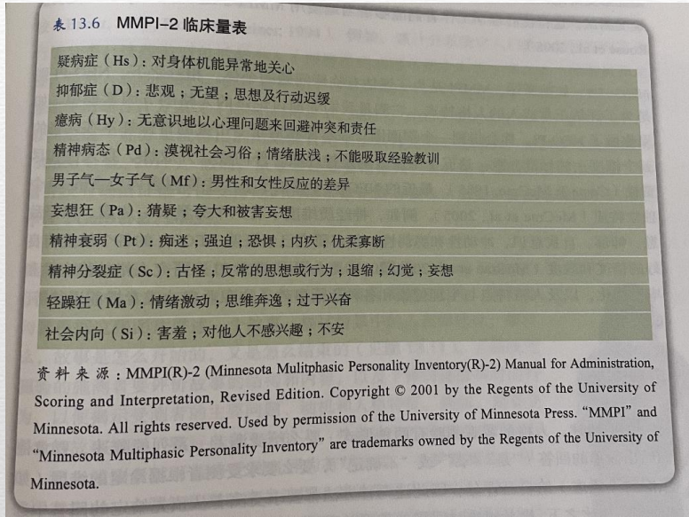
      - 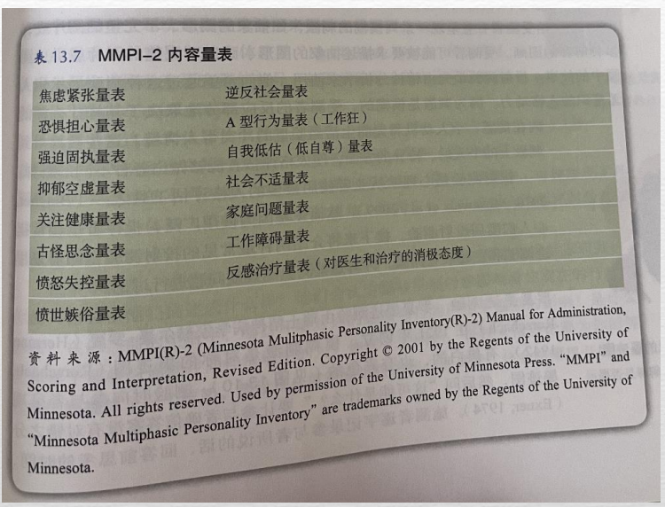

    - NEO-PI
    - 评估正常成人的人格特点
    - 理论基础:人格的五因素模型
    - NEO-PI:相对于一个大的常模样本,你在人格的五个维度上的 标准分数
    - NEO-PI-3:评估了5个主要因素中包含的30个独立特质
    - 良好的信度与效度

  - 投射测验
    - 给受测者呈现一系列的模糊刺激,如抽象的图形,不完 整的图片或有多种解释的图画.要求受测者描述抽象的 图形,画完不完整的图片或讲述画中的故事.
    - 罗夏墨迹测验
      - 对称的墨迹图(彩色,黑白)
      - 计分依据:
        - 定位,反应的内容,决定因素

      - 综合计分系统
      - 没有确凿证据可以支持从业者推论的有效性

    - 主题统觉测验
      - 情景模糊的图片
      - 计分:故事的结构和内 容以及个体讲述故事时 的行为.
      - 揭示受测者的主要问题, 动机和人格特征.
      - 批评:常被用于其效度还未得到证实的领域.

## 14 心理障碍

- 心理障碍的性质
  - 心理病理功能涉及情绪,行为或思维过程的混乱,会导 致个体的痛苦或阻碍个体实现重要目标的能力
  - 异常心理学(也称变态心理学)是最直接涉及理解个体 思维,情绪及行为病理的本质的领域
  - 人们如何将行为标记为"异常"?
    - 七个标准
      - 1,痛苦或功能障碍
      - 2,适应不良
      - 3,非理性
      - 4,不可预测性
      - 5,非常规性和统计上的罕见性
      - 6,令观察者不适
      - 7,违反道德或理想标准
    - 心理障碍最好被看成是心理健康和心理疾病之间的一个连续体
  - 客观性问题
    - 行为的意义是由其内容和背景共同决定的
      - 吻的不同含义
    - 历史上有很多为了维护道德或政治权力而做出异常诊断 的例子
    - 大卫.罗森汉实验
    - 托马斯.萨茨--精神疾病甚至根本就不存在
  - 心理障碍的分类
    - 为发挥最大的作用,分类系统应当具有以下三点好处
      - 通用的简略语言(术语)
      - 对病因的理解
      - 治疗计划
    - 诊断类别的演变
      - 神经症性障碍
      - 精神病性障碍
    - 精神失常的概念
  - 心理障碍的病因
    - 病因(也称作病因学,病原学):是指引起或促使心理 障碍和医学疾病形成发展的因素
    - 生物学取向
    - 心理学取向
      - 心理动力学模型
      - 行为主义模型
      - 认知模型
      - 社会文化模型
  - 焦虑障碍
    - 广泛性焦虑障碍
    - 当一个人在至少6个月的时间里大部分时间都感到焦虑或担心, 但没有受到任何特定危险的威胁时,临床医生就会做出广泛性 焦虑障碍的诊断
    - 至少三种其他症状:例如肌肉紧张,容易疲倦,坐立不安,注 意力难以集中,易激惹或睡眠困难
    - 5.7%的美国成人经历过广泛性焦障碍
    - 惊恐障碍
      - 一种预料之外的严重的惊恐发作
      - 伴随一些焦虑的躯体症状,包括自主神经系统的高兴奋性(如 心率加快),眩晕,头昏或窒息感
      - 反复出现预料之外的惊恐发作,并且开始持续担心再次发作的 可能性
      - 4.7%的美国成年人经历过惊恐障碍
    - 恐怖症
      - 恐惧是客观确定的外部危险的理性反应
      - 恐怖症患者持续和非理性地害怕某一特定的物体,活动或者情 境,这种恐惧相对于实际的威胁来说是夸大的和非理性的
      - 特定恐怖症
      - 广场恐怖症
      - 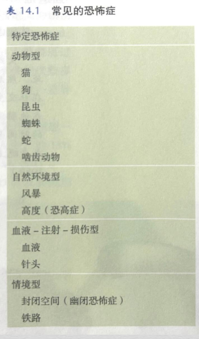
    - 强迫症
      - 强迫观念指的是一些想法,表象或冲动,尽管个体努力抑制, 它们还是反复出现或持续存在
      - 强迫行为指的是重复的,有目的性的动作,是按照特定的规则或仪式化的方式对于某种强迫观念做出的回应
    - 创伤后应激障碍
      - 创伤性事件的一种心理后果:通过痛苦的回忆,梦境,幻觉或 闪回持续地重新体验那些创伤性事件
      - 男性经历创伤性事件的次数多于女性,但女性患创伤后应激障碍的可能性是男性的两倍
      - 五角大楼雇员的PTSD症状
    - 焦虑障碍的成因
      - 生物学取向
        - 预备假设--进化倾向
        - 脑内神经递质GABA的水平降低时,人们通常会产生焦虑的感受
        - MRI技术发现,强迫症患者脑中负责抑制行为的区域的皮质比一 般人厚
        - 家庭和双生子研究
      - 心理动力学取向
        - 症状的目的是试图保护个体免受心理痛苦
      - 行为取向
        - 焦虑障碍症状是强化或条件作用的结果
      - 认知取向
        - 焦虑的认知视角聚焦于可能歪曲一个人对自己所面临危险的评估 的知觉过程或态度
        - 焦虑敏感性:一个人认为身体方面的症状--诸如呼吸短促或心 悸--可能会产生有害后果的信念
          - 焦虑病人强调威胁性刺激
  - 心境障碍
    - 心境障碍是一种情绪障碍, 如严重抑郁或抑郁与躁狂交替出现
    - 抑郁症
      - 约有16%的成年人在一生中的某些时间曾患有抑郁症
      - 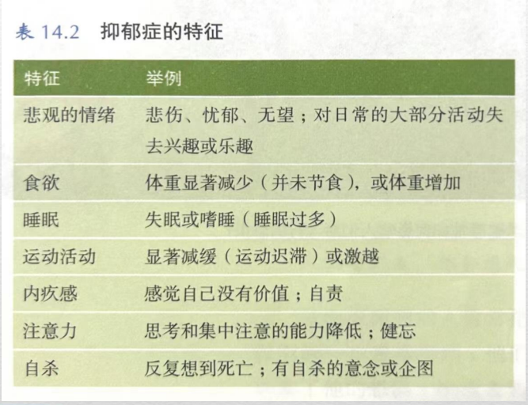
    - 双相障碍
      - 特征是严重抑郁和躁狂发作交替出现
      - 经历躁狂发作的人在行为和情感上通常表现出不寻常的兴奋和膨胀
      - 陷入躁狂心境的患者表现出毫无根据的乐观,冒不必要 的风险,随便做出承诺,并可能会放弃一切
      - 当躁狂开始减退时,患者就不得不努力处理躁狂期间造成的损害和困境,这样,躁狂发作之后几乎总是紧跟着陷入严重的抑郁
      - 在成年人中的发病率为3.9%
    - 心境障碍的原因
      - 生物学因素
        - 脑中的两种化学信使(5-羟色胺和去甲肾上腺素)水平的降低与抑郁相关,而这两种神经递质的提高则与躁狂有关
        - fMRI研究发现双相障碍患者的大脑在抑郁和躁狂状态下的反应 是不同的
        - 双相障碍的遗传力约为0.77
      - 心理动力学取向
        - 无意识冲突和童年早期形成的敌对情绪在抑郁的形成中起了关键的作用
      - 行为取向
        - 关注正向强化和惩罚的数量对个体的影响
      - 认知学取向
        - 消极的认知定势(个体感知世界的设定模式),导致人们对生活中他们认为自己负有责任的事件持消极的看法
          - 抑郁的认知三合一:对自己的消极看法,对当前体验的消极看法,对未 来的消极看法
          - 总是预期负面后果的人不太可能有动机去追求任何目标,这就造成抑郁的主导症状--意志瘫痪
        - 解释风格模型:抑郁是因为个人抱有一种信念,认为自己几乎没有或根本没有能力控制重大的生活事件
          - 人们相信(无论对错)自己无法控制对他们来说很重要的未来结果
          - 习得性无助:动机缺陷,情绪缺陷以及认知缺陷
          - 那些将失败归因为内部,稳定和整体原因的个体容易抑郁
      - 抑郁的性别差异
        - 21%的女性和13%的男性在其一生的某个时候患过抑郁症
        - 女性偏向于深思熟虑,反刍型的反应风格,即过度关注自身问题
      - 自杀
        - 许多企图自杀的人患有抑郁症
        - 年轻人的自杀率
          - 在美国,29.9%的青少年在他们生命的某个时刻想到过自杀, 9.7%的青少年实际尝试过自杀
          - 青少年在经历抑郁时更可能尝试自杀
          - 无望和孤立的感觉以及消极的自我概念,也和自杀风险有关
          - 同性恋青年自杀的风险也比其他青少年更高
- 躯体症状及相关障碍,分离障碍
  - 躯体症状障碍
    - 个体有无法用实际的疾病完全解释的躯体疼痛或主诉
    - 疾病焦虑障碍:患者深信自己的身体有病
    - 被诊断为躯体症状障碍的人一定报告了各种各样无法解释的身体不适
    - 转换障碍的特征是运动或感觉功能的丧失,并且这种丧失无法用神经系统损伤或其他躯体损伤来解释(历史上又称为癔症)
  - 躯体症状及相关障碍的成因
    - 有转换症状的个体与只是假装有这些症状的个体相比,表现出了不同模式的脑区激活(Mailis-Gagnon & Nicholson, 2011; Ellenstein et al., 2011)
    - 认知偏差:对自己的健康感到高度焦虑的个体,其注意力很容 易被显示健康威胁的图片所吸引 (比如一个手臂上有皮疹的男 人)(Jasper & Witthöft, 2011)
  - 分离障碍
    - 分离障碍是身份,记忆或意识等方面的正常整合的混乱和/或中断
    - 分离性遗忘症:仅仅由于心理因素导致的对重要个人经历的遗忘
    - 分离性漫游:失去回忆过去的能力还伴有从家里或工作地点出走,可能连续几个小时,几天或几个月都处于漫游状态,可能以一种新的身份生活在新的地方
    - 分离性身份障碍:过去叫做多重人格障碍,是一种分离性心理障碍,指两个或多个不同的人格存在于同一个体 之中
    - 分离障碍的成因
      - 心理动力学取向的心理学家 认为分离发挥着重要的生存功能.经历了创伤性应激的人有时会用防御机制将创伤事件推到有意识的觉知之外
      - 青少年遭受的情感,身体和性虐待越严重,表现出来的分离性症状就也越严重
      - 并没有可靠证据支持该障碍的普遍性(DSM -IV -TR, 2000 )
- 精神分裂症
  - 精神分裂症是一种严重的心理病理形式,患者的人格似乎解体,思维和知觉扭曲, 情感迟钝
    - 阳性症状:幻觉,妄想,语 言不连贯,行为紊乱的行为
    - 阴性症状:社交退缩和情感 淡漠

  - 精神分裂症的成因
    - 遗传取向
      - 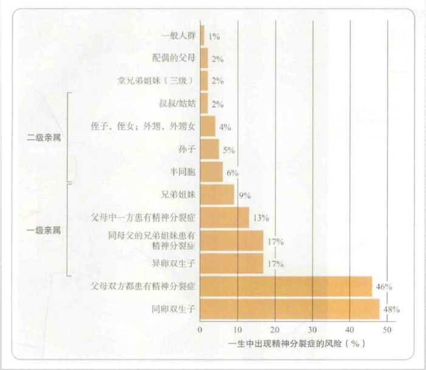

    - 脑功能
      - 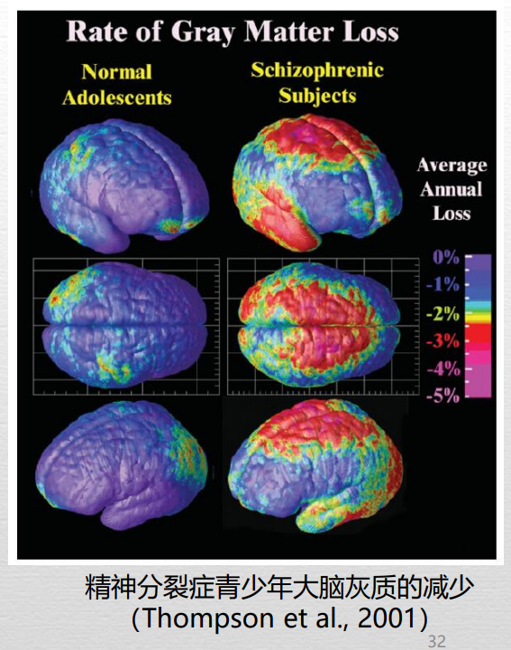

    - 环境应激源
      - 素质-应激假说:遗传因素使个体处于风险中,但这一潜在风险只有受到环境压力的冲击,才会表现为精神分裂症
        - 居住在城市中的人,陷入过经济困境的人和移民出现精神分裂症的比率较高(Bourque et al., 2011; Tandon et al., 2008)
        - 人们经历的创伤越多,越有可能出现精神分裂症(Shevlin et al., 2008)

-
- 人格障碍
  - 人格障碍是一种长期的(慢性的),僵化的,适应不良的感知,思维或行为模式
  - 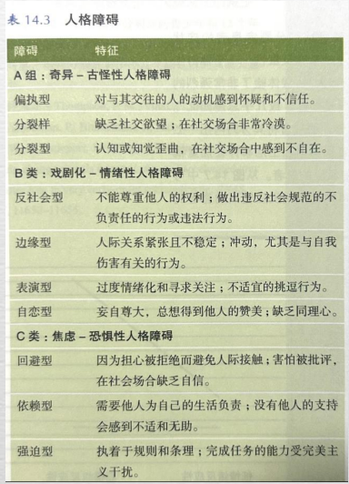
  - 边缘型人格障碍
    - 个体人际关系紧张且极不稳定,他们难以控制愤怒,使 其经常与人争斗和发脾气.
    - 更多的冲动性行为--尤其与自我伤害的行为相关联
    - 对遗弃的强烈恐惧
    - 在美国成人中的患病率约为1.6%
    - 边缘型人格障碍的成因
      - 先天:同卵双生子同时患病的概率为35.3%,而异卵双生子只 有6.7%
      - 环境:73.9%的患者报告童年时遭遇过性虐待
  - 反社会型人格障碍
    - 长期存在违反社会规范的不负责任的行为或违法行为
    - 常常与其他病理状态共存(酗酒,自杀)
    - 反社会型人格障碍的成因
    - 冷漠-无情特质表现出很强的遗传性(Viding et al., 2005)
    - 童年虐待与反社会人格特质具有相关性(Paris, 2003)
- 儿童的心理障碍
  - 注意缺陷/多动障碍(ADHD)
    - 首先,孩子必须表现出与其发育水平不相称的注意缺陷
    - 其次,孩子必须表现出和其发育水平不相称的多动和冲动
    - 孩子在12岁以前持续6个月表现出这些行为模式才能诊断为 ADHD
  - ADHD病因
    - 先天影响
      - 双生子和收养研究提供了强有力的遗传证据(Greven et al., 2011)
      - 脑发育和神经递质功能的特定基因与ADHD症状有关(Poelmans et al., 2011; Smoller et al., 2006)
    - 环境影响
      - 来自经济贫困或有高冲突的家庭的孩子更可能经历这一障碍 (Akinbami et al., 2011; Biederman et al., 2002)
      - 缺乏凝聚力的家庭中,年长孩子比年幼孩子有更高的患ADHD风 险(Pressman et al., 2006)
  - 孤独症
    - 患有孤独症的儿童形成社会联结的能力严重受损.他们的口头语言发展可能严重滞后和受限,对外部世界的兴 趣也非常狭窄
    - 很多患有孤独症的孩子也做出重复性和仪式性的行为
    - 孤独症的成因
      - 研究者们开始识别出使个体更容易患上孤独症的人类基因组变异(Vieland et al., 2011)
      - 孤独症个体的大脑发育会比同龄人更快速(Amaral et al., 2008)
      - 患有孤独症的孩子不能发展出理解他人心理状态的能力 (Baron-Cohen, 2008)
- 精神疾病的污名
  - 污名是耻辱的标志或烙印,在心理学的语境中,它是对 一个人的一整套负性态度,将这个人视为不可接受的另 类(Hinshaw & Stier,2008)
  - 精神病污名从多个方面给人们的生活带来负面影响
  - 许多精神疾病患者会内化负面的刻板印象并进行自我污名化
  - 曾与精神疾病患者有过接触的人的态度较少受污名所影 响(Couture & Penn, 2003)

## 15 心理治疗

- 治疗的背景
  - 目标和主要的治疗学派
  - 对心理障碍的治疗涉及以下四个主要目标:
    - 对个体的问题做出诊断
    - 提出可能的病因
    - 做出预后估计
    - 确诊方法并进行治疗
  - 生物学医疗聚焦于改变中枢神经系统运转的机制.
  - 心理学方面的治疗统称心理治疗,专注于改变人们习得的不良 行为.
  - 心理治疗包括四种主要派别:
    - 心理动力学派认为痛苦是由人们内部未能解决的创伤和冲突引起的外在症状.采用"谈话疗法".
    - 行为治疗将行为本身视为必须矫正的障碍.
    - 认知治疗试图通过改变个体对问题起因的扭曲的自我陈述来重建其思维方式.
    - 人本主义传统的疗法强调人的价值.
  - 治疗师和治疗场所
    - 临床社会工作者(clinical social worker)是精神卫生领域的专业人员.
    - 宗教咨询师(pastoral counselor)是专门治疗心理障碍的宗教团体成员.
    - 临床心理学家(clinical psychologist)必须在研究生院完成心理问题的评 估与治疗训练,完成在临床实习并接受督导,取得哲学博士或心理学博士 学位.
    - 咨询心理学家(counseling psychologist)通常情况下也需获得哲学博士 或心理学博士学位.
    - 精神病专家(Psychiatrist)必须完成获得医学博士学位所必需的所有医学院培训,同时接受一些心理和情绪障碍方面的博士后专业训练.
    - 精神分析师(Psychoanalyst)拥有医学博士或哲学博士学位,并且必须完成从弗洛伊得派的视角理解和治疗心理障碍的专门研究生训练.
    - 采用生物医学方法治疗心理问题的专业人员会使用患者一词.
    - 把心理障碍看做"生活中的问题"而不是精神疾病的专业人员会使用来访者一词.
    - 治疗联盟是来访者或病人与治疗师之间建立的一种共同关系.
  - 心理治疗中的多元化问题
    - 治疗师必须具备文化胜任力(Sue, 2006):
      - "文化意识和信念:治疗师要对自身的价值观和偏见有足够的敏感性,并能洞察到这些个人因素会影响自己对来访者,来访 者的问题以及咨询关系的理解."
      - "文化知识:治疗师要了解来访者的文化,世界观及其对咨询 关系的期待."
      - "文化技能:治疗师能够以具有文化敏感性和相关性的方式进 行干预."
  - 机构化治疗的历史
    - 心理治疗的历史
    - 去机构化和无家可归
- 心理动力学治疗
  - 弗洛伊德的精神分析学派
    - 精神分析是由弗洛伊德创立,是探索神经质的焦虑个体的无意 识动机和冲突的一种密集的,长期的治疗技术.
    - 由于治疗师的中心目标是是患者领悟症状与过去经历之间的关系,因此心理动力学治疗常常又被成为领悟疗法.
  - 自由联想和宣泄
    - 精神分析中用于探索无意识内容,释放被压抑的内心冲突的主 要方法叫作自由联想.
    - 分析师鼓励患者说出自己的每一个想法和感受.
  - 阻抗
    - 不能或不愿意讨论某些想法,欲望或经历.这类阻抗被认为是无意识和意识之间的障碍.
  - 梦的解析
    - 治疗师通过梦的解析这种治疗技术来揭示这些隐藏的动机,考察梦的内容以发现那些潜在的或伪装的动机,以及某些重要生 活经历或欲望的象征意义.
  - 移情和反移情
    - 移情:治疗师常常会被当作个体过去某种情绪冲突的对象.
      - 正移情:患者针对治疗师的情感是爱或崇敬.
      - 负移情:患者的情感是敌意或嫉妒.
    - 反移情:治疗师因认为患者与自己生活中重要之人很相似而对 该患者产生喜欢或反感的情绪.
  - 后期的心理动力学治疗
    - 新弗洛伊德学派与弗洛伊德不同的方面:
      - (1)更强调患者当前的社会环境;
      - (2)更强调生活经历的持续影响.
      - (3)更强调社会动机的作用和人际关系中的爱.
      - (4)更强调自我的功能和自我概念发展的重要性.
    - 哈里.斯塔克.沙利文
    - 梅拉尼.克莱恩
- 行为治疗
  - 心理动力学治疗关注人的内部原因,行为治疗则关注可 观测的外显行为.
  - 行为治疗和行为矫正常常被交替使用,两者均指系统地采用学习原理来增加期望的行为和减少问题行为.
  - 反条件作用
    - 在反条件作用中,个体要学习一个新的条件反应去替代或"对抗"适应不良的反应.
    - 暴露疗法
      - 核心成分是让个体直接面对引发焦虑的客体或情境.
      - 系统脱敏法
      - 满贯疗法
      - 反应预防
    - 厌恶疗法:运用反条件作用的程序,将这些诱发刺激与 一种强烈的,令人厌恶的刺激(如电击或让人呕吐的药物)反复匹配.
    - 榜样模仿
      - 灵感来自社会学习理论,通过模仿榜样的行为而消除恐惧反应.
      - 参与式示范
  - 权变管理
    - 正强化策略:如果某种反应出现之后马上就会有奖赏, 这个反应往往会重复出现,并且出现的频率会随着时间 的推移而增加.
      - 代币和奖赏可以成功治疗药物依赖.
    - 消退策略:首先仔细分析情境以识别强化物,然后,在 不期望的反应出现时通过某种程序撤销这些强化物.
      - 注意缺陷/多动障碍症
  - 泛化技术
    - 为了预防治疗行为的消退,在治疗程序中加入泛化技术, 旨在增加目标行为,强化物,榜样和刺激在治疗环境与 实际生活环境中的相似性.
- 认知治疗
  - 认知治疗通过改变来访者对于其生活经历的思维方式, 以此来改变他们有问题的情感和行为.
  - 这类治疗的潜在假设是,人们所想的内容(认知内容) 以及如何思考(认知过程)是造成异常行为模式和情绪困扰的原因.
  - 改变错误信念
    - 那些错误的想法可能源于:
      - (1)非理性的态度
      - (2)错误的前提假设
      - (3)将行为置于"自动驾驶模式"下的僵化的规则.
    - 对抑郁的认知治疗--四种策略:
      - 挑战来访者关于自己的基本假设
      - 评估来访者给出的支持或否定其自动化思维准确性的证据
      - 对事件进行再次归因,将事件归因于情境因素而非患者的无能.
      - 对于可能失败的复杂任务,与患者一起讨论其他可行的解决办 法.
    - 理性-情绪疗法
  - 认知行为疗法
    - 最基本假设:告诉自己你能成为什么样的人,你就会成 为那样的人;你认为自己应该做什么,你就会那样去做.
    - 不可接受的行为模式可以通过认知重构来矫正,将个体 消极的自我陈述转变为建设性的应对陈述.
- 人本主义治疗
  - 人本主义核心观点是,个体的各方面都处于不断变化和 成长的过程中.
  - 人本主义疗法吸收了研究人类经验的存在主义观点 (May, 1975).
  - 人本主义哲学曾经催生了美国20世纪60年代末的人类潜 能运动.
  - 来访者中心疗法
    - 来访者中心疗法,卡尔.罗杰斯创立,首要目标就是促进 个体的心理健康成长.
    - 基于假设:所有人都有自我实现(即实现自我潜能)的 基本倾向.
    - 无条件的积极关注
  - 格式塔治疗
    - 格式塔治疗专注于如何将个体的身心统一起来,使个体 成为一个完整的人.
    - 发起者弗立兹.波尔斯.
    - 空椅技术
- 团体治疗
  - 优势:
    - (1)对于害怕与权威面对面一起解决问题的人来说是一个威胁 性相对较小的环境;
    - (2)允许运用群体过程来影响个体的适应不良行为;
    - (3)团体治疗的过程为参与者提供了观察和实践人际技巧的机 会;
    - (4)为参与者提供了类似家庭群体的环境,这使纠正性的情绪体验得以产生.
  - 夫妻及家庭治疗
    - 夫妻治疗
      - 首先试图澄清夫妻之间典型的互动模式,然后致力于改善他们 之间的互动质量(Snyder et al., 2006).
    - 家庭治疗
  - 社区支持团体
    - 主要解决四类问题:
      - 成瘾行为
      - 躯体和精神障碍
      - 生活转变或其他危机
      - 有严重问题的人的朋友或亲属所经历的创伤.
- 生物医学治疗
  - 药物治疗
    - 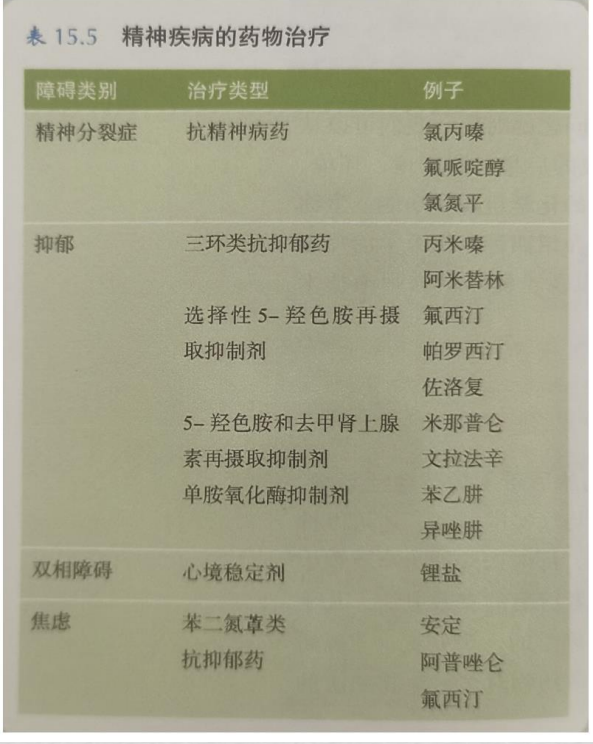
    - 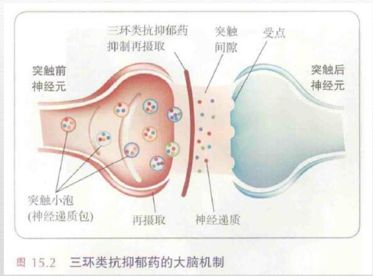
  - 精神外科手术
    - 前额叶切断术
  - 电休克疗法和重复经颅磁刺激技术
- 治疗评估和预防策略
  - 评估疗效
  - 自然缓解效应
  - 安慰剂效应
  - 元分析
  - 共同因素
    - 对于成功的疗法而言,常见的共同因素:
      - (1)来访者对改善有着积极的期待和愿望.
      - (2)治疗师有能力强化和培养这些期待和愿望.
      - (3)这种疗法能够解释来访者将如何改变,并允许来访者去实 践那些将会带来改变的行为.
      - (4)这种疗法能给出一个清晰的治疗计划.
      - (5)来访者与治疗师之间建立起一种以信任,温暖和接纳为特 征的关系.
  - 预防策略
    - 初级预防是在某种障碍出现之前就阻止它.
    - 二级预防是在障碍出现后努力限制其持续时间和严重程度.
    - 三级预防是要通过防止复发来限制心理障碍的长期影响.

## 16 社会心理学

- 社会心理学 (social psychology) 研究思维,情感,知觉, 动机和行为如何受人与人之间相互作用的影响.
- 构建社会现实
  - 归因理论的起源
    - 定义
      - 描述社会知觉者如何利用信息得出因果解释的基本方法
    - 归因的种类
      - 内在归因(特质归因)
      - 外在归因(情景归因)
    - 协变模型
      - 共变模型 (covariation model):当人们试图解释某个人的行为时,要做归因判断,就要评估与行为个体有关的信息的三个维度的共变性
      - 特异性(distinctiveness)
        - 该行为是否只在特定情境下发生?
          - 你的朋友是否对所有的马都尖叫?
      - 一贯性(consistency)
        - 对这一情境的行为反应是否反复出现?
          - 这匹马过去是否也使你的朋友尖叫?
      - 共同性(consensus)
        - 其他人是否在同样情境下也做出同样的行为?
          - 每个人都指着这匹马尖叫吗?
  - 基本归因错误
    - 基本归因错误 (fundamental attribution error, FAE) 指人们 在寻找某一行为或结果的原因时,高估特质因素(谴责 或赞誉当事人)而低估情境因素(谴责会赞誉环境)的 双重倾向.
    - 基本归因错误在一定程度上是由文化导致的.
    - 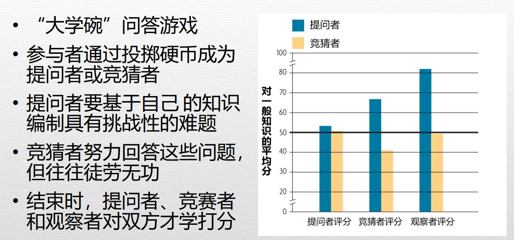
  - 自我服务偏差
    - 自我服务偏差 (self-serving bias) 导致人们将成功归结于 自己,而否认或推卸失败的责任.
    - 在很多情境中,人们倾向于对成功做特质归因,对失败 做情境归因.
  - 期望与自我实现预言
    - 自我实现预言 (self-fulfilling prophecy) 指对某一未来行为 或事件预测,这些预测会改变行为互动以至得到预期的 结果.
    - 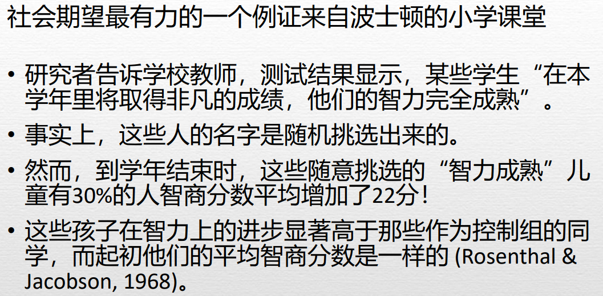

- 情境的力量
  - 角色与规则
    - 社会角色 (social role) 指个体在既定的环境或群体中活动 时,人们期待他做出的一系列由社会界定的行为模式.
    - 情境的特点还可以表现为特定情境下行为指南和规则 (rule) 的运用.
    - 斯坦福监狱实验
      - 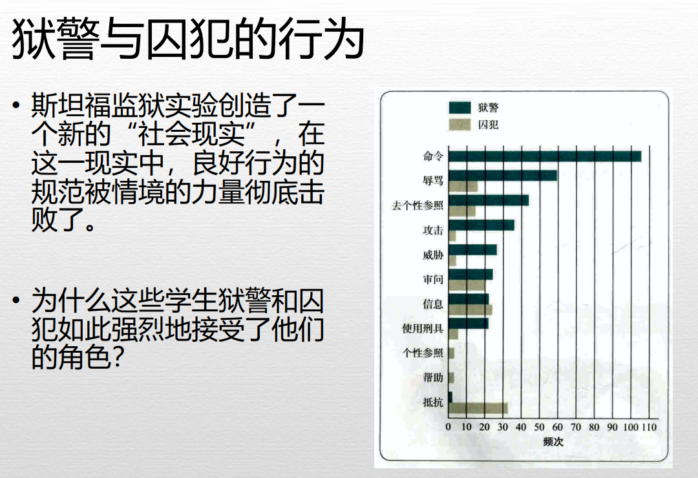
  - 社会规范
    - 除了对角色行为有所期望外,群体还就群体成员应该如何行事形成了很多期待.
    - 内隐的或公开表述的群体规则均包含了特定的期望,告诉群体成员哪些态度和行为从社会角度看是适宜的,这 类期望就是所谓的社会规范 (social norm).
    - 所有或多数成员的某些行为的一致性
    - 违背社会规范的负面后果
      - 嘲笑,再教育和排斥
  - 从众
    - 从众 (conformity) 指人们采纳群体其他成员的行为和意见 的倾向.
    - 两种可能导致从众的因素
      - 信息性影响 (informational influence) 过程
        - 希望准确无误,想了解既定情境下正确的反应方式
        - 很多生活情境都要求你必须做出行为决策,但情境本身非常模糊.观 察其他人,以帮助自己做出适当的选择,即信息性影响.
        - 谢里夫 (Sherif, 1935) 自主运动效应实验
          - 规范具体化:规范的形成和固化 • 要求参与者判断一个光点的移动量,该光点出现在一个全黑的背景上, 没有任何参照点,虽然它实际是静止的,但看上去似乎在运动.这是 一种知觉错觉,称为自主运动效应.
          - 起初判断的个体差异很大.然而,当参与者被召集到一个由陌生人组 成的小组里,大声说出自己的判断时,他们的估计开始趋向一致.他 们开始看到光点朝着同样的方向移动,移动的距离也大体相同.
          - 谢里夫研究的最后一个部分更有意思--在结束集体观看以后,这些 参与者独自待到同样的暗室时,发现他们继续遵从大家在一起时所形 成的群体规范.
      - 规范性影响 (normative influence) 过程
        - 希望被别人喜欢,接受和赞许
        - 阿施 (Asch, 1940, 1956) 实验
          - 引导男大学生,让他们相信自己在参加一项简单的视知觉研究,给他们看的卡片上有三条长短不一的
          - 线段,要求他们指出其中哪条线段与标准线段一样长.线段的长短差距足够明显,所以极少出现错误
          - 参与者与另外6~8名学生呈半圆形就坐,轮流判断.主试同伙将两条显然不同的线段匹配在一起,小组里的其余同伙也做出同样的反应.轮到参与者的时候,他不得不考虑是与周围其他人的观点保持 一致,还是坚持自己独立的判断.
          - 大约四分之一的参与者保持了完全的独立性,然而50%~80%的参与 者至少有一次从众,即服从了大多数人的错误估计,三分之一的参 与者半数或更多的关键试次中都屈从了多数人的错误判断.
      - 少数人影响与不从众
        - 在一些条件下,少数人能够扭转多数人的看法
          - 参与者完成颜色命名任务,多数参与者都正确识别出色块,但有两名 主试一致地将绿色识别为蓝色,他们的反对意见一致,但他们是少数
          - 当时对多数人没有产生什么影响.然而,后来单独测试时,有些参与 者的判断出现了变化,从蓝到绿的颜色连续分布中偏向了蓝色这一端
      - 规范性影响与信息性影响
        - 少数人的规范性影响较小
          - 多数派成员一般不太关心是否被少数人喜欢或接纳
        - 少数派的确具有信息性影响
          - 少数人可以鼓励群体成员从多角度来认识问题
  - 群体中的决策
    - 群体极化 (group polarization):与群体成员单独决策相比, 群体决策倾向于更为极端.
      - 信息影响模型
      - 社会比较模型
    - 群体思维 (groupthink) 指决策群体有这样一种倾向,即过滤掉不中意的信息,从而有可能使观点达成一致,尤其 是与领导的观点保持一致.
  - 服从权威
    - 米尔格拉姆的服从实验
- 态度,态度改变与行动
  - 态度与行为
  - 态度 (attitude) 是我们对人,事,物和观念的积极或消极的 评价
  - 引发态度的三类信息
    - 认知,情感和行为
  - 态度预测行为
    - 态度的可获得性
    - 态度的稳定性
    - 改进态度的测量方法
      - 捕捉自动或内隐的态度
  - 说服过程
    - 精细可能性模型 (elaboration likelihood model)
      - 界定人们有多大可能将他们的认知加工集中于仔细思索精心考 有说服力的信息上.对说服路径做了重要的区分
      - 中心路径
        - 人们仔细思考有说服力的沟通
        - 态度改变与否取决于论点的强弱
      - 外周路径
        - 人们不怎么审慎地关注信息本身
        - 对情境中的表面线索做出反应
        - 广告请明星代言
  - 被自己的行为说服
    - 认知失调 (cognitive dissonance) 理论
      - 指一个人做出的决定,采取的行动或接触到的信息有违原先信 念,情感或价值观之后所体验到的那种冲突状态
      - 当个体认识到自身行为与相应的态度存在不协调时,就会出现 一种令人厌恶的状态,从而促使人们去降低这种失调
    - Festinger 的实验研究
    - 自我知觉理论
      - 你通过觉察你现在正在怎么做,以及回忆里过去在既定情境中 是如何作为的,从而推测你自己的内部状态(信念,态度,动 机和情感)是怎样的或应该是怎样的
      - 你利用这些对自我的了解,反过来推测你行为最有可能的原因 或决定因素
  - 顺从
    - 互惠
      - 互惠规范:当某人为你做了些事情,你也应该为他做些事情
      - 即使是非常小的恩惠也能引导参与者回报大得多的恩惠
      - 以退为进技巧:当人们拒绝一个较大的请求后,往往会应允一个比较适度的请求
    - 承诺
      - 登门槛技巧:同意接受小请求的人,接下来更可能同意接受较大 的请求
- 偏见
  - 偏见 (prejudice) 是对特定目标群体的一种习得性的态度, 包括支持这种态度的消极情感(厌恶或恐惧)和消极信 念(刻板印象),以及逃避,控制,征服和消灭目标群 体的行为意向.
  - 偏见的起源
    - 社会分类 (social categorization)
      - 内群体 (in-group)
      - 外群体 (out-group)
    - 内群体偏向 (in-group bias)
      - 只要有群体认同的细微线索,人们就开始偏袒他们自己群体的成 员,而不是其他群体的成员
  - 刻板印象(stereotype)的影响
    - 是对一群人的概括性描述,该群体的所有成员都被赋予了同样 的特征
    - 刻板印象如此强烈地编码了人们的期望,这些强烈的期望可能 会导致人们出现行为确证
    - 刻板印象威胁:刻板群体的成员如果置身于与负面刻板印象有 关的情境,就会体验到刻板印象威胁,受此威胁影响的人不能 有效利用其心理资源
  - 内隐偏见
    - 负面态度通常以内隐偏见(implicit prejudice)的形式存 在
    - 内隐联想测验(implicit association test,IAT)
  - 逆转偏见
    - 接触假设 (contact hypothesis)
      - 敌对群体间仅凭简单接触不能减少偏见
      - 要克服偏见必须促进人与人之间的互动
        - 例如分享共同目标的合作行为
    - 友谊和间接接触
- 社会关系
  - 喜欢
    - 外表吸引力
      - 西方文化中的刻板印象会影响各类判断
      - 外表吸引力的文化差异
    - 相似性
      - 诸如信念,态度和价值观方面的相似性能促进友谊
    - 互惠
      - 你倾向于喜欢那些你认为喜欢你的人
  - 爱
    - 爱的三个方面
      - 激情--性激情和欲望
      - 亲密--坦诚和理解
      - 承诺--投入和奉献
    - 成人依恋风格
      - 安全型依恋
      - 回避型依恋
      - 焦虑矛盾型依恋
      - 自我包含他人量表
- 攻击,利他行为和亲社会行为
  - 攻击: 给其他个体造成心理或生理伤害的行为.
  - 亲社会行为: 人们旨在帮助他人的行为.
    - 利他行为: 人们在没有考虑自身安全或利益的情况进行的亲社会 行为.
  - 攻击的个体差异
    - 冲动性攻击: 个体对情境的反应,由情绪驱动:盛怒之下的人们以攻击行为做 出反应.
    - 工具性攻击: 目标指引(把攻击当作达到目标的工具)和基于特定认知的攻击: 人们根据预谋发起攻击行为,以达到特定的目的.
    - 冲动性攻击倾向高的个体一般有较高的情绪反应性,工 具性攻击倾向高的个体,往往在暴力的积极评价因素上 得分较高.
  - 情境对攻击的影响
    - 挫折—攻击假说 (frustration-aggression hypothesis)
      - 挫折通常出现于人们实现目标受到妨碍的情境之下,挫折的增加随后会导致更可能做出攻击行为.
    - 直接的挑衅也会导致攻击行为
    - 社会规范和榜样影响攻击的可能性
      - 一般攻击模型
  - 亲社会行为的根源
    - 有四种力量促使人们为公共利益作贡献
      - 利他主义
      - 利己中心
      - 集体主义
      - 原则主义
    - 互惠性利他主义:人们之所以做出利他行为,是因为在 某种意义上他们希望其他人也会对他们做出类似的利他 行为.
      - 间接互惠:人们表现出利他行为是因为他们相信, 在将来他们 会成为利他行为的受惠者.
    - 同理心利他行为假说:存在这样一种特定关系,当你对其他个体产生同理心(情绪认同的感受)时,这些感受 会引发提供帮助的利他动机.
  - 情境对亲社会行为的影响
    - 旁观者介入 (bystander intervention)
      - 人们想帮助危难中的陌生人的意愿
    - 责任分散 (diffusion of responsibility)
      - 当不止一个人能够在紧急事件中帮忙的时候,人们经常假设其 他人会或应该帮忙,于是他们自己就会后退,不介入
    - 紧急情境下影响人们亲社会行为的因素
      - 旁观者必须注意到紧急事件
      - 旁观者一定要感觉到责任
