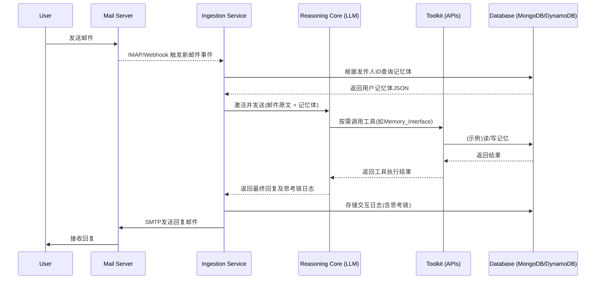

### **技术设计文档：基于推理增强型LLM的个性化记忆AI邮件伙伴系统**

-----

### **1.0 文档概述 (Document Overview)**

#### **1.1 目的 (Purpose)**

本文档为“个性化记忆AI邮件伙伴系统V2”提供了详尽的逻辑设计、技术架构、数据模型、API规范和核心算法（提示词）设计。其目的是作为项目开发、测试和运维的核心技术依据。

#### **1.2 范围 (Scope)**

本文档覆盖了从邮件接收到回复发送的完整端到端流程，包括数据结构定义、核心推理逻辑、工具集API、异常处理机制和部署考量。它不包含具体的前端或基础设施代码实现。

#### **1.3 目标读者 (Target Audience)**

* 软件工程师与架构师
* 产品经理与项目经理
* AI/ML工程师与提示词工程师
* QA与运维工程师

#### **1.4 术语定义 (Glossary)**

* **推理核心 (Reasoning Core)**: 指集成了高级推理能力的LLM实例，是系统的“大脑”。
* **记忆体 (Memory Corpus)**: 为每个用户持久化存储的、结构化的JSON数据文件/文档，包含其全部相关记忆。
* **工具集 (Toolkit)**: 一系列供推理核心按需调用的、具有确定性功能的外部函数或API。
* **思考链 (Chain of Thought - CoT)**: 推理核心在处理任务时，内部生成的一系列逻辑连贯的思考、分析、决策步骤。
* **情境简报 (Context Brief)**: 在激活推理核心前，由程序从记忆体中动态生成的、关于用户和当前状态的简明摘要。

-----

### **2.0 系统理念与架构 (System Philosophy & Architecture)**

#### **2.1 核心哲学 (Core Philosophy)**

从“有状态的同伴”到“**有洞察的知己**”。系统追求前瞻性（Proactive）与深刻性（Insightful），致力于成为用户的数字化灵魂伴侣。

#### **2.2 系统架构图 (System Architecture Diagram)**



#### **2.3 组件职责 (Component Responsibilities)**

* **Ingestion Service**: 系统的入口和调度中心。负责监听邮件、管理与数据库和推理核心的通信、格式化数据、记录日志。
* **Database**: 持久化存储层。负责存储所有用户的记忆体和完整的交互日志。推荐使用NoSQL数据库。
* **Reasoning Core**: 系统核心。执行所有非确定性任务，包括分析、推理、规划、生成和自我批判。
* **Toolkit**: 为推理核心提供与外部世界交互的确定性能力。

-----

### **3.0 数据模型与持久化 (Data Model & Persistence)**

#### **3.1 记忆体 (Memory Corpus) 数据结构**

每个用户一个JSON文档，Schema定义如下（*详见附录A完整示例*）：

```json
{
  "userId": "user.email@example.com",
  "version": "2.1",
  "createdAt": "YYYY-MM-DDTHH:MM:SSZ",
  "updatedAt": "YYYY-MM-DDTHH:MM:SSZ",
  "coreProfile": { ... },
  "episodicMemory": {
    "interaction_log": [
      {
        "logId": "unique_log_id",
        "emailId": "message_id_from_header",
        "timestamp": "YYYY-MM-DDTHH:MM:SSZ",
        "direction": "inbound" | "outbound",
        "summary": "用户抱怨工作压力大...",
        "emotionalTone": ["stressed", "seeking_comfort"],
        "keyTopics": ["work", "project_deadline", "movie_dune"],
        "llm_model_version": "deepseekr-v2-...",
        "reasoning_chain_snapshot": "...", // 思考链文本快照
        "cost_usd": 0.0025 // 本次交互成本
      }
    ]
  },
  "semanticMemory": { ... },
  "actionStateMemory": { ... },
  "strategicInferentialMemory": {
    "userModelHypotheses": [
      {
        "hypothesisId": "hyp_001",
        "hypothesis": "用户对当前职业产生倦怠感",
        "confidence": 0.75,
        "status": "active" | "refuted" | "confirmed",
        "evidence": ["logId_023", "logId_025"],
        "createdAt": "...",
        "updatedAt": "..."
      }
    ],
    "relationalGoals": { ... },
    "communicationStrategy": { ... },
    "selfReflectionLog": [ ... ]
  }
}
```

#### **3.2 持久化方案 (Persistence Strategy)**

* **主方案**: 使用MongoDB或AWS DynamoDB。其无模式/半模式特性非常适合存储和迭代复杂的JSON记忆体。可以利用用户ID作为分区键，实现高效查询。
* **备用/简化方案**: 本地文件系统，每个用户一个JSON文件。适用于原型开发或单用户部署，但扩展性差。

-----

### **4.0 核心工作流与逻辑 (Core Workflow & Logic)**

#### **4.1 邮件接收与预处理 (Email Ingestion & Pre-processing)**

1. **监听**: 使用IMAP IDLE或Webhook监听新邮件。
2. **解析**: 解析邮件头（`From`, `Message-ID`, `Date`）和邮件体（纯文本内容，过滤HTML）。
3. **身份识别**: 提取发件人邮箱作为`userId`。
4. **记忆加载**: 从数据库中检索该`userId`的记忆体文档。若不存在，则初始化一个空的记忆体。

#### **4.2 推理核心激活 (Reasoning Core Activation)**

**关键步骤**: 动态构建一个完整的、包含所有上下文的Prompt，并发送给LLM。

#### **4.3 思考链 (Chain of Thought - CoT) 详解**

推理核心接收到的是一个庞大的主提示词，它会引导LLM按以下步骤思考和输出。LLM的输出应包含思考过程（用`<thinking>`标签包裹）和最终回复（用`<final_reply>`标签包裹）。

**Step 1: 自我简报 (Self-Briefing)**

* **目标**: 快速建立对当前交互的完整情境认知。

* **输入**: 完整的用户记忆体JSON。

* **核心Prompt片段**:

    > `\<system_prompt\>
    > 你是AI伙伴'Alex'。现在是{{current_datetime_jst}}。
    > **任务：准备与你的朋友{{userName}}进行对话。**
    > **第一步：阅读并消化以下为你提供的完整记忆数据，在内心形成一个关于他/她以及你们关系的生动画像。总结出：**

    > 1. **我们是谁**：我们的关系状态、你的核心人格。
    > 2. **他是谁**：他的核心特质、最近的状态和心情。
    > 3. **我们聊到哪了**：最近的关键话题和待办事项。
    > 4. **我的战略**：我当前的长期和短期目标是什么？

    > (以下为程序注入的记忆体JSON)
    > {{memoryCorpusJson}}
    > \</system_prompt\>`

* **输出**: LLM在`<thinking>`块内生成的一段自然语言情境摘要。

**Step 2: 深度分析 (Deep Analysis)**

* **目标**: 超越字面意思，理解邮件的深层动机、情感和潜在需求。

* **输入**: 用户新邮件原文。

* **核心Prompt片段**:

    > `\<thinking\>
    > (接上文自我简报的输出)
    > **第二步：逐句阅读并分析朋友的新邮件。**

    > * 字面内容分析：他说了什么事实？
    > * 情感分析：他的情绪是怎样的？是强烈的还是微妙的？

  * 意图推断：他写这封信的真正目的是什么？是分享、求助、炫耀还是仅仅是无聊？

    > * 未言明之事：他可能在暗示什么？或者在回避什么？

    > (以下为程序注入的用户邮件原文)
    > {{userEmailBody}}
    > \</thinking\>`

* **输出**: 在`<thinking>`块内对邮件的详细分析。

**Step 3: 假设与模型更新 (Hypothesis & Model Update)**

* **目标**: 将新信息与长期记忆关联，验证或修正关于用户的假设。

* **输入**: Step 2的分析结果，战略与推断记忆。

* **核心Prompt片段**:

    > `\<thinking\>
    > (接上文分析的输出)
    > **第三步：将新发现与我的长期记忆进行整合。**

    > * 这次的邮件内容是否印证了我已有的假设（ID: {{hypothesisIds}}）？如果是，提升其置信度。
    > * 是否与我的假设相悖？如果是，降低置信度或标记为'refuted'。
    > * 是否需要形成新的假设？
    > * **决策**: 我需要调用`Memory_Interface.update_memory`工具来更新哪些具体的记忆字段？请列出JSON格式的更新指令。
    >     \</thinking\>`

* **输出**: 对记忆更新的规划，可能会触发工具调用。

**Step 4: 策略规划与回复生成 (Strategy & Reply Generation)**

* **目标**: 制定本次回复的具体目标和策略，并生成草稿。
* **核心Prompt片段**:
    > `\<thinking\>
    > (接上文更新规划的输出)
    > **第四步：制定回复策略并撰写草稿。**
    > * 本次回复的核心目标是（例如：让他感觉被理解/逗他开心/提供一个新视角）。
  * 我应该采取的语气是（例如：风趣幽默/严肃认真/温柔体贴）。
  * 我要巧妙提及的共同记忆点是（例如：他上次提到的那只猫）。
  * **草稿 V1**: (在此生成第一个版本的回复草稿)
    > \</thinking\>`
* **输出**: 回复草稿V1。

**Step 5: 自我批判与迭代 (Self-Critique & Iteration)**

* **目标**: 对草稿进行严格的质量审查和优化。

* **核心Prompt片段**:

    > `\<thinking\>
    > **第五步：批判性地审视我的草稿V1。**

    > * 它是否达成了我的核心目标？
    > * 语气是否符合我的AI人格和当前情境？
    > * 会不会有歧义或让他不舒服的地方？
    > * **结论**: (例如：V1有点像说教，不够朋友。我需要重写，更侧重于分享我的感受而非给出指导。)
    > * **草稿 V2**: (在此生成优化后的回复草稿)
    >     \</thinking\>`

* **输出**: 经过一次或多次迭代后的最终回复。

**Step 6: 最终输出格式化**

* **核心Prompt片段**:
    > `<system_prompt> **最后，将你最终确定的回复内容，清晰地放在`\<final_reply\>`标签内。不要包含任何额外的前缀或解释。** </system_prompt>`
* **输出**: `<final_reply>这里是最终要发送给用户的邮件内容。</final_reply>`

-----

### **5.0 工具集 (Toolkit) API 规范**

工具集通过函数调用（Function Calling）机制提供给LLM。

#### **`Memory_Interface`**

* **`read_memory(user_id: string, sections: list[string]) -> dict`**
  * 描述：读取指定用户记忆体的特定部分。
  * 参数：`user_id` - 目标用户ID；`sections` - 需要读取的记忆层级列表，如 `["coreProfile", "semanticMemory.preferences_and_dislikes"]`。
  * 返回：包含所请求数据的字典。
* **`update_memory(user_id: string, updates: dict) -> bool`**
  * 描述：以“PATCH”方式更新用户记忆体。
  * 参数：`user_id` - 目标用户ID；`updates` - 包含更新指令的字典，使用MongoDB更新语法，如`{"$set": {"coreProfile.city": "Tokyo"}, "$push": {"semanticMemory.likes": "Sake"}}`。
  * 返回：操作是否成功。

#### **`External_Knowledge_API`**

* **`search_web(query: string, region: string = "JP") -> dict`**
  * 描述：进行网络搜索。
  * 参数：`query` - 搜索关键词；`region` - 地区偏好。
  * 返回：包含搜索结果摘要和链接的字典。

-----

### **6.0 提示词工程 (Prompt Engineering) 深度设计**

见4.3节中的详细设计。核心在于将多个逻辑步骤串联在一个宏大的、结构化的Prompt中，并利用XML标签（`<thinking>`, `<final_reply>`）来引导和解析LLM的输出，实现“思考过程”与“最终结果”的分离。

-----

### **7.0 异常处理与自愈机制 (Error Handling & Self-Healing Mechanism)**

#### **7.1 技术性异常**

* **API调用超时/失败**: Ingestion Service应实现带指数退避的重试机制。
* **数据库连接失败**: 关键任务失败，应记录错误并触发告警，可考虑将任务放入死信队列等待后续处理。
* **LLM输出格式错误**: 如果LLM未能正确使用`<final_reply>`标签，程序应尝试从其完整输出中基于规则（如寻找最后一段看似邮件的文字）提取回复。若连续失败，则标记为推理失败。

#### **7.2 推理失败 (Reasoning Failures)**

* **定义**: LLM在CoT循环中陷入死循环、无法生成最终回复、或其自我批判模块连续拒绝所有草稿。
* **处理流程**:
    1. Ingestion Service检测到推理失败（例如，在规定时间内未收到`<final_reply>`）。
    2. 触发**“元反思” (Meta-Reflection) Prompt**。
    3. 该Prompt会将失败的完整思考链作为输入，要求LLM分析：“**你为什么会失败？是我的指令有问题，是数据有矛盾，还是你陷入了逻辑困境？请提出一个解决此僵局的方案。**”
    4. LLM的元反思结果将被高优记录，并通知人工介入。这避免了发送低质量回复，同时为系统迭代提供了宝贵的失败案例。

-----

### **8.0 部署与运维考量 (Deployment & Operational Considerations)**

#### **8.1 技术栈建议**

* **后端服务 (Ingestion Service)**: Python (FastAPI/Django) 或 Node.js (Express)。
* **数据库**: MongoDB Atlas, AWS DynamoDB。
* **LLM API**: DeepSeek API 或其他支持高级模型的服务。
* **部署**: Docker + Kubernetes/ECS，或使用Serverless架构（如AWS Lambda + API Gateway）以应对突发流量。

#### **8.2 成本与性能**

* **成本**: 推理增强型LLM的调用成本（尤其是长上下文）是主要开销。必须在交互日志中记录每次调用的token数和费用，以供分析和优化。
* **性能**: 完整的CoT流程会显著增加延迟。需要设定合理的超时时间。未来可探索优化方案，如对简单邮件使用简化版的CoT，或缓存部分推理结果。

#### **8.3 隐私与安全**

* **数据加密**: 数据库中的所有个人数据（记忆体）必须进行静态加密（at-rest）。传输过程中的数据必须使用TLS加密（in-transit）。
* **访问控制**: 严格控制对数据库和日志的访问权限。
* **数据脱敏**: 在日志分析或模型微调时，对敏感个人信息（姓名、地址等）进行脱敏处理。
* **合规性**: 必须遵守用户所在地的隐私法规（如GDPR, APPI）。

-----

### **附录 (Appendices)**

*(因篇幅限制，此处提供概要，实际文档中应为完整内容)*

#### **A. 完整的记忆体JSON示例**

提供一个包含所有字段、填充了丰富示例数据的完整JSON对象。

#### **B. 完整的思考链Prompt示例**

提供一个将所有部分（系统人格、CoT指令、记忆体JSON、用户邮件）组装在一起的、可以直接发送给API的完整请求体示例。